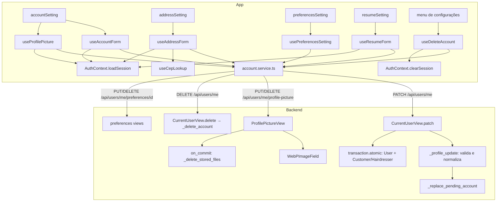

# Configurações da conta Design

**Spec**: `.specs/features/account-settings/spec.md`
**Context**: `.specs/features/account-settings/context.md`
**Status**: Draft

---

## Architecture Overview

A feature tem duas metades, e só a primeira tem testes automatizados.

**Backend:**
- O `PATCH /api/users/me` ganha uma etapa de validação e normalização, que roda antes de qualquer escrita, e a gravação passa a ser atômica.
- Uma view nova, `ProfilePictureView`, troca e remove a foto.
- A exclusão (`_delete_account`) não muda. Só ganha o teste da conta Google.

**App:**
- Um serviço único, `services/account.service.ts`, chama as rotas da conta.
- Os hooks ficam em `hooks/accountHooks/` e não dependem do `RegistrationContext`. Eles alimentam as telas de `configs` dos dois papéis.
- O `AuthContext` ganha `clearSession()`, usado depois da exclusão.



**Alternativas consideradas para a foto** (escolhida: rota própria):

| Abordagem | Por que não |
| --------- | ----------- |
| `PATCH /api/users/me` em multipart | O `PATCH` lê só JSON (`json_object`). Aceitar multipart obrigaria a ler os campos de texto do form e mudaria o contrato do RT-58. |
| `POST /api/users/me/profile-pictures` (coleção) | O usuário tem uma foto só. Uma coleção sugere histórico, que não existe. |

---

## Code Reuse Analysis

### Existing Components to Leverage

| Component | Location | How to Use |
| --------- | -------- | ---------- |
| `authenticated_user` | `backend/users/authentication.py` | Abre a sessão nas duas rotas novas (401 `invalid-session`). |
| `problem_response`, `Problem`, `body_error`, `validation_problem`, `json_object` | `backend/hairmatch/problems.py:67-127` | Erros do `PATCH` e da foto (AD-006). |
| `_PENDING_ACCOUNT`, `_pending_accounts`, `_replace_pending_account` | `backend/users/views.py:164-189` | Substituição da conta pendente que tem o telefone pedido (ACC-12). |
| `_cognito_error_response` | `backend/users/views.py:92` | Responde 503 ou 429 quando a substituição falha (ACC-13). |
| `_delete_stored_files` | `backend/users/views.py:155` | Apaga a foto antiga no `on_commit` (ACC-36 e ACC-40). |
| `WebPImageField` e `InvalidImage` | `backend/hairmatch/images.py` | Conversão e recusa de arquivo que não é imagem (AD-003). |
| `INVALID_PROFILE_PICTURE_DETAIL`, `PHONE_TAKEN_DETAIL` | `backend/users/views.py:78-80` | Mesmos `detail` do cadastro. |
| `UserSerializer` | `backend/users/serializers.py:4-11` | Monta a URL da foto na resposta do `PUT`. |
| `activate_account`, `_register_payload`, `_create_plain_user`, `assert_problem` | `backend/users/testing.py` e `backend/users/tests.py` | Montagem dos testes novos. |
| `useCepLookup` | `frontend-mobile/hooks/authHooks/useCepLookup.ts` | Autofill do CEP, usado sem mudança. |
| Merge do autofill e trava dos campos | `frontend-mobile/hooks/authHooks/useAddress.ts:18-69` | Copiar a lógica para `useAddressForm`. O hook original depende do `RegistrationContext`. |
| Seletor de imagem | `frontend-mobile/hooks/authHooks/useRegisterForm.ts:22-54` | Permissão, recorte quadrado e qualidade 0.5. |
| Upload multipart web e nativo | `frontend-mobile/hooks/customerHooks/useReviewForm.ts:100-114`, `services/review.service.ts:6-11` | Blob no web, `{uri,name,type}` no nativo e header `multipart/form-data`. |
| Máscaras e validação | `frontend-mobile/utils/forms.ts` (`formatCPF`, `formatCNPJ`, `formatCEP`, `formatPhone`, `stripNonDigits`) | Máscaras e limpeza dos campos. |
| `problemMessage` | `frontend-mobile/utils/api-problem.ts:176` | Mensagem de todo erro da API. |
| `ErrorModal` (com `title`) e `ConfirmationModal` | `frontend-mobile/components/modals/` | Erros, sucesso e confirmação da exclusão. |
| `listPreferences`, `getPreferencesByUser` | `frontend-mobile/services/preferences.service.ts` | Catálogo e preferências atuais. |
| UI do seletor de preferências | `frontend-mobile/app/(auth)/register/preferences.tsx:77-100`, `styles/register/styles/PreferencesStyle.ts` | Layout da tela nova. |

### Integration Points

| System | Integration Method |
| ------ | ------------------ |
| Cognito | Só pela substituição da conta pendente (`admin_delete_user`) e pela exclusão já existente. Nenhuma API nova do Cognito. |
| S3 (LocalStack em dev, `InMemoryStorage` nos testes) | `WebPImageField.save` no `PUT`; `default_storage.delete` no `on_commit`. |
| Route Table (AD-007) | RT-88 e RT-89 no `api-restful-routes/spec.md`, `ROUTE_TABLE` e `SINGULAR_SEGMENTS` em `backend/hairmatch/test_routes.py`. |
| `AuthContext` | `loadSession()` depois de cada gravação e `clearSession()` depois da exclusão. |

---

## Components

### `_profile_update(user, data)` (backend)

- **Purpose**: Valida e normaliza o corpo do `PATCH` e devolve só os campos aceitos, ou levanta `Problem`.
- **Location**: `backend/users/views.py`, perto de `_string_field_errors`.
- **Interfaces**:
  - `_profile_update(user, data) -> tuple[dict, dict]`. Devolve `(user_fields, profile_fields)` já normalizados.
  - Levanta `validation_problem(errors)` com todos os erros de uma vez, cada um com o seu pointer (ACC-01 a ACC-07).
  - Levanta `Problem('email-change-unsupported', ...)` quando o e-mail difere sem diferenciar maiúsculas (ACC-10). E-mail igual não entra em `user_fields` (ACC-09).
- **Regras**:
  - Só os campos presentes no corpo são validados. Um campo ausente não é erro (é `PATCH`).
  - Campos obrigatórios: `first_name`, `last_name`, `phone`, `address`, `neighborhood`, `city`, `state` e `postal_code`. Recusa quem não é `str` ou fica vazio depois de `strip()`. O valor gravado é o `strip()`.
  - `complement` e `number` aceitam vazio ou `None`.
  - `max_length` vem do modelo (`User._meta.get_field(f).max_length`), para não duplicar números.
  - `phone`: `re.sub(r'\D', '', ...)`. Se os dígitos forem iguais aos dígitos do telefone gravado, o campo sai de `user_fields` sem validar o formato (ACC-58). Se não, é validado com `^55\d{10,11}$`.
  - `postal_code`: só os dígitos, com 8 de comprimento.
  - `state`: `^[A-Za-z]{2}$`, gravado com `upper()`.
  - `cpf` (só cliente): 11 dígitos. `cnpj` (só cabeleireiro): 14 dígitos. `resume` (só cabeleireiro): `str` com até 1000 caracteres.
  - O campo de outro papel é ignorado, como hoje.
  - `experience_years` continua aceito sem validação nova, como hoje (fora do escopo).
  - Campos fora da lista são ignorados (ACC-57).
- **Dependencies**: `problems.py`.
- **Reuses**: o estilo de `_string_field_errors` e de `_role_and_phone_errors`.

### `CurrentUserView.patch` (backend, reescrita)

- **Purpose**: Aplica a atualização validada de forma atômica.
- **Location**: `backend/users/views.py:692`.
- **Fluxo**:
  1. `authenticated_user` → `json_object` → `_profile_update`. Um `Problem` vira resposta pelo handler (AD-006).
  2. Se `phone` está em `user_fields` e difere do atual:
     - O telefone de uma conta ativa de outro usuário dá 409 `phone-taken` (ACC-11).
     - Para cada conta pendente com esse telefone (`_pending_accounts(phone=...)`, excluindo o próprio usuário), chama `_replace_pending_account`. Um `CognitoError` dá `_cognito_error_response` (ACC-12 e ACC-13).
  3. `with transaction.atomic():` aplica `setattr` e `user.save(update_fields=[...])`, e grava o perfil (`Customer` ou `Hairdresser`) só se houver campos de perfil (ACC-15).
  4. `except IntegrityError` dá 409 `phone-taken` (ACC-14).
  5. Responde `200 {"message": "User updated successfully"}`, como hoje.
- **Reuses**: `_pending_accounts`, `_replace_pending_account`, `_cognito_error_response`.

### `ProfilePictureView` (backend, nova)

- **Purpose**: Troca e remove a foto de perfil do usuário da sessão.
- **Location**: `backend/users/views.py`. Rota `path('users/me/profile-picture', ProfilePictureView.as_view(), name='profile_picture')` em `backend/users/urls.py`.
- **Interfaces**:
  - `PUT` (multipart, campo `profile_picture`) responde 200 `{"profile_picture": "<url>"}`.
    - Campo ausente → 400 `validation-error` `/profile_picture` (ACC-38).
    - Arquivo com `size > 5 * 1024 * 1024` → 400 `validation-error` `/profile_picture` (ACC-39). Checado antes de abrir a imagem.
    - Dentro de `transaction.atomic()`: guarda o nome antigo, atribui o arquivo e chama `user.save(update_fields=['profile_picture'])`. Um `InvalidImage` vira 400 `invalid-image` com `INVALID_PROFILE_PICTURE_DETAIL` (ACC-37). Nada muda, porque a conversão ocorre antes do upload (AD-003).
    - Se havia nome antigo e ele é diferente do novo, `transaction.on_commit(lambda: _delete_stored_files([old]))` (ACC-36).
  - `DELETE` responde 204. Guarda o nome, zera o campo, salva e apaga no `on_commit`. Sem foto, responde 204 sem tocar o storage (ACC-40).
  - Sem sessão → 401 `invalid-session` (ACC-41).
- **Dependencies**: `authenticated_user`, `WebPImageField`, `default_storage`.
- **Reuses**: `_delete_stored_files`, `INVALID_PROFILE_PICTURE_DETAIL` e o tratamento de `InvalidImage` do cadastro (`views.py:276-278`).
- **Parsers**: `APIView` já aceita `MultiPartParser` pelo padrão do DRF. Lê o arquivo de `request.FILES`.

### `services/account.service.ts` (app, novo)

- **Purpose**: Uma função por rota da conta. Todas usam o `axiosInstance` e devolvem a promessa, sem `try/catch` que engula o erro.
- **Interfaces**:
  - `updateMe(fields: Partial<AccountUpdate>): Promise<void>` → `PATCH /api/users/me`.
  - `deleteMe(): Promise<void>` → `DELETE /api/users/me`.
  - `uploadProfilePicture(picture: PickedImage): Promise<string>` → `PUT /api/users/me/profile-picture` (multipart). Devolve a URL.
  - `removeProfilePicture(): Promise<void>` → `DELETE /api/users/me/profile-picture`.
  - `assignPreference(id: number)` e `unassignPreference(id: number)` → `PUT` e `DELETE /api/users/me/preferences/{id}`.
- **Reuses**: o padrão de `review.service.ts` para o multipart.

### `hooks/accountHooks/` (app, novos)

Nenhum destes hooks usa o `RegistrationContext`. Todos leem o usuário de `useAuth().userInfo`.

| Hook | Responsabilidade | Requisitos |
| ---- | ---------------- | ---------- |
| `useAccountForm(role)` | Estado inicial vindo de `userInfo` (telefone sem o `55` e documentos com máscara), `diff` contra o inicial, validação local, `PATCH` só do diff, `loadSession` e mensagens. Expõe `saving` para desabilitar o botão. | ACC-16 a ACC-22 |
| `useAddressForm()` | O mesmo para o endereço, mais o autofill do `useCepLookup` com a lógica de merge de `useAddress.ts:34-69`. | ACC-23 a ACC-27 |
| `useProfilePicture()` | Seletor (permissão, recorte, qualidade), escolha entre trocar e remover, upload e remoção, `loadSession`. | ACC-43 a ACC-46 |
| `usePreferencesSetting()` | Carrega o catálogo e as atuais (404 = `[]`), alterna a seleção, calcula as adições e remoções e chama em sequência. Em falha, mostra o erro e recarrega. | ACC-48 a ACC-52 |
| `useResumeForm()` | Texto até 1000 caracteres, contador, `PATCH {resume}`. | ACC-54, ACC-55 |
| `useDeleteAccount()` | Abre e fecha o modal, controla `deleting` (uma chamada só), chama `deleteMe`, depois `clearSession` e `router.replace('/(auth)/login')`. Em erro, mostra a mensagem. | ACC-29 a ACC-31, ACC-33 |

A validação local fica num módulo puro, `utils/account-validation.ts`, com as mesmas regras do backend. Ele usa `ERROR_MESSAGES` de `constants/errorMessages.ts` e ganha as mensagens que faltarem.

### Telas (app)

As telas dos dois papéis são quase iguais. Por isso cada uma vira um componente compartilhado em `components/account/`, e os arquivos de rota só o renderizam com o papel (`<AccountSettingScreen role="customer" />`).

| Componente ou tela | Mudança |
| ------------------ | ------- |
| `components/account/AccountSettingScreen.tsx` (novo), renderizado por `app/(app)/customer/configs/accountSetting.tsx` e `app/(app)/hairdresser/configs/accountSetting.tsx` | Campos ligados ao `useAccountForm`. Os campos de senha saem, e o e-mail fica `editable={false}`. A foto vira `Pressable` com o `useProfilePicture`. "Salvar" passa a ter `onPress`, `disabled` e indicador. Guarda de nulo em `userInfo`. Reusa os estilos de `styles/customer/styles/AccountConfigStyles`. |
| `components/account/AddressSettingScreen.tsx` (novo), renderizado pelos dois `configs/addressSetting.tsx` | CEP primeiro, com o `useAddressForm`, como em `register/address.tsx:33-96`. |
| `components/account/PreferencesSettingScreen.tsx` (novo), renderizado por `app/(app)/customer/configs/preferencesSetting.tsx` e `app/(app)/hairdresser/configs/preferencesSetting.tsx` (novas) | Seletor do cadastro com "Salvar". |
| `app/(app)/hairdresser/configs/resumeSetting.tsx` (nova) | Textarea, contador e "Salvar". |
| `app/(app)/customer/profile.tsx` e `app/(app)/hairdresser/profile/settings.tsx` | Itens "Preferências", "Resumo" (só cabeleireiro) e "Excluir conta", mais o `ConfirmationModal` da exclusão. Guarda de nulo em `x.user`. |
| `app/(app)/hairdresser/profile/index.tsx` | Guarda de nulo em `hairdresser.user` (ACC-32). |
| `app/_layout.tsx` | `clearSession()` no `authContext`, que zera `userToken` e `userInfo` sem chamar a API. |

---

## Data Models

Não há mudança de modelo nem migração. Os contratos novos são estes:

```typescript
// frontend-mobile/services/account.service.ts
type AccountUpdate = {
  first_name: string; last_name: string; phone: string;          // phone = "55" + dígitos
  address: string; number: string; complement: string;
  neighborhood: string; city: string; state: string; postal_code: string; // postal_code = 8 dígitos
  cpf: string;      // cliente, 11 dígitos
  cnpj: string;     // cabeleireiro, 14 dígitos
  resume: string;   // cabeleireiro, ≤ 1000
};
type PickedImage = { uri: string; type: string; name: string };
```

```text
PUT  /api/users/me/profile-picture   multipart: profile_picture=<arquivo>
  200 {"profile_picture": "https://.../profile_pics/<id>/<nome>.webp"}
DELETE /api/users/me/profile-picture
  204
```

---

## Error Handling Strategy

| Error Scenario | Handling | User Impact |
| -------------- | -------- | ----------- |
| Campo inválido no `PATCH` | `validation_problem` com todos os pointers. Nada é gravado. | O app já barra antes. Se passar, aparece a mensagem de `validation-error`. |
| Telefone de conta ativa | 409 `phone-taken` | Mensagem de `phone-taken` do catálogo do app. |
| Telefone de conta pendente e Cognito fora | `_cognito_error_response`: 503 ou 429. Nada é gravado. | Mensagem de `auth-unavailable` ou `too-many-requests`. |
| Gravação falha depois da substituição da conta pendente | A conta pendente continua apagada, e a resposta é o erro da gravação (ACC-60). | Mensagem do erro. O telefone fica livre para a próxima tentativa. |
| Corrida no telefone | `IntegrityError` dá 409 `phone-taken` | Mensagem de `phone-taken`. |
| Falha ao gravar o perfil | `transaction.atomic` desfaz o `User`, e o handler responde 500 `internal-error`. | Mensagem genérica, e os dados antigos ficam. |
| Foto que não é imagem | 400 `invalid-image` | Mensagem de `invalid-image`. |
| Foto acima de 5 MB ou campo ausente | 400 `validation-error` | Mensagem de `validation-error`. |
| Falha ao apagar o arquivo antigo no storage | `_delete_stored_files` loga e segue. | Nenhum. O arquivo órfão fica no bucket e aparece no log. |
| Falha em uma das chamadas de preferência | Para na primeira falha, mostra o erro e recarrega do servidor. | A tela mostra o que ficou gravado. |
| Exclusão com Cognito fora | Já existe: 503 `auth-unavailable` e nada é apagado. | A sessão continua, e o app mostra a mensagem. |
| Sessão expirada no meio | `axiosInstance` faz o refresh. Se falhar, vai ao login. | Volta ao login, como nas outras telas. |

---

## Risks & Concerns

| Concern | Location (file:line) | Impact | Mitigation |
| ------- | -------------------- | ------ | ---------- |
| Os testes atuais do `PATCH` podem mandar valores que a validação nova recusa (CPF ou CNPJ com outro tamanho, por exemplo). | `backend/users/tests.py:780-900`, `:5715-5830` | Testes vermelhos. | Hoje os payloads usam `98765432100` (11) e `98765432000190` (14), que são válidos. Se algum falhar, corrigir só o dado de entrada para um valor válido, sem mudar o que o teste afirma, e anotar no commit. |
| O `GET /api/users/{id}/preferences` responde 404 sem preferências. | `backend/preferences/views.py:48-49` | A tela pode tratar "sem preferências" como erro. | `usePreferencesSetting` trata o 404 como `[]` (ACC-48). A mudança de contrato fica em Deferred Ideas. |
| As telas leem `x.user.profile_picture` sem guarda. | `customer/profile.tsx:26`, `hairdresser/profile/settings.tsx:13`, `hairdresser/profile/index.tsx:12`, `configs/accountSetting.tsx:12` | Crash ao excluir ou sair. | Guarda de nulo nas telas (ACC-32). O `clearSession` só roda depois do `router.replace`. |
| `formatPhone` corta em 11 dígitos. | `frontend-mobile/utils/forms.ts:43` | O número gravado tem 13 dígitos e seria truncado na tela. | `useAccountForm` tira o `55` antes de formatar e o recoloca ao enviar. |
| `admin_delete_user` busca pelo e-mail, e `UserNotFound` conta como sucesso. | `backend/users/cognito.py:206-211` | Se o e-mail divergir do Cognito, o usuário do pool fica órfão. | Nada muda aqui, porque o e-mail continua sem troca. A #175 trata disso junto com a troca de e-mail. |
| O `PATCH` não tem throttle. | `backend/users/views.py:692` | Escrita autenticada sem limite. | Só fica aberta para quem tem sessão. A substituição de conta pendente chama o Cognito, mas só quando o telefone de uma conta pendente é pedido. Fica registrado, sem throttle novo nesta feature. |
| Upload sem limite de tamanho. | `backend/hairmatch/settings.py` (sem `DATA_UPLOAD_MAX_MEMORY_SIZE` para arquivos) | Um arquivo grande ocupa CPU e memória na conversão. | ACC-39 recusa acima de 5 MB antes de abrir a imagem. O cadastro continua sem limite (fora do escopo). |
| O seed grava telefones crus do Faker (`fake.unique.phone_number()`): no banco de dev, 40 de 42 usuários não seguem `55` + dígitos. | `backend/users/management/commands/populate_hairdressers.py:239` | A tela de conta mostra um número estranho, e o `PATCH` recusaria o próprio telefone. | ACC-58: o telefone igual ao gravado não é validado, e o app só manda o telefone alterado. Normalizar o seed fica fora desta feature. |
| `experience_years` aceita qualquer valor no `PATCH`. | `backend/users/views.py:731` | Um valor não inteiro dá 500. | Fora do escopo: o app não edita o campo. Fica registrado. |

---

## Tech Decisions

| Decision | Choice | Rationale |
| -------- | ------ | --------- |
| Onde validar o `PATCH` | Função `_profile_update` na própria `views.py`, sem serializer DRF. | O app não usa serializers de entrada. As outras validações (`_string_field_errors`, `_role_and_phone_errors`) seguem esse estilo e já produzem os pointers do AD-006. |
| Todos os erros de validação de uma vez | Um único 400 com todos os pointers. | O AD-006 prevê a lista `errors`, e o app pode marcar vários campos. |
| Ordem das checagens | validação → e-mail → telefone de conta ativa → substituição da pendente → gravação atômica | A conta pendente só é apagada quando o resto do corpo é válido, para não apagar à toa. |
| Rota da foto | `PUT`/`DELETE /api/users/me/profile-picture` (RT-88 e RT-89), com `profile-picture` como singular no RT-54. | Ver Architecture Overview. Vale como extensão do AD-007, sem decisão nova de projeto. |
| Atualizar o usuário no app | `loadSession()` depois de cada gravação. | Mantém o `PATCH` com o contrato atual e reaproveita a única fonte do `userInfo`. |
| Sair depois da exclusão | `clearSession()` local, sem `POST /api/auth/logout`. | O backend já limpou os cookies no 204, e a conta não existe mais para o logout revogar. |
