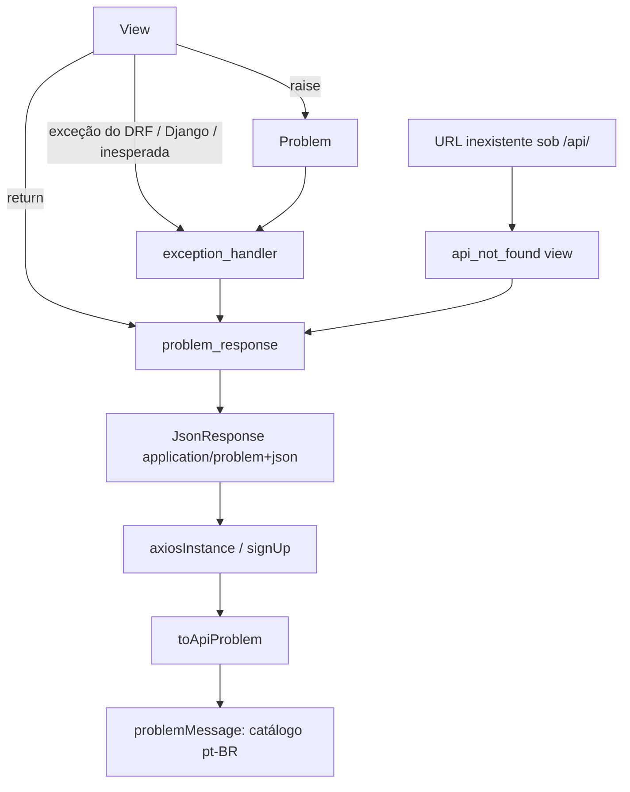

# Erros da API em RFC 9457 Design

**Spec**: `.specs/features/api-problem-details/spec.md`
**Status**: Approved (o usuário pediu a implementação de ponta a ponta, sem gates intermediários)

---

## Architecture Overview

Um módulo único no backend (`hairmatch/problems.py`) é a fonte da verdade do formato. Toda resposta de erro sob `/api/` nasce dele, por três caminhos:

1. A view devolve `problem_response(request, slug, detail, errors)`. É o caminho dos helpers de autenticação, que continuam devolvendo a tupla `(session, error)`.
2. A view ou um helper profundo faz `raise Problem(slug, detail, errors)`. O handler de exceções do DRF renderiza.
3. Erro do framework ou exceção inesperada: o mesmo handler mapeia a exceção para um slug genérico.

Uma view catch-all no fim do `urlpatterns` cobre a URL inexistente sob `/api/`. O app tem um módulo único (`utils/api-problem.ts`) que converte a resposta de erro em `ApiProblem` e traduz o slug em texto pt-BR.



---

## Code Reuse Analysis

### Existing Components to Leverage

| Component | Location | How to Use |
| --------- | -------- | ---------- |
| `authenticated_user`, `authenticated_hairdresser`, `authenticated_customer`, `forbidden` | `backend/users/authentication.py` | Mantêm a tupla de retorno. Só o construtor da resposta troca. Os ~30 call sites não mudam. |
| Exceções de `cognito.py` (`InvalidCredentials`, `InvalidPassword`, `TooManyRequests`...) | `backend/users/cognito.py` | Mapeadas para slugs em `_cognito_error_response`. |
| Exceções de `cep_lookup.py` e `google_auth.py` | `backend/users/` | Mapeadas para slugs nas views. |
| `InvalidImage` | `backend/hairmatch/images.py` | Mapeada para `invalid-image`. |
| `axiosInstance` e o refresh por 401 | `frontend-mobile/services/axios-instance.ts` | Não muda de comportamento (PD-86). |
| `ERROR_MESSAGES` | `frontend-mobile/constants/errorMessages.ts` | O catálogo pt-BR do app reaproveita `cep_not_found` e `cep_lookup_failed`. |

### Integration Points

| System | Integration Method |
| ------ | ------------------ |
| DRF | `REST_FRAMEWORK['EXCEPTION_HANDLER'] = 'hairmatch.problems.exception_handler'` |
| Django URLconf | `re_path(r'^api/', api_not_found)` como último item de `urlpatterns` |
| Chatbot | `create_new_reserve` continua devolvendo `{'error': <pt-BR>}` ao WhatsApp. A constante em português fica no chatbot, e a da API é outra (PD-71). |

---

## Components

### `hairmatch/problems.py` (backend)

- **Purpose**: catálogo de slugs, construção da resposta RFC 9457, exceção `Problem` e handler do DRF.
- **Interfaces**:
  - `CATALOG: dict[str, tuple[int, str]]`: slug → (status, title).
  - `problem_response(request, slug, detail, errors=None, headers=None) -> JsonResponse`
  - `class Problem(Exception)`: `slug`, `detail`, `errors`.
  - `body_error(field, detail)` e `query_error(name, detail)`: itens de `errors`.
  - `validation_problem(errors)`: `Problem('validation-error', ...)`.
  - `json_object(request) -> dict`: parse do corpo, levanta `Problem('malformed-request')`.
  - `exception_handler(exc, context) -> JsonResponse`: trata qualquer exceção, nunca devolve `None`.
  - `api_not_found(request)`: view catch-all.
- **Reuses**: `settings.PROBLEM_TYPE_BASE_URI`.

### Exception handler: mapa de exceções

| Exceção | Slug |
| ------- | ---- |
| `Problem` | o do objeto |
| `ValidationError` (DRF) | `validation-error` |
| `ParseError`, outras 400 do DRF | `malformed-request` |
| `MethodNotAllowed` | `method-not-allowed` |
| `UnsupportedMediaType` | `unsupported-media-type` |
| `NotAuthenticated`, `AuthenticationFailed` | `invalid-session` |
| `PermissionDenied` (DRF ou Django, inclui CSRF) | `forbidden` |
| `NotFound`, `Http404` | `not-found` |
| `Throttled` | `too-many-requests`, com `Retry-After` só se `wait` não é `None` |
| Outra `APIException` 4xx | `malformed-request`, com o status da exceção |
| Qualquer outra | `internal-error` + `logger.error` com método, path e traceback |

### `users/authentication.py` (backend)

- **Purpose**: os helpers de sessão passam a devolver problem+json. `authenticated_user` → 401 `invalid-session` ou 503 `auth-unavailable`. `forbidden(request)` → 403 `forbidden`. Os helpers de perfil → 403 `hairdresser-required` ou `customer-required`.
- **Interface**: `forbidden()` ganha o parâmetro `request` (todos os call sites já têm `request` em escopo).

### `frontend-mobile/utils/api-problem.ts` (app)

- **Purpose**: normalizador único e catálogo pt-BR.
- **Interfaces**:
  - `type ProblemSlug`, `interface ApiProblem { slug, status, detail, errors }`.
  - `toApiProblem(error: unknown): ApiProblem | null`: aceita `AxiosError`, o objeto problem cru (web `signUp`) ou o JSON parseado do `fetch` (native).
  - `problemMessage(error: unknown, fallback: string): string`: texto pt-BR do slug. Sem resposta de rede devolve `Não foi possível conectar ao servidor.`. Slug fora do catálogo ou corpo que não é problem devolve `fallback`. Nunca devolve o `detail`.
- **Reuses**: `axios.isAxiosError`.

---

## Data Models

Sem mudança de modelo ou migração.

```typescript
interface ApiProblem {
  slug: ProblemSlug | string   // último segmento do `type`
  status: number
  detail: string               // só para log, nunca para a UI
  errors: { pointer?: string; parameter?: string; detail: string }[]
}
```

---

## Error Handling Strategy

| Error Scenario | Handling | User Impact |
| -------------- | -------- | ----------- |
| Falha de negócio em view | `return problem_response(...)` com o slug do catálogo | O app mostra o texto pt-BR do slug |
| Campo ausente | `validation-error` com um item em `errors` por campo | O app mostra a mensagem do slug |
| JSON inválido | `json_object` levanta `Problem('malformed-request')` | Mensagem genérica do slug |
| Exceção inesperada em view | Handler devolve 500 `internal-error`, loga traceback | "Ocorreu um erro no servidor..." |
| URL inexistente sob `/api/` | View catch-all devolve 404 `not-found` | Mensagem genérica |
| Exceção fora de view (middleware) | Fora do escopo: o DRF cobre as views e o catch-all cobre o roteamento | Nenhum |

---

## Risks & Concerns

| Concern | Location (file:line) | Impact | Mitigation |
| ------- | -------------------- | ------ | ---------- |
| `str(e)` vazado ao cliente | `availability/views.py`, `review/views.py`, `preferences/views.py`, `hairmatch/ai_clients/gemini_client.py` | PD-06 violado | Os `except Exception` genéricos saem: erro esperado vira slug e o resto vai ao handler central (500 logado). |
| `DEBUG=True` fixo | `hairmatch/settings.py:28` | Django serve página HTML de 404/500 e ignora `handler404`/`handler500` | Sem `handler404`: catch-all no URLconf e handler do DRF. Testes de PD-64/66 rodam com `override_settings(DEBUG=True)`. Ler `DEBUG` do ambiente fica em Deferred Ideas. |
| Renderer do navegador do DRF | `REST_FRAMEWORK` (default) | `Accept: text/html` poderia devolver HTML | O handler devolve `JsonResponse`, não `Response`, então nenhum renderer entra. |
| `CUSTOMER_CONFLICT_MESSAGE` compartilhada com o chatbot | `reserve/views.py:22` | Traduzir a constante muda a mensagem do WhatsApp | Duas constantes (PD-71). O teste do chatbot mantém o assert em português. |
| Bulk de disponibilidade não atômico | `availability/views.py` | Criação parcial | Fora do escopo, em Deferred Ideas. O formato do erro muda, a lógica não. |
| Testes rodam em Python 3.9 no container | `docker exec hairmatch_backend` | Sintaxe nova (`match`, `X \| None`) quebra | Código compatível com 3.9. |

---

## Tech Decisions (only non-obvious ones)

| Decision | Choice | Rationale |
| -------- | ------ | --------- |
| Tipo da resposta | `JsonResponse` com `content_type='application/problem+json'` | Não passa pelos renderers do DRF (o Browsable API devolveria HTML). |
| Rota inexistente | View catch-all em vez de `handler404` ou middleware | `handler404` é ignorado com `DEBUG=True`. A view funciona com qualquer valor. |
| Exceção do DRF | Handler próprio que nunca devolve `None` | O handler padrão devolve `None` para exceção que não é `APIException`, e o Django serve HTML. |
| `forbidden` | Recebe `request` | O `instance` precisa do path. |
| DELETE 204 | `HttpResponse(status=204)` | Sem corpo, e `clear_auth_cookies` funciona sobre ele. |

> **Project-level decision**: registrada como AD-006 em `.specs/STATE.md` (supera o trecho do AD-004 sobre o corpo `{"error"}` do 401).
