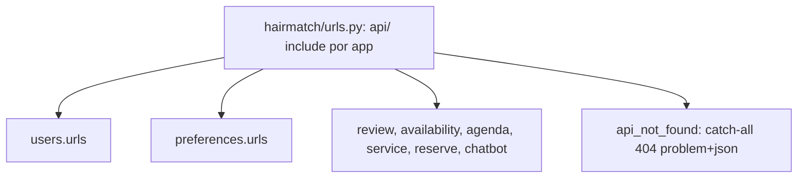

# Rotas da API em RFC 3986 Design

**Spec**: `.specs/features/api-restful-routes/spec.md`
**Status**: Approved (o pedido de implementação da issue #163 aprova o spec e suas assunções)

---

## Architecture Overview

A Route Table do spec é o desenho. Cada app mantém o seu `urls.py`, e todos passam a ser montados em `api/`, sem prefixo por app. As rotas `/hairdressers/{id}/...` atravessam apps, mas cada path tem todos os seus métodos em um só app (`review`, `availability`, `agenda`, `service`), então nada muda de lugar.

Um path com vários métodos é uma classe `APIView` que herda das views atuais, por exemplo `class ServiceDetail(ListService, UpdateService, RemoveService)`. O `Allow` do 405 (RT-53) sai de `allowed_methods` da própria classe, sem dispatcher. Isso exige que os métodos da mesma classe usem o mesmo nome de argumento de URL.

## Code Reuse Analysis

| Component | Location | How to Use |
| --------- | -------- | ---------- |
| Views atuais | `*/views.py` | Herdar em vez de reescrever; o corpo de cada método não muda, salvo o que a coluna "Mudança além do path" lista. |
| `exception_handler` / `api_not_found` | `hairmatch/problems.py` | 404 e 405 em problem+json já existem (AD-006). |
| `query_error` (`{'parameter'}`) | `hairmatch/problems.py:102` | Erro de query string do `available-slots` (RT-64). |
| Nomes de URL (`reverse`) | `*/urls.py` | Mantidos onde a rota mapeia 1:1, então os testes que usam `reverse` seguem o path novo sem edição. |

## Components

- **Login × sessão**: `LoginView.get` (probe de sessão) vira `SessionView` em `auth/session`. `auth/login` fica só com POST.
- **Conta**: `UserInfoCookieView` vira `MeView` (GET, PATCH, DELETE em `users/me`); `put` passa a `patch`. `UserInfoView` (`user/<email>`) é removida (RT-11).
- **Home**: `HomeView` (pública, `home`) e `CustomerHomeView` (`customers/me/home`, sessão de cliente) usam o mesmo montador do corpo.
- **Preferências**: `AssignPreferenceToUser` e `UnnassignPreferenceFromUser` viram `UserPreferenceView` (PUT e DELETE, 204).
- **Slots**: `ReserveSlot.post` vira `get` e lê `request.query_params` (RT-63/64/83).
- **Busca**: lê `q`; corpo sempre `{"data": [...]}` (RT-65).
- **App**: uma constante `REFRESH_PATH`, um normalizador de pathname e a exclusão por igualdade exata (RT-71 a RT-73).

## Risks & Concerns

| Concern | Location | Impact | Mitigation |
| ------- | -------- | ------ | ---------- |
| `reverse()` acompanha o path novo, então ~200 testes existentes não provam a rota | `*/tests.py` | Um path errado passaria sem ser visto | `hairmatch/test_routes.py` compara os `urlpatterns` resolvidos com a Route Table (RT-50). |
| Corte único: o app quebra se sair sem o backend | `frontend-mobile/` | Telas sem dados | Backend e app no mesmo PR e no mesmo release. |
| Webhook do chatbot mudado na Evolution API | fora do repositório | Mensagens perdidas na troca | Passo operacional no README e no PR, com autorização antes do deploy (RT-77). |

## Tech Decisions

| Decision | Choice | Rationale |
| -------- | ------ | --------- |
| Path com vários métodos | Herança múltipla de `APIView` | O `Allow` do 405 vem do DRF sem código novo. |
| Mount dos apps | Todos em `api/` | Uma rota por app inteira, sem mudar de dono. |
