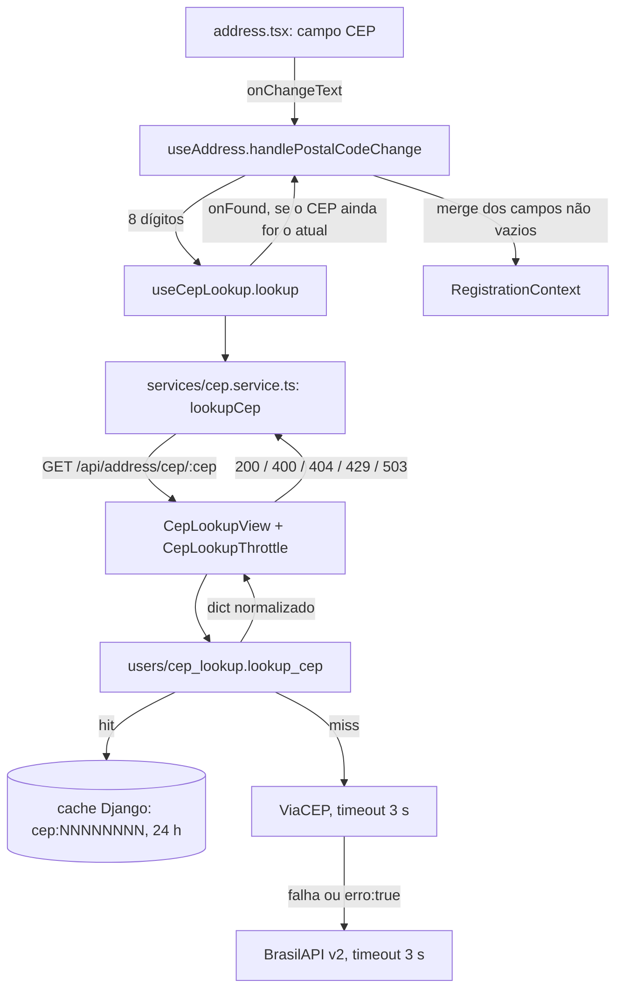

# Preenchimento de Endereço via CEP Design

**Spec**: `.specs/features/cep-autocomplete/spec.md`
**Status**: Draft (aguardando aprovação)

---

## Architecture Overview

O app nunca fala com o provedor. A tela de endereço chama um endpoint anônimo do Django, que:
- normaliza o CEP
- consulta o cache
- tenta o ViaCEP e, se ele falhar, a BrasilAPI v2
- devolve sempre o mesmo formato, com os nomes de campo do modelo `User`

Com os nomes iguais aos do modelo, o app grava a resposta direto no `RegistrationContext`, sem nenhum mapeamento.



---

## Code Reuse Analysis

### Existing Components to Leverage

| Component | Location | How to Use |
| --------- | -------- | ---------- |
| Wrapper de serviço externo com exceção própria | `backend/users/google_auth.py` | Mesmo formato: um módulo com uma função pública e exceções próprias. A view só traduz as exceções em status HTTP. |
| Mock de serviço externo nos testes | `backend/users/tests.py` (`GoogleAuthVerifierTest`, `GoogleAuthViewTest`) | `unittest.mock.patch('users.cep_lookup.requests.get')` nos testes do serviço e `patch('users.views.lookup_cep')` nos da view |
| Padrão de resposta de erro | `backend/users/views.py` (`JsonResponse({'error': ...}, status=...)`) | O endpoint novo devolve erros no mesmo formato |
| `requests` | `backend/requirements.txt` (`requests>=2.31,<3`) | Já é dependência declarada. Não entra pacote novo. |
| Máscara e limpeza de CEP | `frontend-mobile/utils/forms.ts` (`formatCEP`, `stripNonDigits`) | `handlePostalCodeChange` aplica a máscara e conta os dígitos com essas funções |
| Cliente HTTP | `frontend-mobile/services/axios-instance.ts` | `lookupCep` usa essa instância: baseURL do `.env`, timeout de 10 s e log de erro |
| Estado do cadastro | `frontend-mobile/contexts/RegistrationContext.tsx` | O merge do resultado usa `setRegistrationData(prev => ...)` |
| Mensagens | `frontend-mobile/constants/errorMessages.ts` | Ganha `cep_not_found` e `cep_lookup_failed` |

### Integration Points

| System | Integration Method |
| ------ | ------------------ |
| Roteamento Django | Nova linha em `backend/users/urls.py`, sob o prefixo `api/` já incluído em `backend/hairmatch/urls.py:24`. Rota final: `/api/address/cep/<cep>`. |
| Cache | `django.core.cache.cache`. Sem `CACHES` em `settings.py`, o Django usa `LocMemCache`. O throttle do DRF usa o mesmo cache. |
| Banco | Nenhuma mudança. Não há modelo nem migration. |
| Fluxo Google | Nenhuma mudança. `useGoogleAuth` leva à mesma tela de endereço, então o preenchimento vale para os dois fluxos. |

---

## Components

### `users/cep_lookup.py` (backend)

- **Purpose**: Resolver um CEP em endereço normalizado, com cache e fallback entre provedores.
- **Location**: `backend/users/cep_lookup.py`
- **Interfaces**:
  - `lookup_cep(raw_cep: str) -> dict`: devolve `{postal_code, address, neighborhood, city, state}`. Levanta `InvalidCep` (CEP-02), `CepNotFound` (CEP-04) ou `CepServiceUnavailable` (CEP-05).
  - `_fetch_viacep(cep: str) -> dict | None`: devolve `None` quando a resposta tem `erro` (`"true"` ou `True`). Levanta `_ProviderUnavailable` em timeout, erro de conexão, status ≠ 200 ou JSON inválido.
  - `_fetch_brasilapi(cep: str) -> dict | None`: devolve `None` no status 404 e levanta `_ProviderUnavailable` nos demais casos de falha.
  - Constantes do módulo:
    - `VIACEP_URL = 'https://viacep.com.br/ws/{cep}/json/'`
    - `BRASILAPI_URL = 'https://brasilapi.com.br/api/cep/v2/{cep}'`
    - `PROVIDER_TIMEOUT_SECONDS = 3`
    - `CACHE_TTL_SECONDS = 60 * 60 * 24`
- **Algoritmo**:
  1. `digits = re.sub(r'\D', '', raw_cep)`. Se `len(digits) != 8`, levanta `InvalidCep`.
  2. `cache.get(f'cep:{digits}')`. Se houver hit, devolve.
  3. Para cada provedor, em ordem (`viacep`, `brasilapi`):
     - Se o provedor devolve um dict, grava no cache com `CACHE_TTL_SECONDS` e devolve.
     - Se devolve `None`, marca `not_found = True`.
     - Se levanta `_ProviderUnavailable`, faz `logger.warning('CEP provider %s failed: %s', name, reason)`.
  4. Se `not_found`, levanta `CepNotFound`. Senão, levanta `CepServiceUnavailable`.
- **Normalização**: `_clean(value)` devolve `(value or '').strip()`. O mapeamento de cada provedor é:
  - ViaCEP: `logradouro→address`, `bairro→neighborhood`, `localidade→city`, `uf→state`
  - BrasilAPI: `street→address`, `neighborhood→neighborhood`, `city→city`, `state→state`

  `postal_code` recebe os `digits` da entrada, e nenhuma outra chave passa.
- **Dependencies**: `requests`, `django.core.cache`, `logging`
- **Reuses**: o formato de `users/google_auth.py`

### `CepLookupView` + `CepLookupThrottle` (backend)

- **Purpose**: Expor `lookup_cep` como `GET /api/address/cep/<cep>`, anônimo e com rate limit.
- **Location**: `backend/users/views.py` (seção 1, views de autenticação e cadastro, logo depois de `GoogleAuthView`) e `backend/users/urls.py`
- **Interfaces**:
  - `class CepLookupThrottle(AnonRateThrottle)`: `scope = 'cep_lookup'` e `rate = '30/min'`. Definir `rate` direto na classe dispensa `DEFAULT_THROTTLE_RATES` em `settings.py`.
  - `class CepLookupView(APIView)` com `throttle_classes = [CepLookupThrottle]` e `get(request, cep)`. O `get` mapeia:
    - sucesso → 200 com `JsonResponse(dict)`
    - `InvalidCep` → 400
    - `CepNotFound` → 404
    - `CepServiceUnavailable` → 503

    As mensagens são as do spec.
  - Rota: `path('address/cep/<str:cep>', CepLookupView.as_view(), name='cep_lookup')`
- **Dependencies**: `rest_framework.throttling.AnonRateThrottle` e `users.cep_lookup`
- **Reuses**: o padrão `APIView` + `JsonResponse` das views atuais. Não precisa de autenticação: o projeto não define `REST_FRAMEWORK`, então a permissão padrão do DRF é `AllowAny` (CEP-09).

### `services/cep.service.ts` (app)

- **Purpose**: Chamar o endpoint e tipar a resposta.
- **Location**: `frontend-mobile/services/cep.service.ts`
- **Interfaces**:
  - `export type CepAddress = { postal_code: string; address: string; neighborhood: string; city: string; state: string }`
  - `export const lookupCep = async (cep: string): Promise<CepAddress>`. Faz `axiosInstance.get<CepAddress>(`/api/address/cep/${cep}`)` e propaga o erro do axios, cujo `error.response?.status` o hook usa.
- **Reuses**: `services/axios-instance.ts`

### `hooks/authHooks/useCepLookup.ts` (app)

- **Purpose**: Controlar uma consulta por vez, o estado de carregamento, a mensagem e a guarda contra resposta obsoleta.
- **Location**: `frontend-mobile/hooks/authHooks/useCepLookup.ts`
- **Interfaces**:
  - `useCepLookup(): { loading: boolean; message: string; lookup: (digits: string, onFound: (a: CepAddress) => void) => Promise<void>; cancel: () => void }`
  - `lookup`:
    1. Grava `latestCepRef.current = digits`, `loading = true` e `message = ''`.
    2. Espera `lookupCep`.
    3. Se `latestCepRef.current !== digits`, sai sem mexer em nada (CEP-16).
    4. No sucesso chama `onFound`. No 404 grava `message = ERROR_MESSAGES.cep_not_found` (CEP-17). Em qualquer outro erro grava `ERROR_MESSAGES.cep_lookup_failed` (CEP-18).
    5. No `finally`, só se o CEP ainda for o atual, grava `loading = false`.
  - `cancel`: `latestCepRef.current = null`, `loading = false` e `message = ''`. É chamado quando o campo deixa de ter 8 dígitos.
- **Reuses**: o padrão `useRef` de `hooks/customerHooks/useSearch.ts`. Não usa debounce: o gatilho é o 8º dígito, não cada tecla.

### `useAddress.ts` (app, modificado)

- **Purpose**: Ligar o campo CEP à consulta e fazer o merge do resultado.
- **Location**: `frontend-mobile/hooks/authHooks/useAddress.ts`
- **Interfaces** (acrescentadas ao retorno):
  - `handlePostalCodeChange(text: string)`:
    1. `masked = formatCEP(text)` e `handleInputChange('postal_code', masked)`
    2. `digits = stripNonDigits(masked)`
    3. Se `digits.length === 8`, chama `lookup(digits, applyCepAddress)`. Se `digits.length < 8`, chama `cancel()`.

    Não há dedupe por "último CEP consultado". Um ref desses, se não fosse zerado no `cancel`, impediria a nova consulta no caso apagar um dígito e redigitar o mesmo CEP. O `maxLength={9}` e o `formatCEP` já evitam disparos extras, e uma consulta repetida cai no cache do backend.
  - `lastAutofillRef` (`useRef<Partial<CepAddress>>({})`) guarda os valores que o último preenchimento automático gravou.
  - `applyCepAddress(a)`:
    1. Para cada campo `f` em `address`, `neighborhood`, `city` e `state`, calcula dentro do `setRegistrationData(prev => ...)`:
       - `a[f]` quando não vazio
       - senão `''`, se `prev[f] === lastAutofillRef.current[f]`
       - senão `prev[f]`
    2. Atualiza `lastAutofillRef.current` com os valores gravados.
    3. Limpa `errors` desses campos, porque o valor novo pode corrigir um erro já marcado.
    4. Chama `numberInputRef.current?.focus()` (CEP-13, 14, 21).
  - `cepLoading`, `cepMessage` e `numberInputRef` (`useRef<TextInput>(null)`)
  - Remove o literal solto `69020405` em `validateFields` (linha 28).
- **Reuses**: `handleInputChange`, `formatCEP` e `stripNonDigits`

### `address.tsx` (app, modificado)

- **Purpose**: Reordenar o formulário e mostrar o estado da consulta.
- **Location**: `frontend-mobile/app/(auth)/register/address.tsx`
- **Mudanças**:
  - A primeira linha passa a ter o `TextInput` do CEP, com `onChangeText={handlePostalCodeChange}`, e um `ActivityIndicator` quando `cepLoading` (CEP-15, 20).
  - Abaixo dela vem um `<Text>` com `cepMessage` quando não vazio (CEP-17, 18).
  - A linha "Bairro + CEP" vira só "Bairro".
  - O campo Número recebe `ref={numberInputRef}`.
  - Os campos, exceto o CEP, recebem `editable={addressUnlocked}` (CEP-22). `addressUnlocked` nasce `true` só se o CEP já tem 8 dígitos, vira `true` no 8º dígito e nunca volta a `false`. Depois de liberados, ficam editáveis (CEP-19).
- **Reuses**: os estilos de `styles/register/styles/AdressStyle.ts`. Pode ganhar um estilo `cepHint`, que fica no mesmo arquivo de estilo e na mesma tarefa.

---

## Data Models

Nenhuma mudança de modelo ou migration. O contrato do endpoint é:

```typescript
// 200
type CepAddress = {
  postal_code: string;   // 8 dígitos, sem hífen
  address: string;       // "" em CEP geral de cidade
  neighborhood: string;  // "" em CEP geral de cidade
  city: string;
  state: string;         // UF, 2 letras
};
// 400 | 404 | 503
type CepError = { error: string };
// 429: corpo padrão do DRF ({"detail": "..."})
```

---

## Error Handling Strategy

| Error Scenario | Handling | User Impact |
| -------------- | -------- | ----------- |
| CEP com menos ou mais de 8 dígitos no backend | `InvalidCep` → 400, sem chamada externa | O app só chama com 8 dígitos, então na prática não ocorre. Se ocorrer, aparece a mensagem de falha. |
| ViaCEP fora do ar ou lento | `_ProviderUnavailable` + `logger.warning` → BrasilAPI | Nenhum. A consulta leva até 3 s a mais. |
| Os dois provedores fora do ar | `CepServiceUnavailable` → 503 | "Não foi possível buscar o CEP. Preencha o endereço manualmente." |
| CEP inexistente | `CepNotFound` → 404 | "CEP não encontrado. Confira o número ou preencha o endereço manualmente." |
| Rate limit excedido | O DRF responde 429 | A mensagem de falha. O preenchimento manual continua. |
| Backend fora do ar, sem rede ou timeout de 10 s do axios | `lookupCep` rejeita sem `response` | A mensagem de falha |
| Resposta de um CEP antigo chega depois | Descartada pela guarda `latestCepRef` | Nenhum |

---

## Risks & Concerns

| Concern | Location (file:line) | Impact | Mitigation |
| ------- | -------------------- | ------ | ---------- |
| Chamada externa sem timeout, padrão já existente no repo | `backend/chatbot/ai_utils.py:143` | Um worker preso quando o provedor não responde | Não copiar esse padrão. O `timeout=3` é requisito (CEP-06) e tem teste que verifica o argumento. |
| Endpoint anônimo virando relay para os provedores, com risco de o ViaCEP bloquear o IP do servidor | `backend/users/urls.py` (rota nova) | O ViaCEP bloqueia o IP por tempo indeterminado | Throttle de 30/min por IP (CEP-10) e cache de 24 h (CEP-08). A BrasilAPI cobre um bloqueio do ViaCEP. |
| O throttle do DRF identifica o cliente por `REMOTE_ADDR` ou `X-Forwarded-For`, e atrás de ngrok ou proxy todos podem parecer um IP só | `CepLookupThrottle` | Muitos usuários de verdade dividem os 30/min | Aceito no volume atual. Se for problema, configurar `NUM_PROXIES` no `REST_FRAMEWORK`. Isso fica registrado aqui e não vira tarefa. |
| Estado do cache e do throttle vazando entre testes (LocMemCache é por processo) | `backend/users/tests.py` (classes novas) | Testes que passam ou falham conforme a ordem | `cache.clear()` no `setUp` das duas classes novas |
| Literal solto `69020405` | `frontend-mobile/hooks/authHooks/useAddress.ts:28` | É inofensivo, mas é código morto que confunde | Removido em T6 |
| A consulta consome parte do token de cadastro Google (30 min) | `backend/users/auth_tokens.py` (`SIGNUP_TOKEN_TTL`) | Desprezível: no máximo 6 s por consulta | Nenhuma ação |
| O app não tem testes automatizados | `frontend-mobile/package.json` | As regras de UI não têm teste de regressão | Decisão já registrada (gate `tsc` + UAT). A lógica de negócio fica no backend, onde há testes. |

---

## Tech Decisions (only non-obvious ones)

| Decision | Choice | Rationale |
| -------- | ------ | --------- |
| Onde fica o `rate` do throttle | Atributo `rate` na subclasse, sem `DEFAULT_THROTTLE_RATES` | O projeto não tem `REST_FRAMEWORK` em `settings.py`. Criar o bloco só para isso mudaria os padrões de todas as views. |
| Nomes das chaves da resposta | Iguais aos campos de `User` e do `RegistrationContext` | O app faz o merge sem mapeamento. |
| Gatilho da consulta | O 8º dígito, sem debounce | O CEP tem tamanho fixo, e debounce só atrasaria. |
| Cachear 404 | Não | Um CEP recém-criado continua sendo encontrado, e o throttle já contém o abuso. |
| Módulo novo em vez de app Django novo | `users/cep_lookup.py` | Só o cadastro usa. Criar um app `address` seria cerimônia sem ganho. |

Decisão de projeto registrada em `.specs/STATE.md` como **AD-002**: todo acesso a provedor de CEP passa pelo proxy do backend (`users/cep_lookup.py`), com ViaCEP primeiro e BrasilAPI v2 de fallback. A API dos Correios só entra com contrato.
