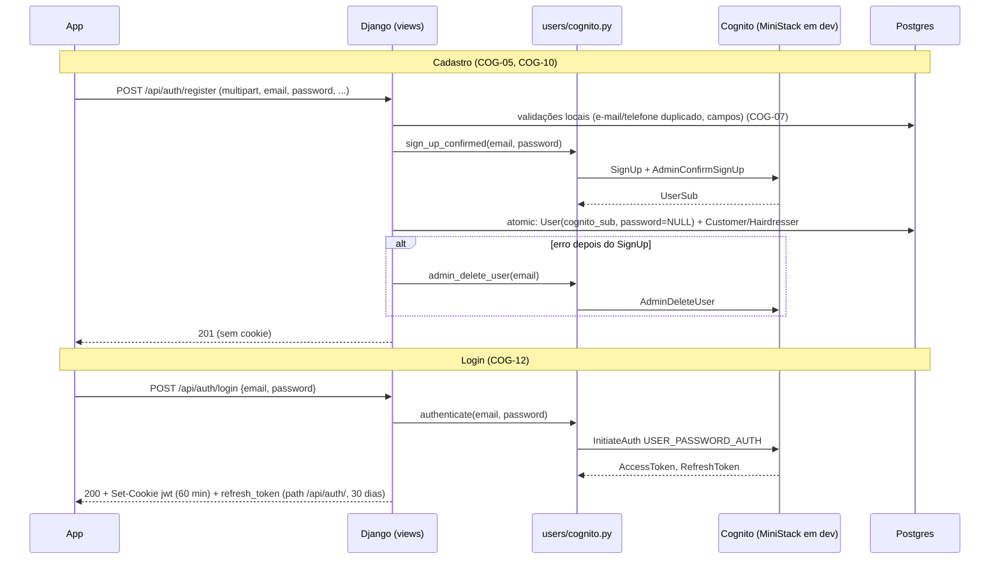
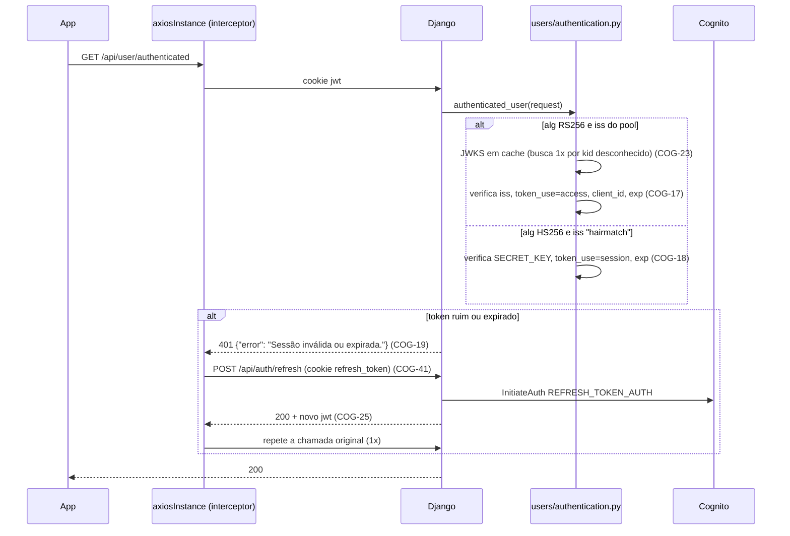

# Autenticação via AWS Cognito Design

**Spec**: `.specs/features/cognito-auth/spec.md`
**Context**: `.specs/features/cognito-auth/context.md`
**Status**: Draft (tasks em `.specs/features/cognito-auth/tasks.md`)

---

## Architecture Overview

O backend faz proxy do Cognito. O app nunca fala com o Cognito: ele manda e-mail e senha ao Django, e o Django guarda os tokens em cookies httpOnly. Cada requisição protegida passa por um autenticador central. Ele verifica localmente o access token do Cognito (RS256 contra o JWKS do pool) ou a sessão própria das contas Google (HS256 com `SECRET_KEY`).





### Abordagens avaliadas

| Abordagem | Prós | Contras | Decisão |
| --------- | ---- | ------- | ------- |
| **Backend faz proxy do Cognito (boto3) e guarda os tokens em cookies httpOnly** | Muda pouco no app. Sem SDK AWS nem módulo nativo novo. Testável no CI com fake. Segue a preferência por boto3. O refresh token nunca fica acessível ao JavaScript. | O backend fica no caminho do login e precisa de throttle/erro próprios. | ✅ Escolhida pelo usuário |
| App fala direto com o Cognito (Amplify / `amazon-cognito-identity-js`) e manda Bearer | Backend só valida. É o padrão da AWS para SPAs. | Módulos nativos novos no Expo 52, pool e client expostos ao app, reescreve login e cadastro e troca cookie por Bearer em todas as chamadas. O endpoint do MiniStack exigiria config extra no app. | ❌ |

### Sessão das contas Google (AD-004)

O fluxo `POST /api/auth/google` fica igual. As contas Google continuam recebendo a sessão emitida pelo backend, que muda de formato:
- **Antes:** `jwt.encode({id, exp, iat}, 'secret', 'HS256')`.
- **Depois:** `jwt.encode({id, iss: "hairmatch", token_use: "session", iat, exp}, settings.SECRET_KEY, 'HS256')`.

O `signup_token` já usa `SECRET_KEY`, mas não tem `iss` nem `token_use`, então o autenticador o recusa (COG-20, preserva GAUTH-14).

---

## Code Reuse Analysis

### Existing Components to Leverage

| Component | Location | How to Use |
| --------- | -------- | ---------- |
| Padrão boto3 com cliente lazy | `backend/hairmatch/storage.py:26-32` (`S3MediaStorage.client`) | Mesmo padrão em `CognitoService._client`. Endpoint, região e credenciais vêm do env padrão do boto3. |
| Troca de backend no modo teste | `backend/hairmatch/settings.py:150-159` (`InMemoryStorage` quando `'test' in sys.argv`) | `COGNITO_USE_FAKE = 'test' in sys.argv` liga o fake de Cognito sem mock por teste. |
| Emissão de cookie e token de cadastro | `backend/users/auth_tokens.py` (`set_session_cookie`, `create_signup_token`, `decode_signup_token`) | Continua sendo o único lugar que escreve cookies de sessão (parte do AD-001 mantida no AD-004). Ganha `set_cognito_cookies`, `set_access_cookie` e `clear_auth_cookies`. |
| Verificador do Google | `backend/users/google_auth.py` | Sem mudança. |
| Validações do cadastro | `backend/users/views.py:47-65` e `_create_role_profile` (`:166-189`) | Rodam antes da chamada ao Cognito (COG-07). |
| Reparo idempotente no seed | `populate_hairdressers.restore_missing_pictures` (`users/management/commands/populate_hairdressers.py:26`) | O mesmo formato serve para `restore_missing_cognito_users` (COG-39). |
| Script de init de nuvem local | `docker/localstack/init/01-resources.sh` | Mesmo estilo (`set -e`, `echo`, idempotente) em `docker/ministack/init/01-cognito.sh`. |
| `loadSession` do app | `frontend-mobile/app/_layout.tsx:57-73` | Usado no boot (COG-45) e depois do refresh. |
| `axiosInstance` | `frontend-mobile/services/axios-instance.ts` | Ganha o interceptor de 401 (COG-41 e COG-42). |

### Integration Points

| System | Integration Method |
| ------ | ------------------ |
| Cognito (AWS ou MiniStack) | `boto3.client('cognito-idp')`. Em dev, o endpoint vem de `AWS_ENDPOINT_URL_COGNITO_IDENTITY_PROVIDER=http://ministack:4566`, definido no compose (botocore 1.43 suporta endpoint por serviço). |
| JWKS | `GET {client.meta.endpoint_url}/{pool_id}/.well-known/jwks.json` com `requests` (já é dependência). Funciona na AWS (`https://cognito-idp.<região>.amazonaws.com/...`) e no MiniStack. |
| Postgres | Novo campo `User.cognito_sub` (migration `0008`). `User.password` continua nullable e sempre nulo para contas novas. |
| LocalStack | Sem mudança (S3 e SES). |
| App | Mesmo contrato de cookies (`jwt`), mais o `refresh_token` e o endpoint `POST /api/auth/refresh`. |

---

## Components

### Backend: `CognitoService` (wrapper boto3)

- **Purpose**: concentrar toda chamada ao Cognito, mapear erros para exceções de domínio e registrar as falhas em log.
- **Location**: `backend/users/cognito.py` (novo)
- **Interfaces**:
  - `get_cognito() -> CognitoService`: singleton por processo. Usa o fake quando `settings.COGNITO_USE_FAKE`.
  - `reset_cognito() -> None`: descarta o singleton e o cache de IDs. Usado nos testes.
  - `CognitoService.pool_id: str` e `CognitoService.client_id: str`: vêm de `settings.COGNITO_USER_POOL_ID` e `COGNITO_APP_CLIENT_ID`. Se estão vazios, são resolvidos uma vez por `ListUserPools` (nome `hairmatch-dev`) e `ListUserPoolClients` (nome `hairmatch-backend`) (COG-03). Se não resolve, levanta `CognitoUnavailable`.
  - `CognitoService.issuer: str`: `https://cognito-idp.{region}.amazonaws.com/{pool_id}` (a região vem de `client.meta.region_name`).
  - `sign_up_confirmed(email, password) -> str` (sub): `SignUp` + `AdminConfirmSignUp`. Se o confirm falha, faz `AdminDeleteUser` antes de propagar.
  - `authenticate(email, password) -> Tokens(access_token, refresh_token)`: `InitiateAuth USER_PASSWORD_AUTH`.
  - `refresh(refresh_token) -> str` (access token): `InitiateAuth REFRESH_TOKEN_AUTH`.
  - `change_password(access_token, old, new) -> None`
  - `revoke(refresh_token) -> None`: `RevokeToken`.
  - `admin_delete_user(email) -> None`: `UserNotFoundException` é engolido (COG-35 e COG-36).
  - `admin_get_sub(email) -> str | None`: `AdminGetUser`, com `None` para `UserNotFoundException` (COG-39).
  - `fetch_jwks() -> dict`: `requests.get(..., timeout=5)`. Erro de rede ou status ≠ 200 levanta `CognitoUnavailable`.
- **Exceções** (todas herdam de `CognitoError`):

  | Exceção | Códigos boto3 |
  | ------- | ------------- |
  | `InvalidPassword` | `InvalidPasswordException` |
  | `UserAlreadyExists` | `UsernameExistsException` |
  | `InvalidCredentials` | `NotAuthorizedException`, `UserNotFoundException` |
  | `TooManyRequests` | `TooManyRequestsException`, `LimitExceededException` |
  | `CognitoUnavailable` | `EndpointConnectionError`, `ConnectTimeoutError`, `ReadTimeoutError`, `InternalErrorException` e qualquer `ClientError` não mapeado |

- **Log**: cada exceção mapeada gera `logger.warning("cognito %s failed: %s", operation, error_code)`, sem argumentos da chamada (COG-49).
- **Dependencies**: `boto3`, `requests`, `django.conf.settings`.
- **Reuses**: o padrão lazy de `hairmatch/storage.py`.

### Backend: `FakeCognitoIdp` (fake para testes)

- **Purpose**: substituir o `boto3.client('cognito-idp')` nos testes, com o mesmo formato de resposta e de erro (`botocore.exceptions.ClientError` com `Error.Code`). Assim o mapeamento de erros e a verificação JWKS rodam de verdade.
- **Location**: `backend/users/cognito_fake.py` (novo)
- **Interfaces**:
  - Métodos boto3: `sign_up`, `admin_confirm_sign_up`, `initiate_auth`, `change_password`, `revoke_token`, `admin_delete_user`, `admin_get_user`, `list_user_pools`, `list_user_pool_clients`, além de `meta.region_name` e `meta.endpoint_url`.
  - `jwks() -> dict`: chave pública RSA gerada uma vez por processo (`cryptography`), com `kid="fake-key-1"`.
  - `make_access_token(sub, **overrides) -> str` e `make_refresh_token(sub) -> str`: usados pelos testes para montar tokens adulterados (outro `iss`, `client_id`, `token_use`, expirado ou chave diferente).
  - `fail_next(operation, error_code_or_exception)`: injeta falhas (COG-10, COG-47, COG-48).
  - `calls: list[tuple[str, dict]]`: registro para os asserts (por exemplo, "`AdminDeleteUser` chamado", "nenhuma chamada").
- **Comportamento**:
  - Aplica a mesma política de senha do pool (COG-08).
  - E-mail sem diferenciar maiúsculas.
  - Refresh token opaco e revogável (COG-28).
  - Access token com os claims do MiniStack e da AWS: `sub`, `iss`, `token_use=access`, `client_id`, `username`, `exp = iat + 3600`.
- **Reuses**: nada. É infraestrutura de teste, mas fica fora de `tests.py` para ser importável por todos os apps.

### Backend: autenticador central

- **Purpose**: único ponto que lê e verifica o cookie `jwt` (COG-17 a COG-24).
- **Location**: `backend/users/authentication.py` (novo)
- **Interfaces**:
  - `authenticate_request(request) -> SessionUser | None`: `SessionUser(user, provider: "cognito" | "google", access_token)`. Devolve `None` para qualquer token ausente ou inválido. Levanta `CognitoUnavailable` só quando o JWKS não pode ser obtido.
  - `authenticated_user(request) -> tuple[SessionUser | None, JsonResponse | None]`: o helper que as views usam. Devolve 401 `{"error": "Sessão inválida ou expirada."}` ou 503 (COG-24).
- **Regras**:
  1. Lê o header sem verificar (`jwt.get_unverified_header`) e o `iss` sem verificar.
  2. Se `iss == cognito.issuer`, exige `alg == "RS256"` e chama `jwt.decode(token, key, algorithms=["RS256"], issuer=cognito.issuer, options={"require": ["exp", "iss", "sub", "token_use", "client_id"]})`. Depois confere `token_use == "access"` e `client_id == cognito.client_id` e busca `User` por `cognito_sub`.
  3. Se `iss == "hairmatch"`, exige `alg == "HS256"` e chama `jwt.decode(token, settings.SECRET_KEY, algorithms=["HS256"], issuer="hairmatch")`. Depois confere `token_use == "session"` e busca `User` por `id` com `is_active=True`.
  4. Qualquer outro `iss`, ou `iss` ausente (formato antigo, `signup_token`), dá `None`.
- **Cache de JWKS**: dict de módulo `{kid: RSAPublicKey}`. Um `kid` desconhecido dispara uma única nova busca na requisição (COG-23).
- **Dependencies**: `PyJWT[crypto]` (`jwt.PyJWK`, `jwt.algorithms.RSAAlgorithm`), `users.cognito`, `users.models.User`.

### Backend: `auth_tokens` (ajustes)

- **Location**: `backend/users/auth_tokens.py` (modificar)
- **Interfaces**:
  - `issue_session_token(user)`: novo formato da sessão Google (AD-004).
  - `set_session_cookie(response, user)`: só o caminho Google. Mesmos atributos de hoje, mais `max_age=3600`.
  - `set_cognito_cookies(response, tokens)`: `jwt` (`max_age=3600`) e `refresh_token` (`path="/api/auth/"`, `max_age=2592000`), ambos `httponly`, `samesite="None"` e `secure`.
  - `set_access_cookie(response, access_token)`: usado no refresh.
  - `clear_auth_cookies(response)`: apaga `jwt` e `refresh_token`, este último com o mesmo `path`.
  - `create_signup_token` e `decode_signup_token`: sem mudança.

### Backend: views de auth (`users/views.py`)

| View | Mudança | Reqs |
| ---- | ------- | ---- |
| `RegisterView.post` (e-mail/senha) | Validações locais primeiro. Depois `sign_up_confirmed` e em seguida `transaction.atomic` com os inserts. Qualquer exceção depois do sign-up chama `admin_delete_user` e devolve o status do erro original. `bcrypt` e `replace(' ', '')` saem. | COG-05 a COG-11 |
| `LoginView.post` | Valida o corpo (400). Checa conta Google (`google_id` preenchido e `cognito_sub` nulo, 403). Depois `authenticate`, busca `User` por `cognito_sub` do access token (verificado pelo autenticador) e `set_cognito_cookies`. Mantém `response.data = {'jwt': ...}`, que os helpers de teste usam. | COG-12 a COG-16 |
| `LoginView.get` | `authenticate_request`. `True`/`False` sempre com 200; `CognitoUnavailable` também vira `False`. | COG-21 |
| `RefreshView.post` (nova, `auth/refresh`, name `refresh`) | Lê o cookie `refresh_token`, chama `refresh` e `set_access_cookie`. Em `InvalidCredentials`, 401 e `clear_auth_cookies`. | COG-25 a COG-27 |
| `LogoutView.post` | Remove a definição duplicada (`:477-483`). Chama `revoke` se há cookie, engole qualquer `CognitoError`, chama `clear_auth_cookies` e devolve 200. | COG-28, COG-29 |
| `ChangePasswordView.put` | `authenticated_user`. Google dá 403. Valida o corpo e chama `change_password(session.access_token, ...)`. `InvalidCredentials` dá 400 "Senha atual incorreta." | COG-30 a COG-34 |
| `UserInfoCookieView.get/put/delete` | `authenticated_user`. `put` recusa `email` diferente (400) antes de alterar qualquer campo. `delete` chama `admin_delete_user` (se há `cognito_sub`), depois `user.delete()` e `clear_auth_cookies`. | COG-22, COG-35, COG-37 |
| `UserInfoView.delete` | `admin_delete_user` antes de `user.delete()` quando há `cognito_sub`. `CognitoUnavailable` dá 503 e mantém a linha. | COG-36 |
| `GoogleAuthView` e `_register_with_google` | Sem mudança de lógica. Passam a emitir a sessão no formato novo, via `set_session_cookie`. | COG-11, COG-18 |

Um handler compartilhado, `_cognito_error_response(exc)`, mapeia as exceções de domínio para `JsonResponse`: `CognitoUnavailable` → 503 e `TooManyRequests` → 429 (COG-47, COG-48). Os mapeamentos específicos de cada rota (400, 401, 409) ficam na própria view.

### Backend: views dos outros apps

- **Location**: `backend/availability/views.py` (`CreateAvailability.post`), `backend/review/views.py` (`CreateReview.post`, `UpdateReview.put`, `RemoveReview.delete`) e `backend/preferences/views.py` (`AssignPreferenceToUser.post`, `UnnassignPreferenceFromUser.post`).
- **Mudança**: trocar o bloco `COOKIES.get('jwt')` + `jwt.decode(..., 'secret')` + `User.objects.filter(id=payload['id'])` por `session, error = authenticated_user(request); if error: return error; user = session.user`. As regras de negócio e os 403 de permissão (por exemplo, "só cabeleireiro") ficam iguais (COG-22).

### Backend: modelo `User`

- **Location**: `backend/users/models.py` (modificar), mais a migration `0008_user_cognito_sub`.
- `cognito_sub = models.CharField(max_length=255, unique=True, null=True, blank=True)`.

### Backend: seed

- **Location**: `backend/users/management/commands/populate_hairdressers.py` (modificar)
- **Mudanças**:
  - Cria cada cabeleireiro com `cognito_sub = get_cognito().sign_up_confirmed(email, SEED_PASSWORD)`, onde `SEED_PASSWORD = "Senha123"`. O `set_password` e a chave `password` saem (COG-38).
  - Novo `restore_missing_cognito_users()`, chamado em todo boot junto com `restore_missing_pictures`. Para `User` com `role="hairdresser"`, `google_id` nulo e e-mail no padrão `^hairdresser\d+_`:
    - se `cognito_sub` é nulo ou `admin_get_sub(email)` dá `None`, chama `sign_up_confirmed` e salva o novo `sub`;
    - se `admin_get_sub(email) != cognito_sub`, salva o `sub` atual.

    Com isso o seed é idempotente (COG-39, COG-40).

### Settings e dependências

- **`backend/hairmatch/settings.py`**:
  - `COGNITO_USER_POOL_ID = os.getenv('COGNITO_USER_POOL_ID', '')`
  - `COGNITO_APP_CLIENT_ID = os.getenv('COGNITO_APP_CLIENT_ID', '')`
  - `COGNITO_USE_FAKE = 'test' in sys.argv`
- **`backend/requirements.txt`**: `PyJWT` → `PyJWT[crypto]` (traz `cryptography`). `bcrypt` sai depois que o último uso sai (COG-06).

### Infra: MiniStack no compose

- **Location**: `docker/docker-compose.yml` (modificar), `docker/ministack/init/01-cognito.sh` (novo), `docker/.env.example` (modificar) e `README.md` (modificar).
- **Serviço**:
  ```yaml
  ministack:
    image: ministackorg/ministack:${MINISTACK_IMAGE_TAG:-latest}
    container_name: hairmatch_ministack
    ports: ["4567:4566"]          # 4566 do host é do LocalStack
    environment:
      MINISTACK_REGION: ${AWS_DEFAULT_REGION:-us-east-2}
      AWS_DEFAULT_REGION: ${AWS_DEFAULT_REGION:-us-east-2}
      AWS_ACCESS_KEY_ID: test
      AWS_SECRET_ACCESS_KEY: test
      PERSIST_STATE: 1
      STATE_DIR: /var/lib/ministack
    volumes:
      - ministack_state:/var/lib/ministack
      - ./ministack/init:/etc/localstack/init/ready.d:ro
    healthcheck:   # só fica healthy quando o pool existe
      test: ["CMD-SHELL", "aws --endpoint-url http://localhost:4566 cognito-idp list-user-pools --max-results 60 | grep -q hairmatch-dev"]
  ```
- **Serviço `django`**:
  - Ganha `depends_on: ministack: condition: service_healthy`.
  - Ganha `AWS_ENDPOINT_URL_COGNITO_IDENTITY_PROVIDER=http://ministack:4566`, `COGNITO_USER_POOL_ID=${COGNITO_USER_POOL_ID}` e `COGNITO_APP_CLIENT_ID=${COGNITO_APP_CLIENT_ID}`.
- **`.env.example`**: ganha `COGNITO_USER_POOL_ID=` e `COGNITO_APP_CLIENT_ID=` (vazios em dev).
- **Init script** (idempotente):
  - Se `list-user-pools` já tem `hairmatch-dev`, sai.
  - Senão, `create-user-pool` com:
    - `--pool-name hairmatch-dev`
    - `--username-attributes email`
    - `--username-configuration CaseSensitive=false`
    - `--policies 'PasswordPolicy={MinimumLength=8,RequireUppercase=true,RequireLowercase=true,RequireNumbers=true,RequireSymbols=false}'`
    - `--auto-verified-attributes email`
  - Depois, `create-user-pool-client` com:
    - `--client-name hairmatch-backend`
    - `--no-generate-secret`
    - `--explicit-auth-flows ALLOW_USER_PASSWORD_AUTH ALLOW_REFRESH_TOKEN_AUTH`
    - `--access-token-validity 60`
    - `--refresh-token-validity 30`
    - `--token-validity-units AccessToken=minutes,RefreshToken=days`
  - Imprime os IDs.
- **README**: nova seção "Cognito local (MiniStack)" com:
  - o motivo (licença `freemium`);
  - a porta 4567;
  - como listar usuários;
  - o código de confirmação fixo `123456`;
  - como zerar (`docker volume rm docker_ministack_state`);
  - a configuração exigida do pool real em produção (mesma política e mesmo client, com os IDs nas env vars).

### App: `axiosInstance` com refresh

- **Location**: `frontend-mobile/services/axios-instance.ts` (modificar)
- **Interfaces**:
  - Interceptor de resposta: em 401 com `config._retry` ausente e URL fora de `AUTH_EXCLUDED = ['/api/auth/login', '/api/auth/refresh', '/api/auth/logout', '/api/auth/google']`:
    - marca `_retry`;
    - aguarda `refreshPromise` (compartilhada entre 401 concorrentes) de `POST /api/auth/refresh`;
    - repete a chamada uma vez (COG-41).
  - Se o refresh falha, chama o handler registrado e rejeita (COG-42).
  - `setSessionExpiredHandler(handler: () => void): void`: o `_layout.tsx` registra a limpeza de estado e o `router.replace('/(auth)/login')`.

### App: contexto de auth (`app/_layout.tsx`)

- **Location**: `frontend-mobile/app/_layout.tsx` (modificar)
- **Mudanças**:
  - `signIn` passa a usar `axiosInstance.post('/api/auth/login', ..., { withCredentials: true })`.
  - `signOut` passa a usar `axiosInstance.post('/api/auth/logout', {}, { withCredentials: true })`, e a limpeza de estado vai para o `finally` (COG-43).
  - O bootstrap passa a ser `loadSession()` → (se não autenticado) `POST /api/auth/refresh` → `loadSession()`, com `isLoading` até terminar (COG-45, COG-46).
  - Saem `AsyncStorage`, `fetchUserInfo` e o header `Bearer`.
  - `setSessionExpiredHandler` é registrado no mount.

### App: serviços com `axios` cru

- **Location**: `frontend-mobile/services/review.service.ts` e `frontend-mobile/services/google-auth.service.ts` (modificar)
- **Mudança**: trocar por `axiosInstance` (COG-44). Em `createReview`, passar `headers: {'Content-Type': 'multipart/form-data'}` nas duas plataformas (ver Risks).

---

## Data Models

### User (alteração)

```python
class User(AbstractUser):
    ...
    password = models.CharField(max_length=255, blank=True, null=True)  # sempre NULL em contas novas
    google_id = models.CharField(max_length=255, unique=True, null=True, blank=True)
    cognito_sub = models.CharField(max_length=255, unique=True, null=True, blank=True)  # novo
```

Toda conta tem exatamente um provedor: `cognito_sub` (e-mail/senha) ou `google_id` (Google). Contas antigas com hash bcrypt e sem `cognito_sub` são descartadas no reset.

### Access token do Cognito (claims verificados)

```json
{"sub": "<uuid>", "iss": "https://cognito-idp.us-east-2.amazonaws.com/<pool_id>",
 "token_use": "access", "client_id": "<app_client_id>", "username": "<uuid|email>",
 "iat": 0, "exp": 0, "scope": "aws.cognito.signin.user.admin", "jti": "..."}
```

### Sessão Google (HS256, `SECRET_KEY`)

```json
{"id": 42, "iss": "hairmatch", "token_use": "session", "iat": 0, "exp": 0}
```

### Contrato `POST /api/auth/refresh` (novo)

| Situação | Resposta | Cookies |
| -------- | -------- | ------- |
| `refresh_token` válido | 200 `{"message": "Session refreshed"}` | novo `jwt` |
| sem cookie | 401 `{"error": "Sessão expirada. Entre novamente."}` | nenhum |
| recusado pelo Cognito | 401 (mesma mensagem) | apaga `jwt` e `refresh_token` |
| Cognito indisponível | 503 | nenhum |
| throttling | 429 | nenhum |

---

## Error Handling Strategy

| Error Scenario | Handling | User Impact |
| -------------- | -------- | ----------- |
| Senha fora da política no cadastro ou na troca | `InvalidPassword` → 400 com a mensagem da política | `ErrorModal` com o texto |
| E-mail já existe (Postgres ou Cognito) | 409, sem linhas e sem usuário órfão | `ErrorModal` |
| Falha depois do `SignUp` | `AdminDeleteUser` + rollback + status original | Pode tentar de novo com o mesmo e-mail |
| Credenciais inválidas | 401 "E-mail ou senha inválidos." | `ErrorModal` no login |
| Conta Google tentando senha | 403 (GAUTH-11) | `ErrorModal` indicando o botão Google |
| Token ausente, inválido ou expirado em rota protegida | 401 | O interceptor faz refresh e repete a chamada, sem o usuário perceber |
| Refresh recusado ou ausente | 401 + cookies apagados | Volta ao login, sem modal |
| Cognito ou JWKS fora do ar | 503 + log WARNING | `ErrorModal` "Serviço de autenticação indisponível..." |
| Throttling do Cognito | 429 | `ErrorModal` "Muitas tentativas..." |
| `RevokeToken` falha no logout | Engolido + log | Logout acontece |

---

## Risks & Concerns

| Concern | Location (file:line) | Impact | Mitigation |
| ------- | -------------------- | ------ | ---------- |
| Chave `'secret'` fixa e decode manual em 13 pontos. Assinatura inválida vira 500. | `users/views.py:222,299,326,353,375`; `availability/views.py:19`; `review/views.py:26,107,142`; `preferences/views.py:33,82`; `users/auth_tokens.py:21` | Sessão forjável por qualquer um que leia o repositório. Erros 500. | Autenticador central (COG-17 a COG-22). O formato antigo é recusado (COG-20). |
| Token revogado continua aceito até expirar | `users/authentication.py` (novo) | Após logout em outro aparelho, o access token vale até 60 min | Risco aceito (edge case no spec). O access token dura 60 min e o refresh é revogado. |
| `sub` muda se o volume do MiniStack for apagado | `docker-compose.yml` (volume `ministack_state`) | Usuários do Postgres ficam sem par no Cognito | `PERSIST_STATE=1` com volume; o seed repara os cabeleireiros do seed (COG-39); o README documenta o reset conjunto (`down -v`). |
| Ordem de boot: seed antes do pool existir | `backend/entrypoint.sh:12` | O seed falha no primeiro boot | O healthcheck do `ministack` só passa quando o pool existe, e o `django` espera com `service_healthy`. A disponibilidade de `aws` e `grep` no container é verificada no T24 (fato não confirmado: o README do MiniStack diz que o `aws` CLI vem incluído). |
| `AWS_ENDPOINT_URL` global aponta para o LocalStack | `docker-compose.yml:59` | O Cognito iria para o LocalStack (sem licença) | Endpoint por serviço `AWS_ENDPOINT_URL_COGNITO_IDENTITY_PROVIDER`. O botocore do projeto é 1.43. O container (Python 3.9) instala o boto3 mais novo que suporta 3.9; o T24 confirma com `boto3.client('cognito-idp').meta.endpoint_url`. |
| `iss` do MiniStack usa o host real da AWS | `ministack/services/cognito.py:766` (upstream) | Nenhum. O `iss` é igual ao de produção. O JWKS vem do endpoint do boto3, e não do `iss`. | `issuer` montado com região + pool. JWKS montado com `client.meta.endpoint_url`. |
| O refresh token do MiniStack é um JWT com `token_use=refresh` | `ministack/services/cognito.py:815` (upstream) | Colocado no cookie `jwt`, passaria na assinatura | `token_use == "access"` é obrigatório (COG-19). O fake gera um caso de teste com esse token. |
| O axios 1.x converte `FormData` em JSON quando o `Content-Type` é `application/json` | `frontend-mobile/services/axios-instance.ts:11` (header padrão) | `createReview` pelo `axiosInstance` mandaria JSON sem a foto | Passar `headers: {'Content-Type': 'multipart/form-data'}` explicitamente em `createReview` (T22) e verificar no UAT. |
| Cerca de 330 testes se autenticam por register → login → `response.data['jwt']` | `users/tests.py:399,483,626`; `preferences/tests.py:54`; `review/tests.py:134`; `availability/tests.py:50` | Quebrariam sem Cognito | O fake é ligado globalmente no modo teste (mesmo padrão do `InMemoryStorage`), e o `LoginView` mantém `response.data['jwt']`. Os testes que montam tokens com `'secret'` (`users/tests.py:538,2028`) passam a usar `FakeCognitoIdp.make_access_token` ou `issue_session_token`. |
| Testes que afirmam 403 ou 200 `{'authenticated': False}` para token ausente ou expirado | `users/tests.py` (`ChangePasswordViewTest`, `UserInfoCookieViewTest`), `review/tests.py`, `preferences/tests.py`, `availability/tests.py` | O contrato muda para 401 | Mudança intencional (Assumptions do spec). Cada tarefa ajusta os asserts do seu app sem remover testes. |
| Seed com `set_password` gera PBKDF2, que o login bcrypt recusa | `populate_hairdressers.py:222` | Hoje o seed não loga | Resolvido por COG-38. |
| `LogoutView` duplicado | `users/views.py:283` e `:477` | A segunda definição sobrescreve a primeira | T12 deixa uma definição só. |
| `signOut` sem `withCredentials` | `frontend-mobile/app/_layout.tsx:121` | No web, o logout não envia nem apaga os cookies | COG-43 (T23). |
| Endpoints sem auth (`UserInfoView.delete` por e-mail, reserve, agenda, service) | `users/views.py:463`; `reserve/views.py:38` | Qualquer um apaga qualquer conta | Fora do escopo (Deferred). COG-36 só mantém o Cognito consistente quando a rota é usada. |

---

## Tech Decisions

| Decision | Choice | Rationale |
| -------- | ------ | --------- |
| Verificar o token localmente ou chamar `GetUser` | Local, via JWKS com cache | Uma chamada de rede por requisição seria cara, e no MiniStack/AWS teria throttling. Custo aceito: revogação só vale na expiração. |
| Qual token vai no cookie `jwt` | AccessToken | É o token feito para autorizar APIs (`token_use=access`). O IdToken tem PII e `aud` em vez de `client_id`. |
| Onde o fake entra | No lugar do `boto3.client` (duck typing), dentro do `CognitoService` | O mapeamento de erros e a verificação JWKS rodam nos testes. Nenhum `patch` por teste. |
| Resolução dos IDs em dev | Busca por nome, com cache por processo | O MiniStack não aceita ID fixo. Em produção as env vars são obrigatórias e dispensam a busca. |
| Contrato de erro de autenticação | 401 `{"error"}` via helper `authenticated_user` | Sinal único para o interceptor. Mantém o formato `JsonResponse` das views, sem exception handler novo do DRF. |
| Porta do MiniStack no host | 4567 | A 4566 é do LocalStack. O app nunca fala com o Cognito, então a porta serve só para debug. |

> **Project-level decisions:** AD-004 (sessão por provedor e autenticador central, supera o AD-001) e AD-005 (Cognito local no MiniStack) em `.specs/STATE.md`.
