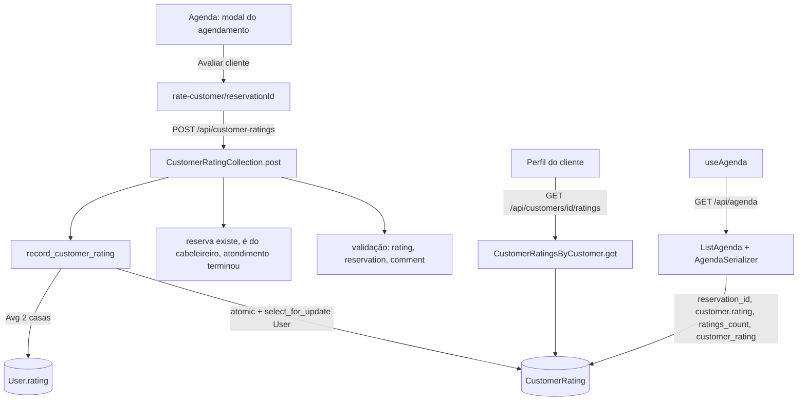

# Nota do cliente Design

**Spec**: `.specs/features/customer-rating/spec.md`
**Context**: `.specs/features/customer-rating/context.md`
**Status**: Approved (abordagem aprovada no plano em 2026-10-09)

---

## Architecture Overview

A feature acrescenta um modelo, `CustomerRating`, ao app `review`. A escrita passa por uma única função de domínio, `record_customer_rating`, que cria a avaliação e recalcula `User.rating` na mesma transação, com a linha do cliente travada. A agenda ganha os campos que o app precisa para chegar à reserva. O app ganha uma tela de avaliação, um bloco no modal da agenda e a média no perfil do cliente.



### Abordagens consideradas

| Abordagem | Veredito |
| --------- | -------- |
| **Modelo novo `CustomerRating` no app `review`, com FK para a reserva** | **Escolhida.** Fica perto de `Review` e reaproveita os helpers de validação de `review/views.py`. A constraint única fica na tabela nova, sem mexer em `Reserve`. |
| Campo de direção (`author_role`) no `Review` | Descartada. `Review` tem foto e um FK de cliente que lá significa o autor, e a ligação com a reserva fica no sentido contrário (`Reserve.review`). Misturar as duas direções confunde as consultas de média e a listagem pública de reviews. |
| App Django novo (`customer_rating`) | Descartada. Duplicaria os helpers de nota e o padrão de views sem trazer isolamento útil. |

---

## Code Reuse Analysis

### Existing Components to Leverage

| Component | Location | How to Use |
| --------- | -------- | ---------- |
| `authenticated_hairdresser`, `authenticated_user`, `forbidden` | `backend/users/authentication.py:56-80` | Autenticação e 403 das rotas novas (AD-004). |
| `problem_response`, `Problem`, `body_error`, `missing_field_errors`, `validation_problem`, `json_object` | `backend/hairmatch/problems.py` | Todo erro em problem+json (AD-006). `json_object` já responde 400 `malformed-request`. |
| `_is_id` | `backend/review/views.py:29` | Validação de `reservation`. |
| `MIN_RATING`, `MAX_RATING` | `backend/review/views.py:26` | Limites da nota. A checagem de inteiro é nova, porque `_rating_error` aceita float. |
| `calculate_end_time` | `backend/reserve/views.py:244` | Fim do atendimento (`start_time + duration`). |
| `ListAgenda` + `reserve_map` | `backend/agenda/views.py:96-123` | Já casa os itens da agenda com as reservas. O `reservation_id` e a avaliação saem do mesmo mapa. |
| `SimpleCustomerSerializer` / `SimpleUserSerializer` | `backend/agenda/serializers.py:8-17` | Ganham `rating` e `ratings_count`. |
| `assert_problem`, `activate_account`, `ReviewsTestCase` (padrão) | `backend/hairmatch/problem_testing.py:10`, `backend/users/testing.py`, `backend/review/tests.py:23-168` | Base dos testes de integração. |
| `ROUTE_TABLE`, `CATALOG` | `backend/hairmatch/test_routes.py:12`, `backend/hairmatch/problems.py:24` | Recebem RT-86, RT-87 e `service-not-finished`. |
| `StarRating` (inline) | `frontend-mobile/app/(app)/customer/review/[id].tsx:36-53` | Sai do arquivo como componente compartilhado. |
| `ConfirmationModal` | `frontend-mobile/components/modals/confirmationModal/ConfirmationModal.tsx` | Confirmação antes do envio (CRT-45). |
| `ErrorModal` + `problemMessage` | `frontend-mobile/components/modals/ErrorModal/ErrorModal.tsx`, `frontend-mobile/utils/api-problem.ts:176` | Erros no app, como em `useServiceManager.ts:57-61`. |
| `axiosInstance` e padrão de service | `frontend-mobile/services/axios-instance.ts`, `frontend-mobile/services/service.service.ts:5-18` | Service novo. |

### Integration Points

| System | Integration Method |
| ------ | ------------------ |
| Postgres | Tabela `review_customerrating` nova. `users_user.rating` muda de `smallint` para `double precision` e passa a aceitar `null` nos clientes. |
| Rotas | `review/urls.py` (montado em `api/`), mais a Route Table do spec `api-restful-routes` e `hairmatch/test_routes.py` (AD-007). |
| Catálogo de erros | `hairmatch/problems.py` `CATALOG`, o spec `api-problem-details` e `frontend-mobile/utils/api-problem.ts` (AD-006). |
| Agenda | O contrato de `GET /api/agenda` e `GET /api/hairdressers/{id}/agenda` ganha campos e não remove nenhum. |
| Sessão do app | Nenhuma mudança. O perfil busca a média pela rota nova, em vez de `userInfo`. |

---

## Components

### `User.rating` (mudança de schema e de dados)

- **Purpose**: guardar a média derivada, com casas decimais e `null` para "sem avaliações".
- **Location**:
  - `backend/users/models.py:31`;
  - `backend/users/migrations/0012_alter_user_rating.py` (schema);
  - `backend/users/migrations/0013_null_customer_ratings.py` (dados);
  - `backend/users/views.py:394` (`_create_role_profile`).
- **Interfaces**:
  - `rating = models.FloatField(blank=True, null=True, default=5)`.
  - A migração de dados roda `User.objects.filter(customer__isnull=False).update(rating=None)` (`RunPython`, com reverse que grava 5). A seleção é pela relação reversa `customer`, nunca por `role`.
  - `_create_role_profile` grava `user.rating = None` (`save(update_fields=['rating'])`) quando cria o `Customer`. Isso cobre os dois caminhos que chamam essa função: o cadastro por e-mail (`:276`) e o Google (`:370`).
- **Dependencies**: nenhuma.
- **Reuses**: o padrão de migração de dados de `0009_dedupe_user_phone.py`.

### `CustomerRating` (modelo)

- **Purpose**: uma avaliação do cliente por reserva.
- **Location**: `backend/review/models.py` e `backend/review/migrations/0004_customerrating.py`.
- **Interfaces**: ver Data Models.
- **Dependencies**:
  - FK `'reserve.Reserve'` por **string**, porque `reserve/models.py` importa `review.models`, e um import direto criaria import circular;
  - `Customer` e `Hairdresser`.
- **Reuses**: o estilo de `Review`.

### `record_customer_rating` (domínio)

- **Purpose**: criar a avaliação e recalcular a média de forma atômica.
- **Location**: `backend/review/customer_ratings.py` (novo).
- **Interfaces**:
  - `record_customer_rating(hairdresser: Hairdresser, reservation: Reserve, rating: int, comment: str | None) -> CustomerRating`:
    ```python
    with transaction.atomic():
        user = User.objects.select_for_update().get(pk=reservation.customer.user_id)
        try:
            with transaction.atomic():  # savepoint: o IntegrityError não envenena a transação de fora
                rating_row = CustomerRating.objects.create(...)
        except IntegrityError:
            raise Problem('review-exists', 'This reservation has already been rated.')
        average = CustomerRating.objects.filter(customer=reservation.customer).aggregate(Avg('rating'))['rating__avg']
        user.rating = round(average, 2)
        user.save(update_fields=['rating'])
    return rating_row
    ```
  - `service_end(reservation) -> datetime | None`: devolve `calculate_end_time(start_time, service.duration)`, ou `None` quando `start_time` é nulo.
- **Dependencies**: `CustomerRating`, `User` e `Problem`.
- **Reuses**: `calculate_end_time`.

### `CustomerRatingCollection` (`POST /api/customer-ratings`, RT-86)

- **Purpose**: endpoint de criação.
- **Location**: `backend/review/views.py` e `backend/review/urls.py` (`path('customer-ratings', ..., name='customer_ratings')`).
- **Interfaces**: `post(request)`, nesta ordem:
  1. `authenticated_hairdresser` (401 ou 403).
  2. `json_object` (400 `malformed-request`).
  3. Validação de todos os campos de uma vez (CRT-11 a CRT-15): `missing_field_errors(['reservation', 'rating'])`, `_is_id`, inteiro de 1 a 5 (`isinstance(v, int) and not isinstance(v, bool)`) e `comment` como `str | None` com até 500 caracteres depois do `strip()`. Depois, `raise validation_problem(errors)`.
  4. `Reserve.objects.select_related('service', 'customer__user').get` (404).
  5. `reservation.service.hairdresser_id != hairdresser.id` (403 `forbidden`).
  6. A pré-checagem `CustomerRating.objects.filter(reservation=...)`.exists() (409 `review-exists`).
  7. `service_end is None or now < service_end` (409 `service-not-finished`).
  8. `record_customer_rating`, que devolve 201 com `{data}`.
- **Dependencies**: `record_customer_rating`.
- **Reuses**: os helpers de `problems.py` e `_is_id`.

### `CustomerRatingsByCustomer` (`GET /api/customers/{id}/ratings`, RT-87)

- **Purpose**: listagem, média e total.
- **Location**: `backend/review/views.py` e `backend/review/urls.py` (`path('customers/<int:customer_id>/ratings', ...)`).
- **Interfaces**: `get(request, customer_id)`:
  1. `authenticated_user` (401).
  2. `Customer` inexistente (404).
  3. Uma sessão de cliente com outro id recebe 403 `forbidden`. Um cabeleireiro passa, mas com o queryset filtrado por `hairdresser=hairdresser`.
  4. `count` vem da contagem de todas as avaliações do cliente, e `average` vem de `customer.user.rating`.
  5. `ratings` usa `select_related('reservation__service', 'hairdresser__user')`, em ordem `-created_at, -id`.
- **Dependencies**: `CustomerRatingSerializer` (em `review/serializers.py`), que monta `{id, rating, comment, created_at, service_name, hairdresser_name}`.
- **Reuses**: o padrão de `ListReserve` (`reserve/views.py:148-159`).

### Agenda (contrato estendido)

- **Purpose**: expor a reserva, a nota do cliente e a avaliação desta reserva (CRT-36 a CRT-38).
- **Location**: `backend/agenda/views.py:96-123` e `backend/agenda/serializers.py`.
- **Interfaces**:
  - Em `ListAgenda`, o queryset de reservas ganha `select_related('customer__user', 'customer_rating')`, o reverso do `OneToOne`. O contexto ganha `ratings_count_by_customer`, um `dict` vindo de **uma** query `CustomerRating.objects.filter(customer_id__in=...).values('customer_id').annotate(n=Count('id'))`.
  - Em `AgendaSerializer`, entram os campos `reservation_id` e `customer_rating`, por `SerializerMethodField` sobre o `reserve_map`.
  - `SimpleUserSerializer` ganha `rating`, e `SimpleCustomerSerializer` ganha `ratings_count`, lido do contexto.
- **Reuses**: o `reserve_map` existente.

### App: types e service

- **Location**: `frontend-mobile/models/CustomerRating.types.ts` (novo), `frontend-mobile/models/Agenda.types.ts` e `frontend-mobile/services/customer-rating.service.ts` (novo).
- **Interfaces**:
  - `CustomerRatingRequest {reservation: number; rating: number; comment?: string | null}`.
  - `CustomerRating {id; rating; comment: string | null; created_at; service_name: string | null; hairdresser_name: string | null}`.
  - `CustomerRatingsSummary {average: number | null; count: number; ratings: CustomerRating[]}`.
  - `AgendaEvent` ganha `reservationId: number | null`, `customer: {id; name; rating: number | null; ratingsCount: number} | null` e `customerRating: {rating; comment} | null`.
  - `createCustomerRating(body): Promise<{data: CustomerRating}>` e `getCustomerRatings(customerId): Promise<{data: CustomerRatingsSummary}>`.
  - Uma função pura `formatCustomerRating(average, count)` em `frontend-mobile/utils/rating.ts` devolve "Sem avaliações" ou "4.3 (3)". O perfil, o modal e a lista a usam.

### App: `StarRating`

- **Location**: `frontend-mobile/components/StarRating/StarRating.tsx` (novo).
- **Interfaces**: `StarRating({rating, onChange?, size?})`. Sem `onChange`, ele vira só leitura, como na lista do P2. A tela `customer/review/[id].tsx` passa a importá-lo, sem mudança visual.

### App: agenda

- **Location**: `frontend-mobile/hooks/hairdresserHooks/useAgenda.ts` e `frontend-mobile/app/(app)/hairdresser/agenda.tsx`.
- **Interfaces**:
  - `useAgenda`:
    - mapeia os campos novos;
    - troca o `useEffect([userInfo])` por `useFocusEffect(useCallback(...))` (CRT-49);
    - expõe `canRate(event)`, que vale `!!event.reservationId && !event.customerRating && now >= event.end`.
  - O modal "Detalhes do Agendamento" (`agenda.tsx:130-149`) ganha o nome do cliente, `formatCustomerRating`, "Sua avaliação: N★" e o botão "Avaliar cliente", que faz `router.push('/(app)/hairdresser/rate-customer/' + reservationId)`.

### App: tela de avaliação

- **Location**:
  - `frontend-mobile/hooks/hairdresserHooks/useRateCustomer.ts` (novo);
  - `frontend-mobile/app/(app)/hairdresser/rate-customer/[reservationId].tsx` (novo);
  - `frontend-mobile/styles/hairdresser/RateCustomerStyles.ts` (novo);
  - `frontend-mobile/app/(app)/hairdresser/_layout.tsx` (`<Tabs.Screen name="rate-customer/[reservationId]" options={{ href: null }} />`).
- **Interfaces**: `useRateCustomer()` devolve `{reservation, rating, setRating, comment, setComment, confirmVisible, openConfirm, closeConfirm, submit, isSubmitting, errorModal, closeError}`.
  - O **nome do cliente** chega pelos parâmetros da rota (`router.push({pathname, params: {reservationId, customerName}})`), a partir do `AgendaEvent`. `GET /api/reservations/{id}` não serve para o nome: `ReserveFullInfoSerializer` devolve `customer` como id solto (`reserve/serializers.py:11-16`). Num refresh do web, os parâmetros somem, e a tela mostra "Cliente".
  - O **serviço e a data** vêm de `getReserveById` (`GET /api/reservations/{id}`, que o cabeleireiro da reserva já pode ler, `_is_reserve_party`).
  - No sucesso, faz `router.back()`. O `useFocusEffect` da agenda recarrega o item (CRT-47).
  - No erro, `problemMessage(error, 'Não foi possível enviar a avaliação.')` abre o `ErrorModal`, e o formulário continua preenchido.

### App: perfil do cliente e lista (P2)

- **Location**:
  - `frontend-mobile/hooks/customerHooks/useCustomerProfile.ts` e `frontend-mobile/app/(app)/customer/profile.tsx:47-50`;
  - `frontend-mobile/hooks/customerHooks/useReceivedRatings.ts` (novo) e `frontend-mobile/app/(app)/customer/ratings.tsx` (novo, `href: null` em `customer/_layout.tsx`).
- **Interfaces**:
  - O perfil chama `getCustomerRatings(customer.id)` em `useFocusEffect` e mostra `formatCustomerRating`, ou "Nota indisponível" se der erro.
  - O menu ganha "Avaliações recebidas", que leva para `ratings.tsx`.

---

## Data Models

### `CustomerRating`

```python
class CustomerRating(models.Model):
    reservation = models.OneToOneField(
        'reserve.Reserve', on_delete=models.SET_NULL, null=True, blank=True,
        related_name='customer_rating',
    )
    customer = models.ForeignKey(Customer, on_delete=models.CASCADE, related_name='received_ratings')
    hairdresser = models.ForeignKey(
        Hairdresser, on_delete=models.SET_NULL, null=True, blank=True, related_name='given_ratings',
    )
    rating = models.PositiveSmallIntegerField()
    comment = models.TextField(blank=True, null=True)
    created_at = models.DateTimeField(auto_now_add=True)

    class Meta:
        constraints = [
            models.CheckConstraint(condition=Q(rating__gte=1) & Q(rating__lte=5), name='customer_rating_1_to_5'),
        ]
```

**Relationships**:
- O `OneToOne` com a reserva gera o índice único que sustenta o CRT-06. No Postgres, vários `NULL` não violam o índice, então várias avaliações podem ficar com `reservation = null` (CRT-24).
- A média é calculada sobre `customer`, e não sobre a reserva. Por isso a avaliação de uma reserva apagada continua na média.

### `User.rating`

| Antes | Depois |
| ----- | ------ |
| `PositiveSmallIntegerField(blank=True, null=True, default=5)` | `FloatField(blank=True, null=True, default=5)` |
| Cliente: 5 fixo | Cliente: `null` ou a média com 2 casas |
| Cabeleireiro: 5 ou o valor do seed (o float era truncado) | Cabeleireiro: o mesmo valor, sem recálculo nesta feature |

---

## Error Handling Strategy

| Error Scenario | Handling | User Impact |
| -------------- | -------- | ----------- |
| Sem sessão ou sessão vencida | 401 `invalid-session` (`authenticated_*`) | O `axiosInstance` tenta o refresh. Se falhar, a sessão expira. |
| Cliente chama o POST | 403 `hairdresser-required` | Não acontece pelo app. |
| Reserva de outro cabeleireiro | 403 `forbidden` | "Você não tem permissão…" (catálogo do app). |
| Reserva inexistente | 404 `not-found` | Texto genérico do catálogo. |
| Entrada inválida | 400 `validation-error` com `errors[].pointer` | O app impede pela UI: estrelas obrigatórias e `maxLength`. |
| Corpo não é JSON | 400 `malformed-request` (`json_object`) | Não acontece pelo app. |
| Atendimento não terminou | 409 `service-not-finished` | "O atendimento ainda não terminou." |
| Já avaliada (pré-checagem ou `IntegrityError`) | 409 `review-exists` | "Esta reserva já foi avaliada." |
| Falha inesperada | 500 `internal-error` (`exception_handler`, AD-006), sem linha gravada (transação) | `ErrorModal` com o texto genérico. O formulário continua preenchido. |
| Falha no GET do perfil | O app mostra "Nota indisponível" | O resto do perfil funciona. |

---

## Risks & Concerns

| Concern | Location (file:line) | Impact | Mitigation |
| ------- | -------------------- | ------ | ---------- |
| Agenda e reserva casadas por `(service_id, start_time)`, sem FK | `backend/agenda/views.py:98-109` | Um item da agenda pode apontar para a reserva errada se duas reservas do mesmo serviço tiverem o mesmo instante. | Hoje o slot impede isso (`slot-unavailable`). O `reservation_id` sai do mesmo mapa, e o POST confere de novo o dono e o horário no servidor. A FK de verdade fica para RF10 e o spike de timezone. |
| Import circular `reserve` ↔ `review` | `backend/reserve/models.py:3` | Importar `Reserve` em `review/models.py` quebra o carregamento dos apps. | FK por string (`'reserve.Reserve'`). Em `customer_ratings.py`, o tipo da reserva fica só na anotação ou é importado dentro da função. |
| Um `IntegrityError` dentro do `atomic` de fora invalida a transação | `backend/review/customer_ratings.py` (novo) | Sem o savepoint, o `raise Problem` depois do erro faria a próxima query falhar com `TransactionManagementError`. | Usar um `atomic()` aninhado (savepoint) em volta do `create`, coberto pelo teste do CRT-06. |
| Nota do cabeleireiro muda de tipo junto | `backend/users/models.py:31` | O app formata a nota do cabeleireiro com `toFixed` em `customer/search.tsx:66` e mostra o valor cru nos perfis. | Com `FloatField`, o JSON continua numérico. O valor do cabeleireiro nunca é `null` nesta feature, e o default 5 continua. O CRT-23 testa o tipo. |
| `role` gravado como `'customer'`, mas as choices dizem `'CUSTOMER'` | `backend/users/models.py:42`, `backend/users/views.py:673` | Uma migração que filtrasse por `role` pularia contas. | Selecionar pela relação `customer__isnull=False` (CRT-22). |
| A agenda busca só no mount | `frontend-mobile/hooks/hairdresserHooks/useAgenda.ts:22-43` | Depois de avaliar, o modal mostraria o botão de novo. | `useFocusEffect` (CRT-49), com o `router.back()` da tela de avaliação disparando o refetch. |
| A review do cliente não valida o horário no backend | `backend/review/views.py:53-113` | Lacuna de RF22: um cliente pode avaliar antes do atendimento por chamada direta. | Fora do escopo. Fica registrada em Deferred Ideas no `context.md`. |
| Feature `external-appointment` (#113) planejada em paralelo, com specs não versionadas | `.specs/features/external-appointment/tasks.md` | Ela move `agenda.tsx` para `agenda/index.tsx`, põe `useFocusEffect` em `useAgenda`, estende `Agenda.types.ts`, `AgendaSerializer` e `ListAgenda` (`service` nulo e `title`) e reserva o número AD-009. | Esta feature usa o AD-010. Se o #113 entrar antes, T7, T11 e T12 partem do código dele: preservam `title` e `isExternal`, editam `agenda/index.tsx` e mantêm o `useFocusEffect` dele. Um item com `service` nulo nunca tem reserva, então cai no CRT-37. |
| O app não tem testes automatizados | `frontend-mobile/` | Uma regressão de UI só aparece no UAT. | `formatCustomerRating` e `canRate` são funções puras, fáceis de conferir no UAT. O gate é `tsc` + UAT (T18). |
| Relógio do aparelho diferente do servidor | `useAgenda.canRate` | O botão aparece cedo ou tarde demais. | O servidor decide (CRT-03), e o app mostra o texto do slug (CRT-48). |

---

## Tech Decisions

| Decision | Choice | Rationale |
| -------- | ------ | --------- |
| Onde mora o modelo | `CustomerRating` no app `review` | Reaproveita helpers e testes. Ver Abordagens. |
| Tipo de `User.rating` | `FloatField` | Um `Decimal` sai como string no JSON e quebra o app. Um inteiro trunca a média. |
| Concorrência da média | `select_for_update` na linha `User` + `Avg` na mesma transação | Serializa só as avaliações do mesmo cliente. Um `UPDATE … SET rating = (SELECT AVG…)` também resolveria, mas não devolve a linha criada com o mesmo tratamento do `IntegrityError`. |
| Duplicado | Pré-checagem + constraint única + savepoint | A pré-checagem dá a resposta comum sem exceção, e a constraint garante o caso de corrida. |
| Avaliação de reserva apagada | `SET_NULL` | Cancelar não pode servir para apagar uma nota. |
| Segmentos das rotas | `customer-ratings`, `customers/{id}/ratings` | Plural, sem verbo e com o filho sob o pai (AD-007). `SINGULAR_SEGMENTS` não muda. |

> **Project-level:** o AD-010 entra em `.specs/STATE.md`. `User.rating` é um valor derivado, recalculado na escrita, em transação, com lock, como `FloatField` e com `null` para "sem avaliações".
