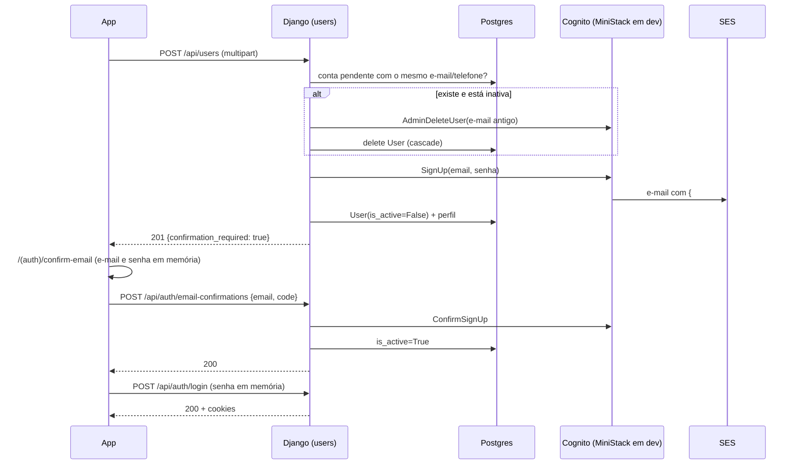
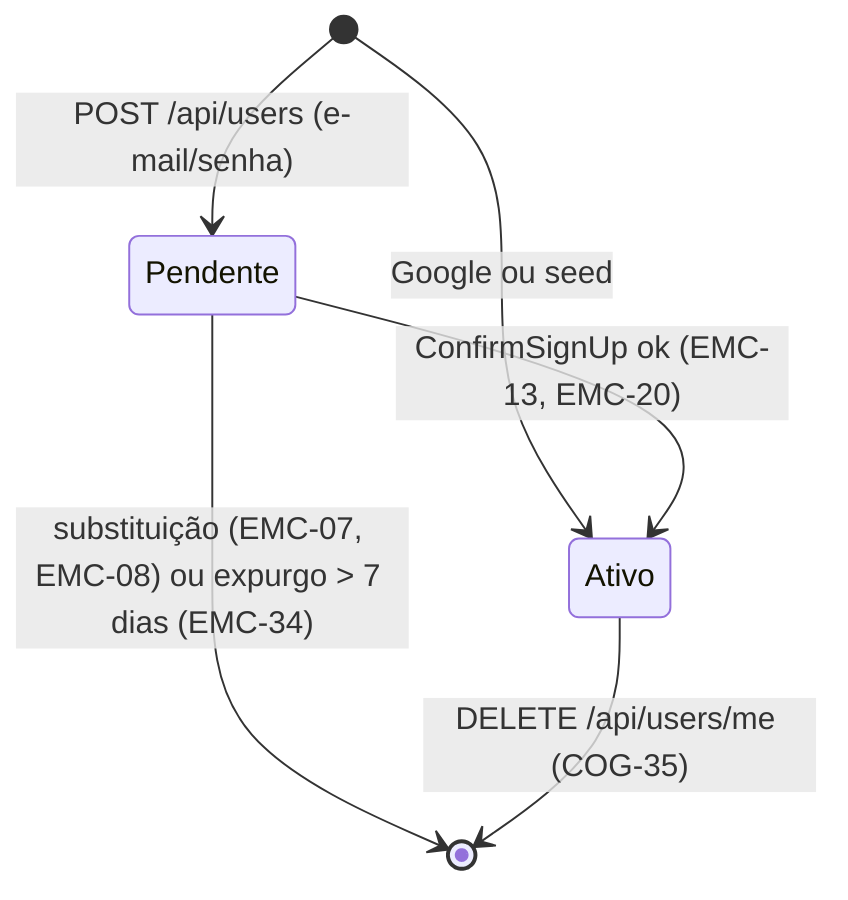

# Confirmação de e-mail no cadastro Design

**Spec**: `.specs/features/email-confirmation/spec.md`
**Context**: `.specs/features/email-confirmation/context.md`
**Status**: Draft

---

## Architecture Overview

A arquitetura do AD-004 não muda. O app fala só com o Django, e o Django fala com o Cognito por boto3 (`backend/users/cognito.py`). O Cognito gera o código e o entrega por e-mail: em produção pelo SES do projeto (`EmailConfiguration` `DEVELOPER`), em dev pelo SES embutido do MiniStack.

O backend:
- deixa de chamar `AdminConfirmSignUp` no cadastro;
- passa a expor duas rotas anônimas, confirmar e reenviar;
- usa `User.is_active` como espelho do estado do Cognito.

O espelho no Postgres tem dois motivos:
- o autenticador já recusa usuário inativo;
- o MiniStack não recusa `UNCONFIRMED` no login.

Fluxos laterais:
- **Reenvio:** `POST /api/auth/confirmation-codes` chama `ResendConfirmationCode` só se existe uma conta pendente, e sempre responde 202.
- **Login de conta pendente:** responde 403 `email-not-confirmed`, e o app abre a tela de confirmação.
- **Expurgo:** `purge_unconfirmed_users` roda no boot e chama `AdminDeleteUser` antes de apagar a linha.

---

## Code Reuse Analysis

### Existing Components to Leverage

| Component | Location | How to Use |
| --------- | -------- | ---------- |
| `CognitoService._call`, `_ERRORS_BY_CODE`, `_log` | `backend/users/cognito.py:46-53,208-222` | Os métodos novos passam por `_call`, e os códigos novos entram na tabela. O log WARNING sem segredo (COG-49) vem de graça. |
| `CognitoService.sign_up_confirmed` | `backend/users/cognito.py:109-126` | Vira `sign_up()` + `admin_confirm_sign_up` com compensação, e só o seed o usa. |
| `CognitoService.admin_delete_user`, `admin_get_sub` | `backend/users/cognito.py:157-175` | São a base da substituição, do expurgo e do `admin_get_status`. |
| `FakeCognitoIdp` (`fail_next`, `calls`, `UserNotConfirmedException` no `initiate_auth`) | `backend/users/cognito_fake.py:66,112,197` | Ganha `confirm_sign_up` e `resend_confirmation_code`, com o código guardado por usuário. |
| `_discard_cognito_user` | `backend/users/views.py:147` | É a compensação de COG-10, reaproveitada em EMC-12. |
| `RegisterThrottle`, `LoginThrottle` (`AnonRateThrottle`) | `backend/users/views.py:160-168` | É o padrão do throttle por IP das rotas novas (rate na classe). |
| `problem_response`, `validation_problem`, `missing_field_errors`, `CATALOG` | `backend/hairmatch/problems.py` | Monta todo erro novo (AD-006). |
| `_cognito_error_response` | `backend/users/views.py:76-79` | Faz o mapeamento de `TooManyRequests` para 429 e de qualquer outro erro para 503 nas rotas novas. |
| `authenticated_user` (filtro `is_active=True`) | `backend/users/authentication.py:111,130` | Já garante EMC-27 e só ganha teste. |
| `normalize_phone` | `backend/users/views.py` (helper atual) | Faz a busca de telefone pendente em EMC-08. |
| `HairmatchTestRunner` (`reset_cognito` + `cache.clear()` por teste) | `backend/hairmatch/test_runner.py` | Isola as contagens de throttle e o fake entre testes, e funciona igual com o `DatabaseCache`. |
| Helpers `assert_throttled`, `assert_auth_unavailable` | `backend/users/tests.py:1957-2000` | Servem às asserções de 429 e 503 das rotas novas. |
| `problemMessage`, `toApiProblem`, `PROBLEM_MESSAGES` | `frontend-mobile/utils/api-problem.ts` | Mostram os slugs novos no app. |
| `REFRESH_EXCLUDED` | `frontend-mobile/services/auth-routes.ts` | Recebe as rotas anônimas novas. |
| `RegistrationContext` (já guarda `email` e `password` em memória) | `frontend-mobile/contexts/RegistrationContext.tsx` | Ganha `pendingConfirmation` `{email, password?}`. |
| `axiosInstance` | `frontend-mobile/services/axios-instance.ts` | É o cliente das chamadas novas (COG-44). |

### Integration Points

| System | Integration Method |
| ------ | ------------------ |
| Cognito (`cognito-idp`) | boto3 por `CognitoService`, com as operações novas `ConfirmSignUp`, `ResendConfirmationCode` e `AdminGetUser` (status) |
| SES | Indireto: o Cognito envia. Nenhum código do backend chama o SES. Em produção, a ligação é a `EmailConfiguration` do pool (operacional). |
| Postgres | `User.is_active` (já existe) e a tabela de cache `hairmatch_cache` (`createcachetable`) |
| MiniStack | `docker/ministack/init/01-cognito.sh`: template de verificação, `PreventUserExistenceErrors` e reconcile de pool existente |
| Route Table (AD-007) | 2 linhas novas no spec `api-restful-routes` e no `ROUTE_TABLE` de `hairmatch/test_routes.py` |
| Catálogo de problemas (AD-006) | 3 slugs novos em 4 lugares |

---

## Components

### `CognitoService` (métodos e exceções novos)

- **Purpose**: Expor o ciclo de confirmação do Cognito com erros de domínio.
- **Location**: `backend/users/cognito.py`
- **Interfaces**:
  - `sign_up(email: str, password: str) -> str`: chama `SignUp` e devolve o `UserSub`. Não confirma.
  - `sign_up_confirmed(email, password) -> str`: chama `sign_up` + `admin_confirm_sign_up`, com a compensação atual. Só o seed o usa.
  - `confirm_sign_up(email: str, code: str) -> None`: chama `ConfirmSignUp`.
  - `resend_confirmation_code(email: str) -> None`: chama `ResendConfirmationCode`.
  - `admin_get_status(email: str) -> str | None`: devolve o `UserStatus` do `AdminGetUser`, ou `None` se o usuário não existe.
- **Exceções novas** (subclasses de `CognitoError`):

  | Código boto3 | Exceção de domínio |
  | ------------ | ------------------ |
  | `CodeMismatchException` | `InvalidConfirmationCode` |
  | `ExpiredCodeException` | `ExpiredConfirmationCode` |
  | `UserNotConfirmedException` | `UserNotConfirmed` |
  | `TooManyFailedAttemptsException` | `TooManyRequests` (já existe) |

  No `resend_confirmation_code`, `InvalidParameterException` (que pela tabela global vira `CognitoUnavailable`) é traduzido localmente para `ResendRejected`. O código exato do Cognito para "usuário já confirmado" não foi conferido na AWS real, por isso a view decide pelo `admin_get_status`.

  No `confirm_sign_up`, `NotAuthorizedException` vira `AlreadyConfirmed`. A tabela global mapeia esse código para `InvalidCredentials`, então o método traduz localmente: captura `InvalidCredentials` e levanta `AlreadyConfirmed`.
- **Dependencies**: boto3, `settings.COGNITO_*`.
- **Reuses**: `_call`, `_username` (e-mail em minúsculas), `_log`.

### `FakeCognitoIdp` (extensão)

- **Purpose**: Emular as regras de código que o MiniStack não emula.
- **Location**: `backend/users/cognito_fake.py`
- **Interfaces**:
  - `sign_up` guarda `code` (6 dígitos aleatórios) e `code_expires_at` (agora + 24 h) no usuário.
  - `confirm_sign_up(ClientId, Username, ConfirmationCode)`:
    - usuário inexistente: `CodeMismatchException` (com `PreventUserExistenceErrors`);
    - já `CONFIRMED`: `NotAuthorizedException`;
    - código vencido: `ExpiredCodeException`;
    - código diferente: `CodeMismatchException`;
    - código certo: passa o usuário a `CONFIRMED`.
  - `resend_confirmation_code(ClientId, Username)`:
    - gera um código novo e um prazo novo, o que invalida o anterior;
    - usuário inexistente responde como entregue;
    - usuário `CONFIRMED` levanta `InvalidParameterException`.
  - `confirmation_code(email) -> str` e `expire_code(email)` são helpers de teste.
- **Reuses**: `fail_next`, `calls`, `_users`.

### Throttles por e-mail

- **Purpose**: Limitar por e-mail alvo, independente do IP (EMC-29, EMC-31, EMC-32).
- **Location**: `backend/users/throttles.py` (novo). Os throttles por IP das rotas novas também ficam aqui.
- **Interfaces**:
  - `class EmailRateThrottle(SimpleRateThrottle)`: `get_cache_key(request, view)` devolve `f'throttle_{scope}_{sha256(email_normalizado)}'`, ou `None` se o corpo não tem e-mail.
    - O e-mail vem de `request.data.get('email')`, sem espaços nas pontas e em minúsculas.
    - O hash evita gravar o e-mail em claro na tabela de cache.
  - Por e-mail:
    - `ConfirmEmailThrottle(EmailRateThrottle)`: `10/hour`.
    - `ResendCodeEmailThrottle(EmailRateThrottle)`: `3/hour`.
    - `RegisterEmailThrottle(EmailRateThrottle)`: `3/hour`.
  - Por IP (`AnonRateThrottle`):
    - `ConfirmIpThrottle`: `10/min`.
    - `ResendCodeIpThrottle`: `10/hour`.
- **Dependencies**: `CACHES['default']`, `REST_FRAMEWORK['NUM_PROXIES']` (já configurado).
- **Reuses**: o handler de `exceptions.Throttled` em `problems.py:181-183` (429 com `Retry-After`).
- **Nota**: o `RegisterEmailThrottle` só conta o cadastro por e-mail/senha. No caminho Google, o e-mail vem do token, e não do corpo, então `get_cache_key` devolve `None` quando há `google_signup_token`.

### `RegisterView` (mudanças)

- **Purpose**: Criar a conta pendente e substituir a conta pendente que conflita.
- **Location**: `backend/users/views.py:171-238`
- **Mudanças**:
  1. `throttle_classes = [RegisterThrottle, RegisterEmailThrottle]`.
  2. Duplicidade por `User.objects.filter(email__iexact=email)`:
     - `User` ativo responde `email-taken`;
     - `User` inativo com `cognito_sub` entra em `stale`.
  3. Telefone, pelo mesmo critério:
     - `User` ativo responde `phone-taken`;
     - `User` inativo com `cognito_sub` também entra em `stale`.
  4. Para cada conta em `stale`, `_replace_pending_account(user)`:
     - chama `get_cognito().admin_delete_user(user.email)`; se o Cognito estiver indisponível, responde 503 sem apagar nada (EMC-11);
     - depois chama `user.delete()`.
  5. `sign_up(email, password)` no lugar de `sign_up_confirmed`. Se vier `UserAlreadyExists` e não houver `User` com o e-mail, chama `admin_get_status(email)`:
     - `UNCONFIRMED`: `admin_delete_user` mais um novo `sign_up`, uma única vez (EMC-10);
     - qualquer outro status: `email-taken`.
  6. `User.objects.create(..., is_active=False)`.
  7. Resposta 201 `{"message": ..., "confirmation_required": True}`.
- **Reuses**: `_discard_cognito_user`, `_create_role_profile`, `_cognito_error_response`.
- No caminho Google (`_register_with_google`), `is_active` fica no padrão `True`. A substituição da conta pendente está descrita na seção do `GoogleAuthView`.

### `GoogleAuthView` e `_register_with_google` (mudanças)

- **Purpose**: Impedir que o Google herde uma conta pendente (EMC-52, EMC-53, EMC-55).
- **Location**: `backend/users/views.py:240-298` (`_register_with_google`) e `:421-428` (`GoogleAuthView`).
- **Problema atual**: quando nenhum `User` tem o `google_id`, o `GoogleAuthView` acha o `User` por `email__iexact` e grava o `google_id` nele, sem olhar o estado da conta. Com contas pendentes, a vítima herdaria a conta criada pelo bot (e a senha dele).
- **Mudanças**:
  - `GoogleAuthView`: se o `User` achado por e-mail tem `is_active=False` e `cognito_sub`, chamar `_replace_pending_account(user)` e seguir como `user = None`, o que emite o `signup_token`. Se o Cognito estiver indisponível, responder 503 sem vincular nada.
  - `_register_with_google`: antes dos checks de 409, substituir a conta pendente que tenha o e-mail do token ou o telefone normalizado. Conta ativa continua respondendo 409.
- **Reuses**: `_replace_pending_account` (o mesmo helper do `RegisterView`).

### `EmailConfirmationView`

- **Purpose**: `POST /api/auth/email-confirmations`.
- **Location**: `backend/users/views.py` (seção 1, views de autenticação), rota em `backend/users/urls.py`.
- **Fluxo**:
  1. Validação:
     - `missing_field_errors(data, ['email', 'code'])`;
     - o `code` precisa casar com `^\d{6}$`; se não casar, o erro aponta para `/code`;
     - qualquer erro responde `validation_problem` (EMC-17).
  2. `user = User.objects.filter(email__iexact=email, cognito_sub__isnull=False).first()`:
     - sem usuário: 400 `invalid-confirmation-code` (EMC-16);
     - usuário já ativo: 200 (EMC-18).
  3. `confirm_sign_up(user.email, code)`:
     - sucesso ou `AlreadyConfirmed`: `user.is_active = True`, `save(update_fields=['is_active'])` e 200 (EMC-13, EMC-20);
     - `InvalidConfirmationCode`: 400 (EMC-14);
     - `ExpiredConfirmationCode`: 400 `confirmation-code-expired` (EMC-15);
     - outros `CognitoError`: `_cognito_error_response`, que dá 429 ou 503 (EMC-19, EMC-48).
- **Throttles**: `[ConfirmIpThrottle, ConfirmEmailThrottle]`.
- **Parser**: JSON, como o `LoginView`.

### `ConfirmationCodeView`

- **Purpose**: `POST /api/auth/confirmation-codes`.
- **Location**: `backend/users/views.py`, rota em `backend/users/urls.py`.
- **Fluxo**:
  1. Validação do campo `email` (EMC-23).
  2. Busca `User` por `email__iexact`, com `cognito_sub` preenchido e `is_active=False`. Se existe, chama `resend_confirmation_code(user.email)`.
  3. Se o Cognito responder `ResendRejected`, consulta `admin_get_status(user.email)`. Com `CONFIRMED`, ativa o `User` (EMC-54); com qualquer outro status, responde 503.
  4. Responde 202 `{"message": "If the account is pending confirmation, a new code was sent"}` (EMC-21, EMC-22, EMC-54).
  5. Qualquer outro `CognitoError` vai para `_cognito_error_response` (429 em EMC-24, 503 em EMC-48).
- **Throttles**: `[ResendCodeIpThrottle, ResendCodeEmailThrottle]`.

### `LoginView` (mudança)

- **Location**: `backend/users/views.py:344-377`
- **Mudanças**:
  - `UserNotConfirmed` responde 403 `email-not-confirmed` (EMC-25).
  - Depois de `authenticate()` e `authenticate_token()`, se o `User` do `sub` existe com `is_active=False`, responde 403 `email-not-confirmed` sem cookie. Esse é o caso do MiniStack.
  - Hoje um `sub` sem `User` ativo cai em `invalid-credentials`. A nova checagem vem antes, por `User.objects.filter(cognito_sub=sub, is_active=False).exists()`.

### Listagens

- **Location**: `backend/users/views.py:589` (`GlobalSearchView`), `:609-612` (`_home_response`, por preferência) e `:650-654` (`CustomerHomeView`, "para você").
- **Mudança**: incluir `is_active=True` no filtro de `User` antes do `[:10]` e usar `Hairdresser.objects.filter(user__is_active=True)` na busca global. O filtro precisa vir **antes** do slice para não encolher a lista da home.

### Command `purge_unconfirmed_users`

- **Location**: `backend/users/management/commands/purge_unconfirmed_users.py` (novo).
- **Interface**: `python manage.py purge_unconfirmed_users`, sem argumentos. A idade de 7 dias é a constante `PENDING_ACCOUNT_MAX_AGE = timedelta(days=7)`.
- **Fluxo**: para cada `User` com `is_active=False`, `cognito_sub` preenchido e `date_joined` anterior a `now - 7 dias`, chama `admin_delete_user(email)`:
  - ok (inclui `UserNotFoundException`): `user.delete()` e incrementa `deleted`;
  - `CognitoError`: `logger.warning('purge kept user %s: %s', user.id, err.code)` e incrementa `kept`.
  - No fim: `logger.info('purge_unconfirmed_users deleted=%d kept=%d', ...)` e exit 0.
- **Reuses**: `get_cognito()`, padrão de `populate_hairdressers.py`.

### Settings e entrypoint

- **Location**: `backend/hairmatch/settings.py` e `backend/entrypoint.sh`.
- **Mudança**:
  - `CACHES = {'default': {'BACKEND': 'django.core.cache.backends.db.DatabaseCache', 'LOCATION': 'hairmatch_cache'}}`.
  - Migração `backend/users/migrations/0011_create_cache_table.py` com `RunPython(lambda apps, schema_editor: call_command('createcachetable'), migrations.RunPython.noop)`. A tabela existe em todo ambiente que rode `migrate`: local, CI (o banco de teste roda as migrações) e Render, mesmo que o comando de start não seja o `entrypoint.sh`. `createcachetable` é idempotente.
  - `entrypoint.sh` roda `purge_unconfirmed_users` depois do `migrate`.
  - O `cache.clear()` do `HairmatchTestRunner` continua isolando os testes.
  - O CI (`hairmatch-backend-test.yml`) roda `manage.py test`, então não muda.

### MiniStack init

- **Location**: `docker/ministack/init/01-cognito.sh`.
- **Mudança**:
  - Pool novo: o `create-user-pool` ganha `--verification-message-template` (`DefaultEmailOption=CONFIRM_WITH_CODE`, `EmailSubject`, `EmailMessage`).
  - Client novo: o `create-user-pool-client` ganha `--prevent-user-existence-errors ENABLED`.
  - Pool já existente: em vez de `exit 0`, o script roda `update-user-pool` e `update-user-pool-client` com o conjunto **completo** de atributos, porque o `update-*` volta ao padrão tudo o que for omitido:
    - pool: política de senha, `auto-verified-attributes` e template;
    - client: auth flows, validades, unidades e prevent.
  - O script continua idempotente: rodar duas vezes deixa o mesmo estado e o mesmo `Id`.

### App: serviço, tela e hook

- **Locations**:
  - `frontend-mobile/services/email-confirmation.service.ts` (novo): `confirmEmail(email, code)` e `resendConfirmationCode(email)` pelo `axiosInstance`, com `withCredentials`.
  - `frontend-mobile/contexts/RegistrationContext.tsx`: `pendingConfirmation: {email: string; password?: string} | null`, `setPendingConfirmation` e `clearPendingConfirmation`. Só memória, nunca `AsyncStorage`, URL nem log. Há um único `RegistrationProvider`, montado em `app/(auth)/_layout.tsx` (o `register/_layout.tsx` não monta outro). Por isso o wizard, o login e `/(auth)/confirm-email` compartilham o mesmo estado.
  - `frontend-mobile/hooks/authHooks/useConfirmEmail.ts` (novo): estado do código, `canSubmit` (6 dígitos), `submit()`, `resend()` com cooldown de 60 s (`setInterval`, limpo no unmount) e `errorModal`.
  - `frontend-mobile/app/(auth)/confirm-email.tsx` (nova): campo numérico com `maxLength=6`, `keyboardType="number-pad"` e `textContentType="oneTimeCode"`; botões "Confirmar" e "Reenviar código (Ns)"; texto "Enviamos um código para <e-mail>". Segue o visual de `login.tsx`.
  - `frontend-mobile/hooks/authHooks/usePreferences.ts` e `useDescription.ts`: no modo e-mail, o 201 chama `setPendingConfirmation({email, password})` e `router.replace('/(auth)/confirm-email')` (EMC-40).
  - `frontend-mobile/app/_layout.tsx` (`signIn`): devolve também `slug` (`toApiProblem(error)?.slug`).
  - `frontend-mobile/hooks/authHooks/useLogin.ts`: com `slug === 'email-not-confirmed'`, chama `setPendingConfirmation({email, password})` e navega para a tela, sem modal (EMC-41).
  - `frontend-mobile/utils/api-problem.ts`: os 3 slugs e as mensagens em pt-BR.
  - `frontend-mobile/services/auth-routes.ts`: as 2 rotas.
- **Mensagens em pt-BR**:

  | Slug | Mensagem |
  | ---- | -------- |
  | `email-not-confirmed` | "Confirme seu e-mail para entrar." |
  | `invalid-confirmation-code` | "Código inválido. Confira o e-mail ou peça um novo código." |
  | `confirmation-code-expired` | "Este código venceu. Peça um novo código." |

---

## Data Models

Não há model nem migração novos.

| Campo | Uso nesta feature |
| ----- | ----------------- |
| `User.is_active` (`AbstractUser`, padrão `True`) | `False` = conta pendente de confirmação. Só o cadastro por e-mail/senha cria com `False`, e só a confirmação passa para `True`. |
| `User.date_joined` (`AbstractUser`, `auto_now_add` por `default=timezone.now`) | Idade da conta pendente para o expurgo. |
| `User.cognito_sub` | Distingue a conta Cognito (expurgável e substituível) da conta Google (nunca tocada). |
| Tabela `hairmatch_cache` (`DatabaseCache`) | Contagens dos throttles e o cache do CEP, que já usa `django.core.cache`. |

---

## Error Handling Strategy

| Error Scenario | Handling | User Impact |
| -------------- | -------- | ----------- |
| Código errado | 400 `invalid-confirmation-code` | "Código inválido. Confira o e-mail ou peça um novo código." |
| Código vencido | 400 `confirmation-code-expired` | "Este código venceu. Peça um novo código." |
| E-mail sem conta pendente na confirmação | 400 `invalid-confirmation-code` (mesmo corpo) | Mesma mensagem. Nada revela se a conta existe. |
| Tentativas demais (Cognito ou throttle) | 429 `too-many-requests` + `Retry-After` | Mensagem do slug existente. |
| Cognito fora do ar | 503 `auth-unavailable`, log WARNING, sem mudar `is_active` nem apagar linha | Mensagem do slug existente. |
| Login de conta pendente | 403 `email-not-confirmed` | O app abre a tela de confirmação, sem modal. |
| `AdminDeleteUser` falha na substituição | 503, conta antiga intacta | O usuário tenta de novo. |
| `AdminDeleteUser` falha no expurgo | Mantém a linha, WARNING, segue | Nenhum (roda no boot). |
| Login automático falha depois da confirmação | O app navega para o login com "E-mail confirmado. Entre com sua senha." | O usuário digita a senha. |

---

## Risks & Concerns

| Concern | Location (file:line) | Impact | Mitigation |
| ------- | -------------------- | ------ | ---------- |
| O MiniStack aceita qualquer código e não recusa `UNCONFIRMED` no `InitiateAuth` | `/opt/ministack/ministack/services/cognito.py` (`_confirm_sign_up`: "Accept any code in emulation") | Em dev, a conta pendente logaria e qualquer código confirmaria | Login bloqueado também pelo `is_active` no Postgres (EMC-25). Erros de código testados no fake (T1). Limite registrado no AD-005 e no README. |
| Throttle em LocMemCache por processo | `backend/hairmatch/settings.py` (sem `CACHES`) | As contagens zeram a cada deploy e não se somam entre processos ou instâncias | `DatabaseCache` (EMC-33, T4) |
| Checagem de e-mail duplicado diferencia maiúsculas | `backend/users/views.py:186` | `A@x.com` passa pelo Postgres e falha no Cognito como `UsernameExists`, caindo em 409 por outro caminho | `email__iexact` (EMC-05, T6) |
| O init do MiniStack sai sem fazer nada quando o pool existe | `docker/ministack/init/01-cognito.sh:12-15` | Volumes antigos nunca recebem o template nem o `PreventUserExistenceErrors` | Reconcile com `update-user-pool` e `update-user-pool-client` com o conjunto completo de atributos (T16) |
| `update-user-pool` volta ao padrão os atributos omitidos | AWS `UpdateUserPool` | Perder a política de senha ou o `auto-verified-attributes` | O script passa todos os atributos do `create`. Verificação manual com `describe-user-pool` no T16. |
| Listagem da home corta com `[:10]` antes de filtrar | `backend/users/views.py:609-612` | Filtrar depois do slice encolheria a lista | O filtro `is_active=True` entra no queryset de `User`, antes do slice (T14). |
| A substituição apaga dados de uma conta pendente legítima | `RegisterView` | Quem se cadastrou e não confirmou perde a conta se outra pessoa se cadastrar com o mesmo e-mail | A conta pendente não tem histórico (não loga). Só o dono do e-mail confirma a conta nova. Risco aceito na decisão do usuário. |
| E-mail em claro na tabela de cache | `EmailRateThrottle` | Dado pessoal persistido fora de `users_user` | A chave usa o SHA-256 do e-mail normalizado. |
| `COGNITO_DEFAULT` em produção | Pool real (fora do repo) | O e-mail não sai pelo SES do projeto e tem cota diária baixa | Configuração `DEVELOPER` + `SourceArn` documentada (EMC-51). É passo operacional que exige autorização. |
| SES em sandbox | Conta AWS (fora do repo) | Usuários reais não recebem o código | Pedido de production access no checklist do README (EMC-51). |
| Os testes do `RegisterView` assumem conta ativa logo após o 201 | `backend/*/tests.py` (cadastro → login, listagem ou perfil) | Os helpers de outros apps quebram com 403, e as listagens perdem os cabeleireiros cadastrados pela API | O T5 cria `activate_account(email)` e o aplica a todo cadastro via API cuja conta é usada depois, antes de o T6 mudar o comportamento. Nenhum teste é removido. |
| Teste de compensação que injeta falha no `admin_confirm_sign_up` pelo `RegisterView` | `backend/users/tests.py:3884` | Depois do T6, o cadastro não chama mais `admin_confirm_sign_up`, então o teste receberia 201 | O T6 redireciona a falha para `sign_up`, mantendo a contagem. O caso do `admin_confirm_sign_up` segue coberto no serviço (`users/tests.py:3309`), porque o seed ainda o usa. |
| Tabela do cache ausente | `CACHES` → `hairmatch_cache` | Todo request com throttle (login, cadastro, CEP) responde 500 | A tabela nasce numa migração (T4), e não só no `entrypoint.sh`. O UAT (T23) confere a tabela. |
| O Google vincula conta por e-mail sem olhar o estado | `backend/users/views.py:421-428` | A vítima herda a conta pendente criada por um bot, inclusive a senha dele | Substituir a conta pendente antes de vincular (EMC-52, EMC-53, T9). |
| Código de erro do Cognito para reenvio a conta já confirmada não conferido | `ResendConfirmationCode` na AWS real | Um código diferente de `InvalidParameterException` cairia em 503 permanente | A view decide pelo `admin_get_status`. Conferir na AWS antes do lançamento (checklist do README, T22). |

---

## Tech Decisions

| Decision | Choice | Rationale |
| -------- | ------ | --------- |
| Estado pendente no Postgres | `User.is_active=False` | O autenticador já filtra. Não precisa de migração, e as contas atuais continuam ativas. |
| Rotas | `POST /api/auth/email-confirmations` e `POST /api/auth/confirmation-codes` | Substantivos no plural, sem verbo (AD-007). Ficam sob `auth`, ao lado do login. |
| Throttle por e-mail | `SimpleRateThrottle` com chave pelo SHA-256 do e-mail normalizado | Limita o alvo, e não só a origem. Não grava o e-mail em claro. |
| Cache das contagens | `DatabaseCache`, com a tabela criada por migração | Compartilhado e persistente, sem infraestrutura nova nem env var. A migração garante a tabela fora do `entrypoint.sh`. **Vira AD-008.** |
| Google sobre conta pendente | Substituir, nunca vincular | O Google provou a posse do e-mail, e a conta pendente pode ter a senha de um bot. **Vira AD-008.** |
| Seed | Continua com `sign_up_confirmed` | O seed não tem caixa de e-mail. Mantém COG-38. |
| E-mail | Enviado pelo Cognito, não pelo backend | Uma única fonte de código e de validade. O backend não chama o SES. |
| Pendente → ativo | Só por `ConfirmSignUp` (ou já confirmado no Cognito) | Nenhum endpoint admin ativa conta nesta feature. **Vira AD-008.** |
