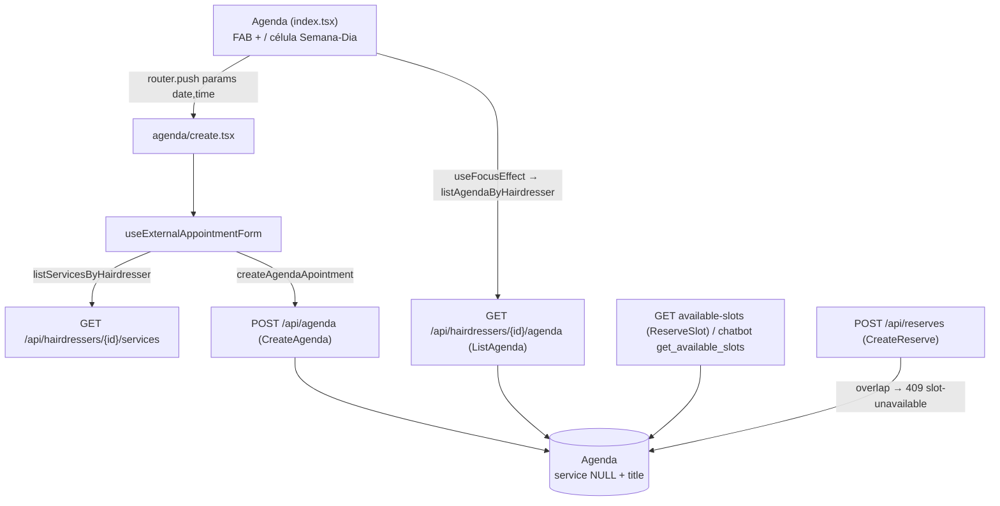

# Atendimento Externo na Agenda Design

**Spec**: `.specs/features/external-appointment/spec.md`
**Context**: `.specs/features/external-appointment/context.md`
**Status**: Approved (abordagem aprovada com o plano em 2026-10-09)

---

## Architecture Overview

Esta feature não traz arquitetura nova. O bloqueio externo é uma linha de `Agenda` sem `service` e com `title`. Todo o resto já desconta a `Agenda`: o cálculo de horários livres do app e do chatbot e a checagem de sobreposição da reserva. O backend muda o modelo, o contrato do `CreateAgenda` e a listagem. O app ganha uma tela num sub-stack da agenda.



Decisões ativas respeitadas:
- **AD-004** (auth): a rota segue com `authenticated_hairdresser`.
- **AD-006** (problem+json): só `validation-error`, `not-found`, `forbidden` e `agenda-overlap`, todos já no catálogo.
- **AD-007** (rotas): nenhuma rota nova, e a Route Table não muda.

---

## Code Reuse Analysis

### Existing Components to Leverage

| Component | Location | How to Use |
| --------- | -------- | ---------- |
| `_parse_local_datetime`, `DATETIME_FORMAT_DETAIL` | `backend/agenda/views.py:17-25` | Mantém o parse ISO, com o ingênuo lido como Manaus |
| `body_error`, `validation_problem`, `json_object`, `problem_response` | `backend/hairmatch/problems.py` | O mesmo acumulador `errors` do `CreateAgenda` |
| `authenticated_hairdresser`, `forbidden` | `backend/users/authentication.py` | Sem mudança |
| `assert_problem` | `backend/hairmatch/problem_testing.py` | Asserções de erro nos testes |
| `AgendaTestCase`, `CreateAgendaTest._post`, `login` | `backend/agenda/tests.py:16, 196` | Base dos testes novos de criação e listagem |
| `ReserveTestCase`, `next_monday()`, `reserve_views()` | `backend/reserve/tests.py:21, 616, 621` | Segunda das 09:00 às 17:00 com almoço das 12:00 às 13:00, para o teste de aceite |
| `listServicesByHairdresser`, `ServiceResponse` | `frontend-mobile/services/service.service.ts:5`, `models/Service.types.ts` | Chips de serviço com `duration` |
| `createAgendaApointment` | `frontend-mobile/services/agenda.service.ts:19` | O serviço que a issue pede para usar, agora tipado |
| `problemMessage` | `frontend-mobile/utils/api-problem.ts:176` | Texto pt-BR do erro da API |
| `ErrorModal` | `frontend-mobile/components/modals/ErrorModal/ErrorModal.tsx` | Erros de validação e da API |
| `FormInput` | `frontend-mobile/components/formInputs/FormInput.tsx` | Campos de título, início e término |
| `formatTimeInput` | `frontend-mobile/utils/forms.ts:64` | Normaliza HH:mm no `onBlur` |
| `Calendar` + `ptBR` | `react-native-calendars`, `utils/locale-calendar.ts` | Seletor de data com `minDate` igual a hoje (padrão de `service-booking.tsx:47-66`) |
| `useFocusEffect(useCallback(...))` | `hooks/hairdresserHooks/useServiceManager.ts:20` | Recarrega a agenda ao voltar |
| Sub-stack `index`/`create` | `app/(app)/hairdresser/services/_layout.tsx` | Molde de `agenda/_layout.tsx` |
| `useServiceForms` | `hooks/hairdresserHooks/useServiceForms.ts` | Validação no cliente → `ErrorModal`; `router.back()` ao salvar |

### Integration Points

| System | Integration Method |
| ------ | ------------------ |
| `Agenda` (Postgres) | `service` passa a aceitar nulo e entra o campo `title`. A migração `0002` é aditiva e não muda as linhas existentes (`title=''`). |
| `ReserveSlot` / `get_available_slots` / `CreateReserve` / `create_new_reserve` | Sem mudança de código. Já leem só `start_time` e `end_time` da `Agenda` (`reserve/views.py:117, 224, 288, 349, 377`). A cobertura entra em teste. |
| `cancel_reserve` | Filtra por `service_id` da reserva, que nunca é nulo, então nunca apaga um bloqueio externo. Sem mudança. |
| `service/views.py:116` e `users/views.py:140` | Só filtram por `service` ou `hairdresser`. Sem mudança. |
| Expo Router / `BottomBar` | `agenda.tsx` vira `agenda/index.tsx`. O `BottomBar` (`components/BottomBar.tsx:23`) compara o último segmento: em `agenda/` continua `agenda`, e em `agenda/create` nenhum tab fica ativo, como em `services/create`. |

---

## Components

### Backend: `Agenda` model

- **Purpose**: Representar o bloqueio externo sem serviço.
- **Location**: `backend/agenda/models.py` mais `backend/agenda/migrations/0002_agenda_title_alter_agenda_service.py`.
- **Interfaces**:
  - `service = ForeignKey(Service, on_delete=DO_NOTHING, null=True, blank=True)`
  - `title = CharField(max_length=100, blank=True, default='')`
- **Reuses**: o modelo atual.

### Backend: `CreateAgenda.post`

- **Purpose**: Aplicar o contrato EXT-01 a EXT-14.
- **Location**: `backend/agenda/views.py`.
- **Fluxo**:
  1. `authenticated_hairdresser` (EXT-12).
  2. `json_object`.
  3. Acumular erros na ordem `start_time`, `end_time`, `title`:
     - `start_time`: obrigatório, ISO (`DATETIME_FORMAT_DETAIL`). Se for anterior a `timezone.now()`: "The start time must not be in the past." (EXT-09).
     - `end_time`: se vier, ISO. Se faltar **e** não houver `service`: "This field is required." (EXT-07).
     - `title`: se vier e não for `str`: "This field must be a string." (EXT-05). Depois de `strip()`, se tiver mais de 100 caracteres: "Ensure this field has no more than 100 characters." (EXT-06). Se estiver vazio **e** não houver `service`: "This field is required." (EXT-04).
     - Se `start_time` e `end_time` forem válidos e `end_time <= start_time`: item em `#/end_time`, "The end time must be after the start time." (EXT-08).
  4. Se houver erros, `raise validation_problem(errors)` (EXT-14).
  5. Se `service` vier: `Service.objects.get` (404) e checagem de dono (403), como hoje (EXT-11). Sem `end_time`, `end_time = start + duration` (EXT-02).
  6. Checar sobreposição como hoje (EXT-10). Depois, `Agenda.objects.create(service=service_or_None, title=title, ...)` e responder 201 (EXT-01, EXT-13).
- **Observação**: "não ter serviço" quer dizer `service` ausente, `null` ou `""` (`not data.get('service')`), o mesmo teste falsy de hoje.
- **Reuses**: a estrutura atual da view.

### Backend: `ListAgenda` + `AgendaSerializer`

- **Purpose**: Listar bloqueios com `service: null` e `title` (EXT-18, EXT-19).
- **Location**: `backend/agenda/views.py` (`ListAgenda.get`) e `backend/agenda/serializers.py`.
- **Interfaces**:
  - `reserve_identifiers` ignora itens com `service_id is None`. Assim o `Q(service_id=None, …)` nunca vira `IS NULL`, e se todos os itens forem externos, o `reserve_map` fica `{}` sem consulta.
  - Em `AgendaSerializer`, `service = SimpleServiceSerializer(allow_null=True)`. `fields` passa a ser `['id', 'start_time', 'end_time', 'title', 'service', 'customer']`. `get_customer` devolve `None` cedo quando `obj.service_id is None`.

### App: tipos e serviço

- **Location**: `frontend-mobile/models/Agenda.types.ts` e `frontend-mobile/services/agenda.service.ts`.
- **Interfaces**:
  ```ts
  export interface AgendaEntryResponse {
    id: number;
    start_time: string;
    end_time: string;
    title: string;
    service: { id: number; name: string } | null;
    customer: { id: number; user: { first_name: string; last_name: string } } | null;
  }
  export interface CreateAgendaRequest {
    start_time: string;   // YYYY-MM-DDTHH:mm:00 (Manaus)
    end_time: string;
    title?: string;
    service?: number;
  }
  export interface AgendaEvent { id: number; title: string; start: Date; end: Date; isExternal: boolean; }
  ```
  - `listAgendaByHairdresser(id): Promise<{ data: AgendaEntryResponse[] } | undefined>`
  - `createAgendaApointment(data: CreateAgendaRequest): Promise<void>`. O nome se mantém, porque a issue cita o serviço existente.
  - Sai o `import axios` que não é usado.

### App: rotas da agenda

- **Location**:
  - `app/(app)/hairdresser/agenda/_layout.tsx` (novo, um `Stack` com `index` e `create`);
  - `app/(app)/hairdresser/agenda/index.tsx` (é o `agenda.tsx` movido por `git mv`);
  - `app/(app)/hairdresser/agenda/create.tsx` (novo).
- **Checagem**: `HAIRDRESSER_HOME` e `hairdresserTabs[].path` continuam valendo `/(app)/hairdresser/agenda`.

### App: `useAgenda`

- **Purpose**: Carregar a agenda em todo foco e abrir a tela de criação.
- **Location**: `frontend-mobile/hooks/hairdresserHooks/useAgenda.ts`.
- **Interfaces**:
  - Usa `useFocusEffect(useCallback(fetch, [hairdresserId]))` no lugar do `useEffect` (EXT-22).
  - Mapeia cada item para `{ id, title: ev.title || ev.service?.name || '', start, end, isExternal: ev.customer === null }` (EXT-20).
  - `handleAddPress()` faz `router.push('/(app)/hairdresser/agenda/create')` (EXT-23).
  - `handlePressCell(date)`: no modo `month` mantém o comportamento atual (EXT-34). Nos outros, faz `router.push({ pathname: '/(app)/hairdresser/agenda/create', params: { date: dayjs(date).format('YYYY-MM-DD'), time: dayjs(date).format('HH:mm') } })` (EXT-33).

### App: `useExternalAppointmentForm`

- **Purpose**: Estado, validação e envio da tela (EXT-23 a EXT-33).
- **Location**: `frontend-mobile/hooks/hairdresserHooks/useExternalAppointmentForm.ts`.
- **Estado**:
  - `date` (`YYYY-MM-DD`): param `date`, senão hoje;
  - `startTime`: param `time`, senão `''`;
  - `endTime`: `''`;
  - `serviceId: number | null`: `null`, que é "Sem serviço";
  - `title`: `''`;
  - `services: ServiceResponse[]`;
  - `isSaving`;
  - `errorModal: { visible, message }`.
- **Regras**:
  - Função pura exportada `computeEndTime(start: string, durationMin: number): string | null`, que dá HH:mm ou `null` quando passa de 23:59 ou o início é inválido. Ao mudar o serviço ou o início (`onBlur` com `formatTimeInput`), se houver serviço e o resultado não for nulo, `setEndTime` (EXT-25).
  - Função pura exportada `validateExternalAppointment(form, now: Date): string | null`, que devolve a primeira mensagem nesta ordem: EXT-26, EXT-27, EXT-28, EXT-29. Para "passado", compara `new Date(\`${date}T${startTime}:00\`)` com `now`, os dois no relógio do aparelho.
  - `handleSave()`: se `isSaving`, sai. Se a validação der mensagem, abre o modal. Senão monta o `CreateAgendaRequest` (EXT-30), `await createAgendaApointment`, `Alert.alert('Sucesso!', 'Atendimento externo registrado.')` e `router.back()` (EXT-31). No `catch`, o modal recebe `problemMessage(err, 'Não foi possível registrar o atendimento externo.')` (EXT-32). No `finally`, `setIsSaving(false)`.
  - Os serviços carregam com `listServicesByHairdresser`. Uma falha só loga, e a tela segue com "Sem serviço" (Edge Cases).

### App: `agenda/create.tsx` + estilos

- **Purpose**: A tela "Atendimento externo" (EXT-23, EXT-24).
- **Location**: `app/(app)/hairdresser/agenda/create.tsx` e `styles/hairdresser/agenda/ExternalAppointmentStyles.ts`.
- **Layout**, de cima para baixo dentro de um `ScrollView`:
  1. Header com voltar e o título "Atendimento externo".
  2. `Calendar` (`minDate` igual a hoje, `markedDates` na data escolhida).
  3. Linha com `FormInput` "Início" e "Término" (`placeholder="HH:mm"`, `keyboardType="numeric"`, `maxLength={5}`, `onBlur` com `formatTimeInput`).
  4. Chips "Sem serviço" mais um chip por serviço, com nome e duração.
  5. `FormInput` "Título" (`maxLength={100}`).
  6. Botões "Cancelar" e "Salvar" (`disabled={isSaving}`).
  7. `ErrorModal`.

### App: `agenda/index.tsx`

- **Purpose**: Ponto de entrada (EXT-21, EXT-23, EXT-33).
- **Mudanças**:
  - FAB "+" (`Ionicons name="add"`) no canto inferior direito, chamando `handleAddPress`.
  - Na lista, o rótulo "Externo" quando `item.isExternal`.
  - O `Header` sai de dentro do componente, o que corrige o erro de lint `react-hooks/static-components` que já existia.
  - Os estilos novos (`fab`, `externalBadge`) entram em `AgendaManagerStyles.ts`.

---

## Data Models

### Agenda (Django)

```python
class Agenda(models.Model):
    start_time = models.DateTimeField(default=timezone.now)
    end_time = models.DateTimeField(default=timezone.now)
    hairdresser = models.ForeignKey(Hairdresser, on_delete=models.DO_NOTHING)
    service = models.ForeignKey(Service, on_delete=models.DO_NOTHING, null=True, blank=True)  # NULL = bloqueio externo sem serviço
    title = models.CharField(max_length=100, blank=True, default='')
```

**Relationships**: uma `Reserve` continua pareada com a `Agenda` por `(service_id, start_time)`. Uma linha com `service` nulo nunca pareia com uma `Reserve` (AD-009).

---

## Error Handling Strategy

| Error Scenario | Handling | User Impact |
| -------------- | -------- | ----------- |
| Campo faltando ou inválido na API | 400 `validation-error` com todos os itens de uma vez (EXT-04 a EXT-09, EXT-14) | O app já valida antes. Se escapar, `problemMessage` dá "Verifique os dados informados." |
| Sobreposição | 409 `agenda-overlap` | "Este horário se sobrepõe a outro compromisso." |
| Serviço de outro cabeleireiro / inexistente | 403 `forbidden` / 404 `not-found` | Texto do catálogo |
| Sessão expirada | 401, que o interceptor do `axiosInstance` trata (refresh ou logout) | Fluxo atual |
| Rede fora | `ApiConnectionError` → `CONNECTION_ERROR_MESSAGE` | Modal com o texto de conexão, e a tela continua preenchida |
| Lista de serviços falha | `console.error`, `services=[]` | Só "Sem serviço". Dá para salvar com título. |

---

## Risks & Concerns

| Concern | Location (file:line) | Impact | Mitigation |
| ------- | -------------------- | ------ | ---------- |
| A corrida entre a checagem de sobreposição e o `create`, nos dois caminhos | `backend/agenda/views.py:66-83`, `backend/reserve/views.py:117-144` | Duas requisições simultâneas podem gravar dois blocos sobrepostos | Fora de escopo (spec). Registrado em Deferred Ideas como follow-up. |
| Pareamento Agenda↔Reserve por `(service, start_time)` | `backend/agenda/serializers.py:38`, `backend/reserve/views.py:35` | Um bloqueio com serviço no mesmo início de uma reserva antiga seria lido como reserva | A sobreposição impede duas linhas no mesmo início para o mesmo cabeleireiro. Para `service` nulo, o pareamento é cortado no código (EXT-19, AD-009). |
| `RemoveAgenda` apaga a `Agenda` de uma reserva e deixa a `Reserve` órfã | `backend/agenda/views.py:120-134` | Já existe hoje. A tela nova não chama o DELETE. | Fora de escopo, porque remover é uma feature futura. |
| `confirmCancelEvent` remove só localmente | `frontend-mobile/hooks/hairdresserHooks/useAgenda.ts:66-72` | O botão "Cancelar Agendamento" engana o usuário, e o item volta no próximo foco (agora sempre, com `useFocusEffect`) | Fora de escopo. Registrado. O UAT confere só a criação. |
| Horários fora da grade depois de um bloqueio com término quebrado | `backend/reserve/views.py:316` | Os horários oferecidos passam a 10:45, 11:15, … | Comportamento atual, registrado no spec (Edge Cases). |
| O app não tem testes automatizados | `frontend-mobile/package.json` | A lógica do formulário só é verificada por `tsc` e UAT | `computeEndTime` e `validateExternalAppointment` ficam puros e exportados, prontos para um teste futuro. O UAT cobre EXT-23 a EXT-34. |
| Fuso do aparelho diferente de Manaus | `useExternalAppointmentForm` (`now`) e `useAgenda` (`dayjs(date)`) | A regra do passado e a hora da célula seguem o relógio do aparelho | Igual ao fluxo de reserva atual (spike N1). Registrado em Assumptions. |

---

## Tech Decisions

| Decision | Choice | Rationale |
| -------- | ------ | --------- |
| Como marcar o bloqueio externo | `service` nulo mais `title`, sem campo `kind` | É a menor mudança. A listagem já distingue por `customer === null`. |
| Onde a regra do passado roda | No backend, com `timezone.now()`, e espelhada no app | O backend é a fonte da verdade, e o app evita a viagem. |
| Validação de término com serviço sem `end_time` | EXT-08 vale só para o `end_time` enviado. O calculado (início + duração) não é revalidado. | É o comportamento atual. Um serviço com `duration` 0 (o `service/views.py:25` só exige dígitos) gera um bloco de duração zero, que já pode acontecer hoje. Fica fora de escopo. |
| Rota | Sub-stack `agenda/` | Mesmo padrão de `services/` e `availability/`. A tela não aparece como tab. |

**AD-009 (novo, vai para o `STATE.md` na T12)**: uma linha de `Agenda` com `service` nulo é um bloqueio externo, que se identifica pelo `title`. O pareamento Agenda↔Reserve por `(service_id, start_time)` nunca a considera. Na listagem, `customer === null` identifica toda entrada que não é reserva do app. Uma nova escrita na `Agenda` sem reserva usa este formato.
