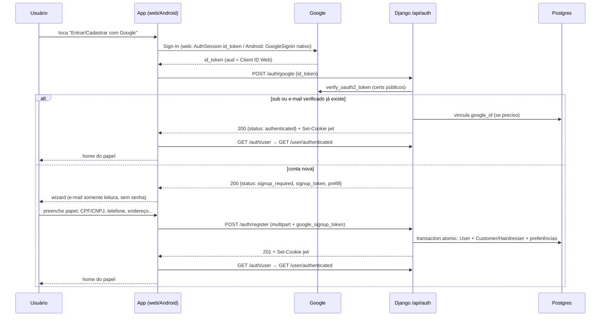

# Login e Cadastro via Google Design

**Spec**: `.specs/features/google-auth/spec.md`
**Context**: `.specs/features/google-auth/context.md`
**Status**: Draft. A abordagem A (token de cadastro pendente) foi confirmada na aprovação do plano, em 2026-09-27. **A escolha da biblioteca cliente** (seção "Biblioteca cliente de Google Sign-In") mudou em relação ao plano depois da pesquisa e **aguarda confirmação do usuário**.

---

## Architecture Overview

O backend é a única fonte de verdade da identidade Google. O app só obtém um **ID token** do Google e o entrega ao backend, que o verifica com `google-auth`, confere o `aud` contra `GOOGLE_OAUTH_CLIENT_IDS` e decide entre dois caminhos:

1. **Conta existente:** o backend emite a sessão atual, com cookie `jwt` e payload `{id, exp, iat}` assinado com `'secret'`, por um helper compartilhado com o `LoginView`.
2. **Conta nova:** o backend **não cria nada**. Ele devolve um `signup_token` de 30 min, assinado com `settings.SECRET_KEY`, e um `prefill`. O app abre o wizard de cadastro existente em "modo Google". O envio final vai para o mesmo `POST /api/auth/register`, que no caminho Google cria `User` e perfil em uma transação e já devolve o cookie de sessão.



### Abordagens avaliadas

| Abordagem | Resumo | Veredito |
| --------- | ------ | -------- |
| **A. Token de cadastro pendente, sem stateful** | O `/auth/google` só cria sessão para quem já existe. Para quem é novo, devolve um token assinado, e o `RegisterView` aceita esse token no lugar da senha. | **Escolhida.** Não mexe nas colunas NOT NULL, não cria usuário sem papel e reusa o wizard e o endpoint de cadastro. |
| B. Endpoint `/auth/google/complete` separado | Mesmo token, mas a criação fica em um endpoint novo. | Rejeitada. Duplica as regras de criação, preferências e perfil do `RegisterView`. |
| C. Criar o usuário parcial no primeiro login | Cria `User` com campos nulos e um flag de "perfil incompleto". | Rejeitada. Exige tornar nulas as colunas `phone`, `address`, `city`, etc. (`backend/users/models.py:13-21`), e cria usuários sem `Customer`/`Hairdresser`. Isso quebra `components/BottomBar.tsx:19` e os hooks que leem `userInfo.customer`/`userInfo.hairdresser`. |

### Biblioteca cliente de Google Sign-In (pesquisa)

Seguindo a Knowledge Verification Chain:

- **Codebase:** não há nenhuma biblioteca de auth instalada. Só `expo-web-browser ~14.0.2` (`frontend-mobile/package.json:39`).
- **Docs da Expo:** a página de referência do `AuthSession` marca a configuração do provider Google como **Deprecated**, apontando para o guia de Google authentication ([docs.expo.dev/versions/latest/sdk/auth-session](https://docs.expo.dev/versions/latest/sdk/auth-session/)). O guia ([docs.expo.dev/guides/google-authentication](https://docs.expo.dev/guides/google-authentication/)) recomenda `@react-native-google-signin/google-signin`, que não roda no Expo Go e exige development build.
- **Docs do `@react-native-google-signin`:** a versão gratuita suporta **só Android e iOS**, e o suporte a web é pago ([install](https://react-native-google-signin.github.io/docs/install)). Existe um config plugin da Expo ([expo setup](https://react-native-google-signin.github.io/docs/setting-up/expo)). No npm, as versões 13.3+ até 16.x declaram o peer `expo >=52.0.40`, e o projeto usa `~52.0.46`.
- **No Android com AuthSession:** o cliente OAuth Android do Google vem com custom URI scheme desativado por padrão ([expo/expo#32468](https://github.com/expo/expo/issues/32468)). Isso torna frágil o caminho AuthSession no Android.

**Decisão: um hook com implementação por plataforma** (`.web.ts` e `.ts`), ambos devolvendo um `id_token` com `aud` igual ao **Client ID Web**:
- **Web:** `expo-auth-session`, com a API genérica `useAuthRequest` e a discovery `https://accounts.google.com` (`responseType: IdToken` + `nonce`). Não usa o provider Google deprecated.
- **Android:** `@react-native-google-signin/google-signin` (gratuito, nativo), com `GoogleSignin.configure({ webClientId })`. O Client ID Android só precisa existir no Google Cloud (pacote + SHA-1). Ele não entra no código.

**Desvio do plano aprovado:** o plano previa o provider Google do `expo-auth-session` nas duas plataformas e a variável `EXPO_PUBLIC_GOOGLE_ANDROID_CLIENT_ID`. A pesquisa acima mostrou que esse provider está deprecated e que o caminho AuthSession no Android depende de custom URI scheme, que o Google desativa por padrão. A variável Android sai do código.

**Incertezas a confirmar na execução:**
- **Forma do retorno de `GoogleSignin.signIn()`:** na v13+, a documentação indica `{ type: 'success', data: { idToken } }` ou `{ type: 'cancelled' }`. Confirmar na versão instalada.
- **`iosUrlScheme` no config plugin:** o plugin pode exigi-lo mesmo sem iOS. Se exigir, usar o valor do Client ID Web invertido ou um placeholder, e registrar o fato.
- **Nonce no fluxo web:** confirmar que o `id_token` implícito com `nonce` funciona no web com `useAuthRequest`, e que `WebBrowser.maybeCompleteAuthSession()` fecha o popup no expo-router.

**Resultado da execução (T9, T13, T14; lote 2, 2026-09-27).** Tudo abaixo foi confirmado lendo o código das versões instaladas. Não havia dispositivo nem navegador com Client ID real. O fluxo ponta a ponta fica para o UAT (T23).
- **`iosUrlScheme`:**
  - O plugin exige o parâmetro. Sem opções, ele entra no modo Firebase e espera `google-services.json`. O valor precisa começar com `com.googleusercontent.apps.`.
  - Valor usado em `app.json`: `com.googleusercontent.apps.ios-not-used-placeholder`. Ele só afeta o `Info.plist`, e o iOS está fora do escopo.
- **`GoogleSignin.signIn()` (v16.1.5):**
  - Retorna `{ type: 'success', data: User }` ou `{ type: 'cancelled' }`. O cancelamento vem da tradução de `SIGN_IN_CANCELLED` em `translateCancellationError`.
  - `data.idToken` é `string | null`. O hook lança erro quando é `null`, porque isso não é cancelamento. É o caso de um `webClientId` inválido.
  - `hasPlayServices` exige `showPlayServicesUpdateDialog` explícito em dev. O hook passa `true`.
- **Expo Go:** o módulo usa `TurboModuleRegistry.getEnforcing('RNGoogleSignin')`, que lança já na avaliação. O `require` tardio dentro de `try/catch` converte isso na mensagem "Login com Google indisponível no Expo Go. Use o build do app.". `ready` é sempre `true` no Android, para o botão continuar clicável e mostrar a mensagem.
- **Nonce:**
  - O Google exige `nonce` no fluxo implícito de `id_token`. O hook o passa em `extraParams`, gerado uma vez com `Crypto.randomUUID()` em `useState`.
  - Um nonce novo a cada render recriaria o request, porque `useLoadedAuthRequest` depende de `JSON.stringify(extraParams)`.
  - O backend não valida o nonce.
- **Popup fechado pelo usuário:** o `expo-web-browser` (web) checa `popupWindow.closed` a cada 1 s e resolve `{ type: 'dismiss' }`. O hook devolve `null`, ou seja, cancelamento silencioso. Qualquer resultado diferente de `success` vira `null`, conforme o design. Na prática, o único `error` que volta por redirect é `access_denied`, que também é cancelamento.
- **Redirect URI no web:** `makeRedirectUri()` vira `Linking.createURL('')`, que é a origem **sem barra final** (ex.: `http://localhost:8081`). É assim que o valor precisa estar em "Authorized redirect URIs" no Google Cloud.
- **Restrição para T15 (popup blocker):** `getIdToken()` precisa ser chamado **antes de qualquer `await`** em `handleGoogle`. A URL de autorização já vem pré-carregada pelo `useAuthRequest`, então o `window.open` sai de forma síncrona a partir do toque. Um `await` antes dele faz o navegador bloquear o popup (`ERR_WEB_BROWSER_BLOCKED`).
- **Não verificado (Android), reuso da conta depois do logout:**
  - O `signOut` do app não chama `GoogleSignin.signOut()`. Depois de um logout no app, o `signIn()` pode reusar a última conta Google em silêncio, sem mostrar o seletor.
  - Isso afetaria os passos 5, 7 e 8 do UAT, que trocam de conta.
  - Mitigação candidata, **não aplicada**: chamar `GoogleSignin.signOut()` no logout do Android ou antes do `signIn()`.
  - Confirmar no dispositivo durante o T23.
- **RISCO ABERTO, `maybeCompleteAuthSession` no build web de produção:**
  - **O que falha:** a chamada no topo de `useGoogleIdToken.web.ts` só roda quando o módulo é avaliado. O expo-router só avalia todas as rotas na inicialização em dev (`NODE_ENV === 'development'` com import síncrono; ver `expo-router/build/getRoutesCore.js`). Em produção (`expo export`), a rota só é avaliada quando renderiza.
  - **Como falha:** não existe `app/index.tsx`. O popup volta em `/#id_token=...` e o `RootLayoutNav` troca para `/login` antes de a tela de login carregar o hook. A checagem de URL do `maybeCompleteAuthSession` falha, o popup fica aberto, e o fluxo termina como `dismiss` → `null` em silêncio.
  - **Onde funciona:** no `expo start --web` (dev), porque as rotas são avaliadas cedo.
  - **Correção recomendada (fora dos arquivos de T13, não aplicada):** uma linha `WebBrowser.maybeCompleteAuthSession();` no topo de `app/_layout.tsx`. O layout raiz é sempre avaliado antes da navegação, e a chamada não faz nada no nativo. Aplicar em T15/T17 ou antes do UAT, e validar no UAT com a URL web publicada.

---

## Code Reuse Analysis

### Existing Components to Leverage

| Component | Location | How to Use |
| --------- | -------- | ---------- |
| Emissão do JWT de sessão | `backend/users/views.py:120-135` (`LoginView.post`) | Extrair sem mudar o formato para `users/auth_tokens.py` e chamar a partir do `LoginView`, do `GoogleAuthView` e do `RegisterView` (caminho Google). |
| Criação de usuário e perfil por papel | `backend/users/views.py:55-101` (`RegisterView.post`) | Extrair o bloco de preferências e perfil (77-101) para um helper `_create_role_profile(user, data)` no mesmo arquivo. O caminho clássico o chama sem mudar comportamento, e o caminho Google o chama dentro de `transaction.atomic`. |
| Padrão de testes | `backend/users/tests.py` (`RegisterViewTest:15`, `LoginViewTest:206`) | Django `TestCase` + `APIClient`, `reverse(...)` e payload multipart. Mock com `unittest.mock.patch` (já importado na linha 12). |
| Carga de sessão no app | `frontend-mobile/app/_layout.tsx:58-67` | Extrair a sequência `GET /api/auth/user` → `GET /api/user/authenticated` para `loadSession()` no contexto de auth, usada por `signIn`, pelo login Google e pelo fim do wizard Google. |
| Redirecionamento por papel | `frontend-mobile/app/_layout.tsx:25-40` (`RootLayoutNav`) | Nada muda. Com `userToken` definido dentro do grupo `(auth)`, ele já leva à home ou à agenda. |
| Wizard de cadastro | `frontend-mobile/contexts/RegistrationContext.tsx`, `app/(auth)/register/*`, `hooks/authHooks/*` | Reusado inteiro. Recebe o campo `google_signup_token` e o "modo Google". |
| Modal de erro | `components/modals/ErrorModal/ErrorModal` (usado em `app/(auth)/login.tsx:81-85`) | Exibe os erros do fluxo Google. |
| Helpers de formulário | `frontend-mobile/utils/forms.ts` (`stripNonDigits` etc.) | O wizard já normaliza telefone, CPF/CNPJ e CEP. Nada muda. |

### Integration Points

| System | Integration Method |
| ------ | ------------------ |
| Google (verificação) | `google.oauth2.id_token.verify_oauth2_token(token, google.auth.transport.requests.Request(), audience=None)`. O `aud` é checado à mão contra a lista, porque `verify_oauth2_token` aceita um único audience ([referência](https://googleapis.dev/python/google-auth/latest/reference/google.oauth2.id_token.html)). Erros de verificação lançam `ValueError` ou `google.auth.exceptions.GoogleAuthError`. |
| Sessão existente | O cookie `jwt` tem o mesmo nome, payload, algoritmo e atributos. Os decodes feitos à mão em `users`, `review`, `availability` e `preferences` continuam funcionando sem mudança. |
| Banco | Uma coluna nova, `users_user.google_id` (única, nula), na migration `0005`. Nenhuma coluna existente muda. |
| Configuração | Backend: `GOOGLE_OAUTH_CLIENT_IDS` via `os.getenv` (`backend/hairmatch/settings.py:31-36`), `.env.example` e `docker-compose.yml:36-46`. App: `EXPO_PUBLIC_GOOGLE_WEB_CLIENT_ID` em `frontend-mobile/.env.example` e em `eas.json` (perfil `preview`). |

---

## Components

### Backend: `auth_tokens` (helper de tokens)

- **Purpose**: único lugar que emite a sessão e o token de cadastro pendente.
- **Location**: `backend/users/auth_tokens.py` (novo)
- **Interfaces**:
  - `issue_session_token(user) -> str`: payload `{'id': user.id, 'exp': now + 60 min, 'iat': now}` com `datetime.datetime.now()`, `jwt.encode(..., 'secret', algorithm='HS256')`. Idêntico a `views.py:120-126`.
  - `set_session_cookie(response, user) -> response`: `response.set_cookie(key='jwt', value=issue_session_token(user), httponly=True, samesite='None', secure=True)`. Idêntico a `views.py:129-135`.
  - `create_signup_token(email: str, sub: str) -> str`: claims `{'email', 'sub', 'purpose': 'google_signup', 'iat', 'exp': iat + 30 min}`, com datetimes UTC com timezone, `jwt.encode(..., settings.SECRET_KEY, 'HS256')`.
  - `decode_signup_token(token: str) -> dict`: decodifica com `settings.SECRET_KEY`. Lança `InvalidSignupToken` para qualquer `jwt.InvalidTokenError` (inclui expirado) ou `purpose` diferente de `google_signup`.
  - `class InvalidSignupToken(Exception)`
  - Constante `SIGNUP_TOKEN_TTL = datetime.timedelta(minutes=30)`
- **Dependencies**: PyJWT (já instalado), `django.conf.settings`.
- **Reuses**: o formato de `LoginView.post`.

### Backend: `google_auth` (verificador)

- **Purpose**: transformar um `id_token` em identidade confiável, ou em erro.
- **Location**: `backend/users/google_auth.py` (novo)
- **Interfaces**:
  - `verify_google_id_token(token: str) -> GoogleIdentity`: chama `id_token.verify_oauth2_token(token, requests.Request(), audience=None)`.
    - Converte `ValueError` e `GoogleAuthError` em `GoogleTokenError`.
    - Rejeita com `GoogleTokenError` um `aud` fora de `settings.GOOGLE_OAUTH_CLIENT_IDS`. Com a lista vazia, rejeita tudo.
    - Retorna `{'sub', 'email', 'email_verified': bool, 'given_name', 'family_name'}`.
    - `email_verified` só é `True` se o claim for `True` ou `'true'`. `given_name` e `family_name` usam `''` como default.
  - `class GoogleTokenError(Exception)`
- **Dependencies**: `google-auth` e `requests` (novos, fixados em `requirements.txt`), `settings.GOOGLE_OAUTH_CLIENT_IDS`.
- **Reuses**: nada. Os testes fazem mock de `users.google_auth.id_token.verify_oauth2_token`, e os testes de view fazem mock de `users.views.verify_google_id_token`.

### Backend: `GoogleAuthView`

- **Purpose**: `POST /api/auth/google`, que entra com Google ou pede o cadastro.
- **Location**: `backend/users/views.py` (nova classe, depois de `LoginView`) e rota em `backend/users/urls.py` (`path('auth/google', GoogleAuthView.as_view(), name='google_auth')`, junto das outras rotas `auth/`).
- **Interfaces**: `post(request)`, com corpo JSON `{"id_token": str}`.
  1. `id_token` ausente ou vazio → 400 (GAUTH-03).
  2. `verify_google_id_token` → `GoogleTokenError` → 401 (GAUTH-04).
  3. `email_verified` falso → 403 (GAUTH-05).
  4. `User` com `google_id == sub` → sessão (GAUTH-01).
  5. `User` com `email__iexact == email`:
     - `google_id` nulo → grava `sub` e cria a sessão (GAUTH-02).
     - `google_id` diferente → 409 (GAUTH-06).
  6. Senão → 200 `{status: 'signup_required', signup_token, prefill}` sem `Set-Cookie` (GAUTH-12, 13, 23).
- **Dependencies**: `auth_tokens`, `google_auth`.
- **Reuses**: `JsonResponse` + `{'error': ...}` em português, como as outras views.

### Backend: `LoginView` (ajustes)

- **Purpose**: usar o helper e fechar dois buracos que a conta Google expõe.
- **Location**: `backend/users/views.py:108-157`
- **Changes**:
  - `post`: se `user.password` é nulo, responde 403 com `"Esta conta usa login com Google. Use o botão Entrar com Google."` (GAUTH-11). Hoje `views.py:116` chamaria `.encode` em `None` e daria 500. A emissão passa a usar `set_session_cookie`. O `response.data` fica como está, porque os testes existentes dependem dele (`users/tests.py:292`).
  - `get`: captura `jwt.InvalidTokenError`, além de `ExpiredSignatureError`, e responde `{'authenticated': False}` (GAUTH-14).

### Backend: `RegisterView` (caminho Google)

- **Purpose**: concluir o cadastro Google usando o mesmo endpoint e o mesmo formulário do wizard.
- **Location**: `backend/users/views.py:28-105`
- **Changes**:
  - No início de `post`: se `request.data.get('google_signup_token')` existe, retorna `self._register_with_google(request)`. O caminho clássico segue igual.
  - `_register_with_google(request)`:
    1. `decode_signup_token` → `InvalidSignupToken` → 401 (GAUTH-18).
    2. O e-mail vem do token. `email`, `password` e `confirmPassword` do form são ignorados (GAUTH-17).
    3. Campos obrigatórios: `role ∈ {customer, hairdresser}`, `first_name`, `last_name`, `phone` (≥ 10 dígitos), `address`, `neighborhood`, `city`, `state`, `postal_code`, e `cpf` ou `cnpj` conforme o papel. Faltando algum → 400 (GAUTH-21).
    4. E-mail (`iexact`) ou `sub` já existentes → 409 (GAUTH-20).
    5. `User.objects.filter(phone=f"55{phone}")` existente → 409 (GAUTH-19).
    6. `with transaction.atomic():` cria `User(password=None, google_id=sub, phone=f"55{phone}", role=role, ...)`, salva `profile_picture` se houver e chama `_create_role_profile(user, request.data)`. Um JSON de preferências inválido lança exceção dentro do bloco e desfaz tudo → 400 (GAUTH-22).
    7. Sucesso → 201 `{'message': ...}` + `set_session_cookie` (GAUTH-15, 16).
  - `_create_role_profile(user, data)`: bloco extraído de `views.py:77-101`. Lança `ValueError` com JSON inválido. O caminho clássico captura o erro e mantém o 400 atual.
- **Reuses**: o bloco de preferências e perfil existente.

### Backend: modelo `User`

- **Location**: `backend/users/models.py:7-37` e `backend/users/migrations/0005_user_google_id.py` (gerada por `makemigrations`).
- **Change**: `google_id = models.CharField(max_length=255, unique=True, null=True, blank=True)`.

### App: `loadSession` no contexto de auth

- **Purpose**: reusar a carga de sessão em todo fluxo que termina com o cookie `jwt` definido.
- **Location**: `frontend-mobile/app/_layout.tsx:50-113`
- **Interfaces**:
  - `loadSession(): Promise<{ success: boolean; error?: string }>`: `GET /api/auth/user`, e, se `authenticated`, `GET /api/user/authenticated` → `setUserInfo` + `setUserToken('authenticated')`.
  - `signIn` passa a chamar `loadSession()` depois do `POST /api/auth/login`.
  - `signUp(formData)`:
    - **Web:** `axios.post(..., formData, { withCredentials: true })`, para o navegador guardar o cookie do 201.
    - **Nativo:** checa `response.ok`. Se não estiver ok, lança o JSON do corpo (`{error}`) (GAUTH-27).
    - Retorna a resposta. O caminho clássico também passa a ver os erros, que hoje são engolidos no nativo. É uma correção desejada, registrada em Tech Decisions.

### App: `RegistrationContext` (modo Google)

- **Location**: `frontend-mobile/contexts/RegistrationContext.tsx`, `app/(auth)/_layout.tsx`, `app/(auth)/register/_layout.tsx`
- **Changes**:
  - Campo `google_signup_token?: string` em `IRegistrationData`, com valor inicial `''`.
  - Constante exportada `INITIAL_REGISTRATION_DATA` e função `resetRegistration()` no valor do contexto.
  - O `RegistrationProvider` passa a envolver o `Stack` de `app/(auth)/_layout.tsx` e sai de `app/(auth)/register/_layout.tsx`. Assim a tela de login consegue semear o contexto.

### App: `google-auth.service`

- **Location**: `frontend-mobile/services/google-auth.service.ts` (novo)
- **Interfaces**:
  - `type GoogleAuthResponse = { status: 'authenticated' } | { status: 'signup_required'; signup_token: string; prefill: { email: string; first_name: string; last_name: string } }`
  - `loginWithGoogle(idToken: string): Promise<GoogleAuthResponse>`: `axios.post(`${API_BACKEND_URL}/api/auth/google`, { id_token: idToken }, { withCredentials: true })`.
- **Reuses**: `API_BACKEND_URL` de `@/app/_layout`, como os outros services.

### App: `useGoogleIdToken` (por plataforma)

- **Location**: `frontend-mobile/hooks/authHooks/useGoogleIdToken.web.ts` e `frontend-mobile/hooks/authHooks/useGoogleIdToken.ts`. O Metro resolve `.web.ts` no web.
- **Interface comum**: `useGoogleIdToken(): { ready: boolean; getIdToken: () => Promise<string | null> }`. `null` significa que o usuário cancelou (GAUTH-08).
  - **Web:**
    - Chama `WebBrowser.maybeCompleteAuthSession()` no topo do módulo.
    - `useAutoDiscovery('https://accounts.google.com')` + `useAuthRequest({ clientId: EXPO_PUBLIC_GOOGLE_WEB_CLIENT_ID, responseType: ResponseType.IdToken, scopes: ['openid','email','profile'], redirectUri: makeRedirectUri(), usePKCE: false, extraParams: { nonce } })`.
    - `getIdToken` chama `promptAsync()` e retorna `result.params.id_token` quando o `type` é `success`. Caso contrário, `null`.
  - **Android:**
    - O módulo `@react-native-google-signin/google-signin` é carregado **sob demanda** dentro de `getIdToken` (`require` tardio). Nunca é importado no topo do arquivo. Se o módulo nativo não existir (Expo Go), `getIdToken` lança um erro com a mensagem "Login com Google indisponível no Expo Go. Use o build do app.", e o resto do app continua funcionando.
    - `GoogleSignin.configure({ webClientId: EXPO_PUBLIC_GOOGLE_WEB_CLIENT_ID })` uma vez, na primeira chamada.
    - `getIdToken` chama `hasPlayServices()` e `signIn()`, e retorna `data.idToken` quando há sucesso. Retorna `null` quando o usuário cancela. Outros erros são lançados.

### App: `useGoogleAuth`

- **Purpose**: orquestrar o fluxo inteiro para as duas telas.
- **Location**: `frontend-mobile/hooks/authHooks/useGoogleAuth.ts` (novo)
- **Interfaces**: `useGoogleAuth(): { handleGoogle(): Promise<void>; isGoogleLoading: boolean; ready: boolean; googleError: { visible: boolean; message: string }; closeGoogleError(): void }`
  - `handleGoogle`:
    1. Liga `isGoogleLoading` (GAUTH-10).
    2. Obtém o `id_token`. Se vier `null`, sai em silêncio (GAUTH-08).
    3. Chama `loginWithGoogle`.
       - `authenticated` → `loadSession()` (GAUTH-07, 29).
       - `signup_required` → `setRegistrationData({ ...INITIAL_REGISTRATION_DATA, ...prefill, google_signup_token })` e `router.push('/(auth)/register')` se a tela atual não for a de cadastro (GAUTH-24, 28).
    4. Em qualquer erro → `googleError` com `error.response?.data?.error` ou o texto padrão do spec (GAUTH-09).
- **Dependencies**: `useGoogleIdToken`, `useAuth`, `useRegistration`, `expo-router`.

### App: `GoogleSignInButton`

- **Location**: `frontend-mobile/components/GoogleSignInButton.tsx` (novo)
- **Interfaces**: `props { label: string; onPress: () => void; disabled?: boolean; loading?: boolean }`. É um `TouchableOpacity` com ícone `logo-google` (Ionicons, já usado no projeto). Com `disabled` ou `loading`, fica desabilitado e com opacidade reduzida.

### App: telas e hooks do wizard

- **`app/(auth)/login.tsx`:** divisor "ou" e `GoogleSignInButton label="Entrar com Google"` entre as linhas 71 e 73. O `ErrorModal` também exibe o `googleError`.
- **`hooks/authHooks/useLogin.ts`:** `handleGoRegister` (27-29) chama `resetRegistration()` antes do `push` (GAUTH-30).
- **`hooks/authHooks/useRegisterForm.ts`:**
  - `isGoogleMode = !!registrationData.google_signup_token`.
  - Em modo Google, `validateFields` (66-132) pula senha e confirmação.
  - Retorna `isGoogleMode`.
- **`app/(auth)/register/index.tsx`:**
  - `GoogleSignInButton label="Cadastrar com Google"` abaixo do subtítulo (linha 40), escondido em modo Google.
  - Em modo Google, o e-mail fica com `editable={false}` e os campos de senha não são renderizados (GAUTH-25, 28).
- **`hooks/authHooks/usePreferences.ts:63-119` e `hooks/authHooks/useDescription.ts:43-99`:**
  - Em modo Google, não anexam `password`, `confirmPassword` nem `email` ao `FormData`, mas anexam `google_signup_token`.
  - Depois do `signUp` com sucesso, chamam `loadSession()` em vez de `Alert` + `router.replace('/(auth)/login')` (GAUTH-26).
  - Em erro, mantêm o `ErrorModal` e permanecem no wizard (GAUTH-27). Em modo Google, o `useDescription` não redireciona para o login ao fechar o modal (`useDescription.ts:110`).

---

## Data Models

### User (alteração)

```python
class User(AbstractUser):
    # ...campos existentes sem mudança...
    google_id = models.CharField(max_length=255, unique=True, null=True, blank=True)  # `sub` do Google
```

**Relationships**: nenhuma nova. Um `User` tem no máximo um `google_id`, e um `google_id` pertence a no máximo um `User` (unique). Um usuário criado via Google tem `password = NULL`.

### Signup token (JWT, não persistido)

```json
{ "email": "ana@gmail.com", "sub": "1098...", "purpose": "google_signup", "iat": 1790000000, "exp": 1790001800 }
```

### Contrato `POST /api/auth/google`

```json
// request
{ "id_token": "<Google ID token>" }
// 200 conta existente (+ Set-Cookie: jwt=...)
{ "status": "authenticated" }
// 200 conta nova (sem Set-Cookie)
{ "status": "signup_required", "signup_token": "<jwt>", "prefill": { "email": "ana@gmail.com", "first_name": "Ana", "last_name": "Souza" } }
// 400 / 401 / 403 / 409
{ "error": "<mensagem em português>" }
```

---

## Error Handling Strategy

| Error Scenario | Handling | User Impact |
| -------------- | -------- | ----------- |
| Usuário cancela o consentimento do Google | `getIdToken` retorna `null`, e `handleGoogle` sai sem erro | Continua na tela, sem modal |
| `id_token` ausente | 400 `{"error": "Token do Google não informado."}` | `ErrorModal` com a mensagem |
| `id_token` inválido, expirado ou com `aud` errado | 401 `{"error": "Não foi possível validar sua conta Google. Tente novamente."}` | `ErrorModal` |
| E-mail do Google não verificado | 403 `{"error": "Seu e-mail do Google não está verificado."}` | `ErrorModal` |
| E-mail já vinculado a outra conta Google | 409 `{"error": "Este e-mail já está vinculado a outra conta Google."}` | `ErrorModal` |
| `signup_token` inválido ou expirado no envio final | 401 `{"error": "Sua sessão de cadastro com o Google expirou. Entre com o Google novamente."}` | `ErrorModal`, sem sair do wizard |
| Telefone, e-mail ou `sub` já cadastrados | 409, com mensagens no padrão atual do `RegisterView` | `ErrorModal` |
| Campo obrigatório faltando ou papel inválido | 400 `{"error": "Campo obrigatório ausente: <campo>"}` | `ErrorModal` |
| Erro inesperado na criação | `transaction.atomic` desfaz tudo; 500 `{"error": "Erro ao criar a conta."}` (string, não o objeto da exceção) | `ErrorModal`; nenhuma conta criada |
| Senha enviada para conta só-Google | 403, com a mensagem do GAUTH-11 | `ErrorModal` no login por senha |
| Falha de rede ao falar com o backend | O axios lança, e `useGoogleAuth` mostra o texto padrão | `ErrorModal` |

---

## Risks & Concerns

| Concern | Location (file:line) | Impact | Mitigation |
| ------- | -------------------- | ------ | ---------- |
| A chave do JWT de sessão é a string fixa `'secret'` | `backend/users/views.py:126` e os decodes em `users`, `review`, `availability`, `preferences` | Qualquer pessoa pode forjar uma sessão. O Google login herda isso. | Fora de escopo (mudaria quatro apps). O helper `auth_tokens` concentra a emissão, o que facilita a troca futura. O `signup_token` usa `settings.SECRET_KEY` para não ampliar o problema. |
| `LoginView.post` chama `.encode` em `password` nulo | `backend/users/views.py:116` | Uma conta criada via Google que tente login por senha gera 500 | Tratado no GAUTH-11 (403 com mensagem). |
| `LoginView.get` só captura `ExpiredSignatureError` | `backend/users/views.py:152` | Um token com assinatura inválida, como o `signup_token` no cookie, gera 500 | Tratado no GAUTH-14, capturando `jwt.InvalidTokenError`. Os outros decodes (`views.py:176, 203, 230, 252` e os outros apps) ficam como estão: fora de escopo. |
| `RegisterView` sem transação | `backend/users/views.py:55-103` | Um erro depois do `create` deixa o usuário pela metade | O caminho Google roda em `transaction.atomic` (GAUTH-22). O caminho clássico não muda. |
| A checagem de telefone duplicado ignora o prefixo `55` | `backend/users/views.py:38` e `:59` | Telefone duplicado passa no cadastro clássico | O caminho Google compara `55`+telefone (GAUTH-19). A correção do caminho clássico fica em Out of Scope. |
| O `RegisterView` devolve o objeto da exceção no JSON | `backend/users/views.py:103` | O 500 vira um erro de serialização | O caminho Google devolve uma mensagem em string. |
| `response.data` nunca chega ao corpo HTTP | `backend/users/views.py:136` | Engana quem lê o código. Só o cliente de teste o enxerga. | O contrato novo usa só `JsonResponse` com corpo explícito. `LoginView` fica como está, porque `users/tests.py:292` depende disso. |
| O `fetch` nativo em `signUp` não lança erro em 4xx/5xx | `frontend-mobile/app/_layout.tsx:79-85` | O erro do cadastro no Android é tratado como sucesso | `signUp` passa a checar `response.ok` (GAUTH-27). |
| Caminho morto do AsyncStorage no startup | `frontend-mobile/app/_layout.tsx:115-144` | A sessão não sobrevive a um reinício do app | Fora de escopo, igual ao login por senha. Não mexer. |
| A rota `user/<str:email>` engole rotas `user/...` adicionadas depois | `backend/users/urls.py:23` | Uma rota nova em `user/` ficaria inacessível | A rota nova é `auth/google`, sem conflito. |
| Datetimes ingênuos no JWT de sessão | `backend/users/views.py:122-123` | `exp` depende do fuso do servidor | O helper mantém o comportamento para não mudar a sessão. O `signup_token` usa UTC com timezone. |
| O provider Google do `expo-auth-session` está deprecated | docs da Expo (ver pesquisa) | O caminho recomendado pode sumir em SDKs futuros | O web usa a API genérica do AuthSession, e o Android usa a biblioteca nativa recomendada pela Expo. |
| Módulo nativo do Google Sign-In inexistente no Expo Go | `frontend-mobile/package.json` (sem `expo-dev-client`); `frontend-mobile/eas.json:8` | Um import no topo de `useGoogleIdToken.ts`, carregado pela tela de login, derrubaria o app inteiro no Expo Go, e o time desenvolve no Android por ele | `require` tardio dentro de `getIdToken`, com erro amigável quando o módulo não existe (T14). Só o botão do Google deixa de funcionar no Expo Go. |
| Não existem testes no frontend | `frontend-mobile/` (sem `*.test.*`) | Regressões na UI não são pegas automaticamente | Decisão do usuário: gate `tsc` sem novos erros mais o roteiro de UAT no `tasks.md`. |
| Os testes do backend exigem Postgres | `.github/workflows/hairmatch-backend-test.yml` | O gate local falha sem banco | Os gates rodam com as variáveis `DB_*` apontando para o Postgres do `docker compose`, ou dentro do container `django`. |

---

## Tech Decisions

| Decision | Choice | Rationale |
| -------- | ------ | --------- |
| Onde verificar o Google | Somente no backend, com `google-auth` | O app não é confiável. O backend precisa do `sub` verificado para vincular contas. |
| Audience aceito | Lista `GOOGLE_OAUTH_CLIENT_IDS`, checada à mão | `verify_oauth2_token` aceita um único audience. A lista permite adicionar o Client ID iOS no futuro sem mudar código. |
| Chave do `signup_token` | `settings.SECRET_KEY`, com claim `purpose` | Um token de cadastro nunca é aceito como sessão (GAUTH-14). |
| Validade do `signup_token` | 30 min | Cobre o wizard mais longo (cabeleireiro). |
| Endpoint de conclusão | O mesmo `POST /api/auth/register`, com `google_signup_token` | Reusa o formulário multipart, a foto e as preferências que o wizard já envia. |
| Cliente Google no app | Web: `expo-auth-session` genérico. Android: `@react-native-google-signin/google-signin`. | Provider Google do AuthSession deprecated; a biblioteca nativa gratuita não suporta web. |
| `signUp` passa a lançar erro em 4xx/5xx também no fluxo clássico | Sim | Corrige um erro silencioso sem custo. O comportamento de sucesso não muda. |

> Decisão de projeto registrada em `.specs/STATE.md` como **AD-001**: identidade de provedor externo usa token de cadastro pendente sem stateful e emissão de sessão única via `users/auth_tokens.py`.
