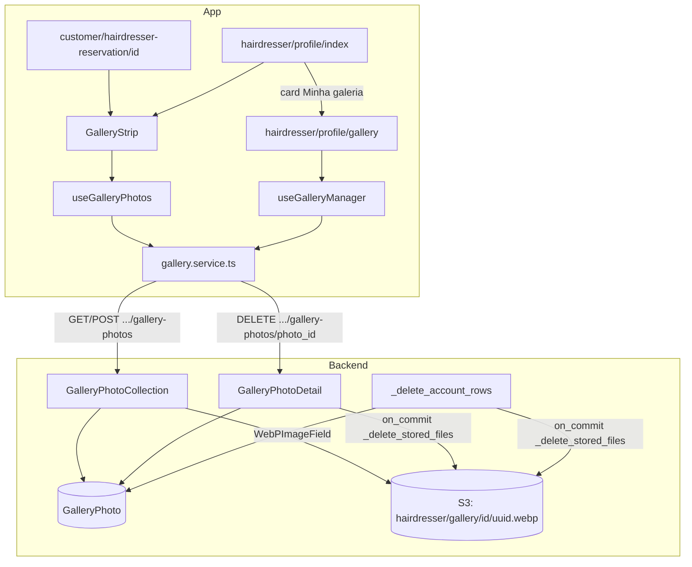

# Galeria de fotos do cabeleireiro Design

**Spec**: `.specs/features/hairdresser-gallery/spec.md`
**Context**: `.specs/features/hairdresser-gallery/context.md`
**Status**: Draft

---

## Architecture Overview

A galeria é um recurso filho do cabeleireiro, com três rotas novas no app `users`:
- `GET /api/hairdressers/{id}/gallery-photos`, pública (RT-94);
- `POST /api/hairdressers/{id}/gallery-photos`, só do dono (RT-95);
- `DELETE /api/hairdressers/{id}/gallery-photos/{id}`, só do dono (RT-96).

Cada foto é uma linha de `GalleryPhoto`. O arquivo é gravado pelo `WebPImageField` (AD-003), que converte a imagem antes do único `PUT` ao S3.

O fluxo copia a foto de perfil (`ProfilePictureView`, `backend/users/views.py:840`):
- o tamanho é validado antes de abrir a imagem;
- um `InvalidImage` vira 400 `invalid-image`;
- o arquivo é apagado em `transaction.on_commit` por `_delete_stored_files`.

O que muda é o limite de 30 fotos, garantido com `select_for_update` na linha do `Hairdresser`, como o AD-010 faz com `User`.

No app:
- um serviço e um hook alimentam um componente de faixa, usado no perfil público e no perfil do cabeleireiro;
- uma tela nova de gestão em grade fica na pilha do perfil do cabeleireiro.



### Tabela própria ou JSONB

A pergunta do usuário foi qual opção é mais performática. Na escala desta feature, a leitura custa o mesmo nas duas:
- a tabela lê até 30 linhas pelo índice `(hairdresser_id, created_at)`;
- o JSONB lê um valor de até ~30 chaves numa linha que o `GET` já buscaria.

O que decide são a correção e as convenções do projeto, e todas favorecem a tabela:

| Critério | Tabela `GalleryPhoto` | `JSONField` em `Hairdresser` |
| -------- | --------------------- | ---------------------------- |
| AD-003 (WebP em um ponto só) | O `WebPImageField` converte e grava. | O campo não serve para um array. Seria preciso chamar `to_webp` e o storage à mão, fora do ponto único do AD-003. |
| Uploads em paralelo | Cada upload é um `INSERT`. Só o limite de 30 precisa de lock. | Cada upload reescreve o array. Sem `select_for_update` em toda escrita, uma foto se perde. |
| Remover uma foto | `DELETE` por PK, com a posse filtrada pela FK. | O array é reescrito, e o "id" vira posição ou chave gerada à mão. |
| Leitura nas listagens (busca e home) | Não muda: a galeria não entra no `Hairdresser`. | Toda leitura de `Hairdresser` com `SELECT *` traz o array junto, a menos que cada query use `defer`. |
| Exclusão da conta | O `CASCADE` apaga as linhas, e as chaves saem de uma query. | Funciona, mas as chaves saem de um parse do JSON. |
| Leitura da galeria | 1 query indexada. | 1 query sem join. Ganho desprezível em 30 itens. |

Decisão: tabela própria. A decisão vira o **AD-013**, porque vale para mídia futura com várias imagens por dono.

---

## Code Reuse Analysis

### Existing Components to Leverage

| Component | Location | How to Use |
| --------- | -------- | ---------- |
| `WebPImageField` e `InvalidImage` | `backend/hairmatch/images.py` | Campo `GalleryPhoto.image`. O `InvalidImage` vira `invalid-image`. |
| `PROFILE_PICTURE_MAX_SIZE` | `backend/users/views.py:837` | O mesmo limite de 5 MB. Vira `IMAGE_UPLOAD_MAX_SIZE`, com um alias para o nome antigo ou uma troca nas duas views. |
| `_delete_stored_files` | `backend/users/views.py:255` | Apaga os arquivos no `on_commit` e loga a falha (GAL-34). |
| `_delete_account_rows` | `backend/users/views.py:229` | Passa a juntar as chaves da galeria (GAL-39). |
| `authenticated_hairdresser` e `forbidden` | `backend/users/authentication.py:72` e `:67` | Dono do recurso, no padrão de `CreateMultipleAvailability` (`backend/availability/views.py:108`). |
| `problem_response`, `validation_problem`, `body_error` e `Problem` | `backend/hairmatch/problems.py` | Todos os erros (AD-006). |
| `CustomerRatingRaceTest` | `backend/review/tests.py:978` | O padrão de teste de corrida (`TransactionTestCase`, `threading.Barrier`) para GAL-15. |
| `image_fixtures` | `backend/hairmatch/image_fixtures.py` | Imagens reais em memória para os testes. |
| `restore_missing_pictures` | `backend/users/management/commands/populate_hairdressers.py:29` | Ganha um irmão para as chaves da galeria. |
| `uploadProfilePicture` e `PickedImage` | `frontend-mobile/services/account.service.ts:21-46` | O mesmo `FormData` (blob no web, `{uri,name,type}` no nativo) e o header multipart. |
| `useProfilePicture` | `frontend-mobile/hooks/accountHooks/useProfilePicture.ts` | A permissão, o `ImagePicker` e o `updatingRef` contra toque duplo. |
| `problemMessage` | `frontend-mobile/utils/api-problem.ts` | O texto pt-BR de cada falha. |
| `ConfirmationModal` e `ErrorModal` | `frontend-mobile/components/modals/` | O modal de remoção (GAL-35) e as mensagens. |
| Estilos `gallery` e `galleryImage` | `styles/customer/reservation/styles/HairdresserProfileReservationStyle.ts:55` e `styles/hairdresser/profile/styles/HairdresserProfileStyles.ts:60` | A faixa de miniaturas. |

### Integration Points

| System | Integration Method |
| ------ | ------------------ |
| Postgres | Modelo novo `GalleryPhoto` e a migração `users/0014_galleryphoto.py`. |
| S3 (LocalStack em dev) | Pelo `default_storage` (`S3MediaStorage`). Nenhuma env var nova (memória `aws-integration-preferences`). |
| Route Table (AD-007) | RT-94 a RT-96 no `api-restful-routes/spec.md` e no `ROUTE_TABLE`. `gallery-photos` termina em `s` e passa no RT-54 sem entrar em `SINGULAR_SEGMENTS`. |
| Catálogo de problemas (AD-006) | `gallery-full` no spec `api-problem-details`, no `CATALOG` e em `api-problem.ts` (tipo e texto). |
| Exclusão de conta | `_delete_account_rows`. |
| Seed | `populate_hairdressers` (criação e restauração). |

---

## Components

### `GalleryPhoto` (backend, modelo novo)

- **Purpose**: uma foto da galeria de um cabeleireiro.
- **Location**: `backend/users/models.py`, depois de `Hairdresser`.
- **Interfaces**:
  - `gallery_photo_path(instance, filename) -> str`: devolve `f"hairdresser/gallery/{instance.hairdresser_id}/{uuid4().hex}.webp"`.
    - Usa `hairdresser_id`, e não `pk`, que ainda é `None` antes do primeiro save.
    - Ignora `filename`, que o `WebPImageFieldFile.save` já trocou para `.webp`, e assim não vaza o nome original (GAL-05).
  - `GALLERY_MAX_PHOTOS = 30`, uma constante do módulo.
- **Dependencies**: `WebPImageField`.
- **Reuses**: `user_profile_picture_path` como padrão.

### `GalleryPhotoSerializer` (backend, novo)

- **Location**: `backend/users/serializers.py`.
- **Interfaces**: `ModelSerializer` com `fields = ['id', 'image', 'created_at']`. Sem `request` no contexto, `image` é a URL do storage, como `profile_picture` no `UserSerializer`.

### `GalleryPhotoCollection` (backend, view nova)

- **Purpose**: `GET` e `POST` em `hairdressers/<int:hairdresser_id>/gallery-photos`.
- **Location**: `backend/users/views.py`, perto da `ProfilePictureView`. A rota vai em `backend/users/urls.py`, com `name='gallery_photos'`.
- **Interfaces**:
  - `get(request, hairdresser_id)`:
    - responde 404 `not-found` se o `Hairdresser` não existe (GAL-03);
    - senão, responde 200 `{"data": GalleryPhotoSerializer(qs, many=True).data}`, com `qs = GalleryPhoto.objects.filter(hairdresser_id=...)` na ordem do `Meta` (GAL-01, GAL-02 e GAL-04).
  - `post(request, hairdresser_id)`, nesta ordem:
    1. `authenticated_hairdresser`, que dá 401 ou 403 (GAL-16 e GAL-17).
    2. `hairdresser_id != hairdresser.id` dá `forbidden` (GAL-18).
    3. Sem `request.FILES.get('image')`, dá `validation_problem([body_error('image', ...)])` (GAL-11 e GAL-48).
    4. Com `image.size > IMAGE_UPLOAD_MAX_SIZE`, dá a mesma validação (GAL-12).
    5. Dentro de `transaction.atomic()`:
       - `Hairdresser.objects.select_for_update().get(pk=hairdresser.pk)`;
       - se a contagem de `GalleryPhoto` dele for maior ou igual a `GALLERY_MAX_PHOTOS`, levanta `Problem('gallery-full', ...)` (GAL-14 e GAL-15);
       - cria `photo = GalleryPhoto(hairdresser=hairdresser)`;
       - chama `photo.image.save(image.name, image, save=False)`, que converte e sobe;
       - chama `photo.save()`.
       - Se o `INSERT` falhar depois do upload, o `except` apaga a chave subida (`default_storage.delete`) e relança o erro.
    6. Um `except InvalidImage` dá `problem_response('invalid-image', INVALID_GALLERY_PHOTO_DETAIL)` (GAL-13). Uma falha do storage sobe ao `exception_handler`, que responde 500 `internal-error` e loga. A transação desfaz a linha (GAL-19).
    7. Responde 201 `{"data": GalleryPhotoSerializer(photo).data}` (GAL-09).
- **Dependencies**: `authenticated_hairdresser`, `forbidden`, `Problem`, `WebPImageField`.
- **Reuses**: a estrutura do `ProfilePictureView.put`.

### `GalleryPhotoDetail` (backend, view nova)

- **Purpose**: `DELETE` em `hairdressers/<int:hairdresser_id>/gallery-photos/<int:photo_id>`.
- **Location**: `backend/users/views.py`. A rota fica em `backend/users/urls.py`, com `name='gallery_photo'`.
- **Interfaces**: `delete(request, hairdresser_id, photo_id)`:
  - faz a autenticação e a posse como no `POST` (GAL-33);
  - busca `GalleryPhoto.objects.filter(pk=photo_id, hairdresser=hairdresser).first()`, e o `None` dá 404 `not-found` (GAL-32);
  - guarda `name = photo.image.name`;
  - dentro de `transaction.atomic()`, chama `photo.delete()` e agenda `transaction.on_commit(lambda: _delete_stored_files([name]))`;
  - responde 204 (GAL-31 e GAL-34).
- **Reuses**: `ProfilePictureView.delete`.

### `_delete_account_rows` (backend, alteração)

- Antes de `user.delete()`, a função acrescenta `GalleryPhoto.objects.filter(hairdresser__user=user).values_list('image', flat=True)` a `pictures` (GAL-39).
- A atomicidade que existe garante o GAL-40: o `on_commit` só roda depois do commit.

### `populate_hairdressers` (backend, alteração)

- **Criação** (GAL-44): depois de criar o `Hairdresser`, sorteia `random.randint(0, 6)` arquivos de `seed_assets/gallery/` e chama `GalleryPhoto(hairdresser=h).image.save(name, File(f), save=True)` para cada um.
- **Restauração** (GAL-45): `restore_missing_gallery_photos()` corre todas as `GalleryPhoto` de cabeleireiros do seed (`user__email__regex=SEED_EMAIL_REGEX`).
  - Para cada chave que falta, sobe `to_webp` de um placeholder na mesma chave.
  - O placeholder é escolhido de forma estável: `sorted(files)[zlib.crc32(key) % n]`.
  - A chave é um uuid, e não o nome do placeholder, por isso a escolha não pode usar o nome do arquivo, como `restore_missing_pictures` faz.
- **Assets**: os 5 `galery*.jpg` saem de `frontend-mobile/assets/hairdressers/gallery/` e vão para `backend/users/management/commands/seed_assets/gallery/` (GAL-46).

### `services/gallery.service.ts` (app, novo)

- **Interfaces**:
  - `listGalleryPhotos(hairdresserId: number): Promise<GalleryPhoto[]>`: `GET`, devolve `data`.
  - `uploadGalleryPhoto(hairdresserId: number, picture: PickedImage): Promise<GalleryPhoto>`: `POST` multipart, campo `image`, mesmo `FormData` do `uploadProfilePicture`.
  - `removeGalleryPhoto(hairdresserId: number, photoId: number): Promise<void>`: `DELETE`.
- **Types**: `models/Gallery.types.ts` com `GalleryPhoto { id: number; image: string; created_at: string }`.
- **Reuses**: `axiosInstance`, `PickedImage`, e a regra "quem chama trata o erro com `problemMessage`".

### `hooks/hairdresserHooks/useGalleryManager.ts` (app, novo)

- **Purpose**: o estado da tela de gestão.
- **Interfaces**: devolve:
  - `photos`, `loading`, `count`;
  - `canAdd` (`count < 30 && !busy`);
  - `busy`, `progress` (`{ current, total } | null`);
  - `pickAndUpload()`, `requestRemove(photo)`, `confirmRemove()`, `cancelRemove()`;
  - `pendingRemoval`, `modal` e `closeModal`.
- **Comportamento**:
  - `pickAndUpload`:
    - pede a permissão, e a negada dá a mensagem de GAL-24;
    - chama `launchImageLibraryAsync({ mediaTypes: ['images'], allowsMultipleSelection: true, selectionLimit: 30 - count, quality: 0.5 })` (GAL-23);
    - corta `result.assets` às `30 - count` primeiras e avisa (GAL-49). O `selectionLimit` só vale no Android e no iOS 14+ (`ImagePicker.types.d.ts`, `@platform`), e o web devolve quantas o usuário escolher;
    - envia em laço `for` com `await`, atualizando `progress` (GAL-25);
    - conta as falhas e guarda o `problemMessage` da primeira;
    - no fim, recarrega pelo `GET` (GAL-26) e mostra GAL-27 se `F ≥ 1`.
  - Um `busyRef` impede a reentrada (GAL-29).
  - `confirmRemove`: no 204, tira a foto do estado (GAL-36); no 404, recarrega (GAL-37); com outro erro, abre o modal com o slug (GAL-38).
- **Reuses**: `useProfilePicture` (permissão, `updatingRef` e montagem do `PickedImage`).

### `hooks/useGalleryPhotos.ts` (app, novo)

- **Purpose**: a leitura da galeria para a faixa, compartilhada pelos dois perfis.
- **Interfaces**: `useGalleryPhotos(hairdresserId?: number) => { photos: GalleryPhoto[] }`. Em erro, devolve `[]` (GAL-07).
- O perfil do cabeleireiro recarrega com `useFocusEffect` ao voltar da tela de gestão, como o `useAgenda` faz.

### `components/gallery/GalleryStrip.tsx` (app, novo)

- **Purpose**: a seção "Galeria" (título e `FlatList` horizontal de miniaturas 100 × 100) e a visualização em tela cheia (`Modal` com a imagem em `contain` e o botão de fechar).
- **Props**: `{ photos: GalleryPhoto[] }`. Devolve `null` com a lista vazia (GAL-07).
- **Usado em**:
  - `app/(app)/customer/hairdresser-reservation/[id].tsx`, entre o resumo e "Técnicas", no lugar do bloco comentado (GAL-06, GAL-08 e GAL-46);
  - `app/(app)/hairdresser/profile/index.tsx` (GAL-30).

### `app/(app)/hairdresser/profile/gallery.tsx` (app, tela nova)

- **Purpose**: a gestão da galeria (GAL-21 a GAL-29 e GAL-35 a GAL-38).
- **Layout**:
  - cabeçalho com voltar, o título "Minha galeria" e "N/30";
  - o botão "Adicionar fotos" e a linha "Enviando i de K" ou "Limite de 30 fotos atingido.";
  - uma `FlatList` com `numColumns={3}` de fotos quadradas, cada uma com um botão de remover (ícone `trash-outline`);
  - o estado vazio, o `ConfirmationModal` e o `ErrorModal`.
- **Rota**: `<Stack.Screen name="gallery" />` em `app/(app)/hairdresser/profile/_layout.tsx`. O card "Minha galeria" fica em `profile/index.tsx`, e `goToGallery` em `useHairdresserProfile` (GAL-20).

---

## Data Models

### `GalleryPhoto`

```python
def gallery_photo_path(instance, filename):
    # One directory per hairdresser; the name is random so the original filename never reaches the bucket.
    return f"hairdresser/gallery/{instance.hairdresser_id}/{uuid.uuid4().hex}.webp"


class GalleryPhoto(models.Model):
    hairdresser = models.ForeignKey(Hairdresser, on_delete=models.CASCADE, related_name='gallery_photos')
    image = WebPImageField(upload_to=gallery_photo_path)
    created_at = models.DateTimeField(auto_now_add=True)

    class Meta:
        ordering = ['-created_at', '-id']
        indexes = [models.Index(fields=['hairdresser', '-created_at'], name='gallery_hairdresser_created')]
```

**Relationships**:
- N:1 com `Hairdresser`, com `CASCADE`. Os arquivos saem por `_delete_account_rows`, porque o `CASCADE` não apaga arquivo.
- `max_length` do `image`: o default de 100 cabe na chave (`hairdresser/gallery/` + id + `/` + 32 + `.webp` ≈ 62).

### Contrato da API

```
GET /api/hairdressers/{id}/gallery-photos
  200 {"data": [{"id": 7, "image": "<S3_PUBLIC_ENDPOINT_URL>/<bucket>/hairdresser/gallery/3/9f...c1.webp", "created_at": "2026-10-10T14:03:11.204Z"}]}
  404 not-found

POST /api/hairdressers/{id}/gallery-photos      multipart: image=<arquivo>
  201 {"data": {"id": 8, "image": "...", "created_at": "..."}}
  400 validation-error (errors[0].pointer == "#/image") | invalid-image
  401 invalid-session | 403 hairdresser-required | 403 forbidden | 409 gallery-full

DELETE /api/hairdressers/{id}/gallery-photos/{photo_id}
  204
  401 | 403 | 404 not-found
```

---

## Error Handling Strategy

| Error Scenario | Handling | User Impact |
| -------------- | -------- | ----------- |
| Arquivo não é imagem | `InvalidImage` antes do upload, 400 `invalid-image` e nenhuma linha. | No lote, a foto conta como falha, e o modal mostra o texto do slug. |
| Arquivo acima de 5 MB | Checado antes de abrir a imagem: 400 `validation-error`. | Conta como falha no lote. |
| Galeria cheia (inclusive em corrida) | Lock em `Hairdresser`, depois a contagem e 409 `gallery-full`. | "Sua galeria já tem 30 fotos. Remova uma para adicionar outra." |
| S3 fora no upload | A exceção sobe, o `exception_handler` responde 500 e loga, e o `atomic` desfaz. | Conta como falha no lote. |
| `INSERT` falha depois do upload | O `except` apaga a chave subida e relança. | 500, sem objeto órfão. |
| S3 fora na remoção | `_delete_stored_files` loga e engole, e a resposta continua 204. | Nenhum. O objeto órfão fica no log. |
| Foto já removida (outra sessão) | 404 `not-found`. | O app recarrega a grade sem erro. |
| Falha no `GET` do perfil público | O hook devolve `[]`. | A seção some, e o resto do perfil aparece. |

---

## Risks & Concerns

| Concern | Location (file:line) | Impact | Mitigation |
| ------- | -------------------- | ------ | ---------- |
| O lock em `Hairdresser` fica preso durante a conversão e o upload ao S3. | `GalleryPhotoCollection.post` (novo) | Os `POST` do mesmo cabeleireiro são serializados, e outra escrita na linha `Hairdresser` (`PATCH /api/users/me` com `resume`) espera alguns centésimos de segundo. | O app manda em sequência. A espera é limitada ao upload de uma foto de no máximo 5 MB. Aceito e registrado no AD-013. |
| O `get_available_name` herdado chama `exists`, um `HEAD` por upload. | `backend/hairmatch/storage.py:50` | Uma requisição a mais ao S3 por foto. | O uuid nunca colide. O custo é igual ao da foto de perfil. Fica como está. |
| `users/views.py` já tem 988 linhas. | `backend/users/views.py` | O arquivo cresce mais ~80 linhas. | As views ficam perto da `ProfilePictureView`, pela convenção do app. Dividir o módulo é fora de escopo. |
| `_delete_stored_files` engole a falha. | `backend/users/views.py:255` | Um objeto órfão a cada falha do S3 na remoção. | Comportamento aceito na #120. GAL-34 exige o log com a chave. |
| O `HairdresserInfoView` não filtra `is_active`. | `backend/users/views.py:981` (`HairdresserInfoView`) | Um perfil pendente abre por URL direta. | Fora desta feature. A galeria segue o mesmo comportamento, e a de uma conta pendente é sempre vazia. |
| A feature `review-editing` (#105), especificada em paralelo, move `_delete_stored_files` para `backend/hairmatch/storage.py` como `delete_stored_files` e reescreve a coleta das fotos de review em `_delete_account_rows`. | `backend/users/views.py:229` e `:255` | Conflito de merge no T6 e no T7 desta feature. | Quem entrar depois se adapta: se a #105 entrar antes, o T6 e o T7 usam `hairmatch.storage.delete_stored_files` e acrescentam a galeria à coleta nova. O comportamento exigido (GAL-31, GAL-34 e GAL-39) não muda. |
| As faixas usam `Image` do React Native sem cache dedicado. | `components/gallery/GalleryStrip.tsx` (novo) | As miniaturas baixam a imagem de 1080 px. | 30 × ~100 KB é aceitável. Uma miniatura derivada fica nas Deferred Ideas. |

---

## Tech Decisions

| Decision | Choice | Rationale |
| -------- | ------ | --------- |
| Persistência | Tabela `GalleryPhoto` (AD-013). | Ver "Tabela própria ou JSONB". |
| Limite sob concorrência | `select_for_update` em `Hairdresser`, depois a contagem e o insert, numa transação. | É o padrão do AD-010. Um `CHECK` não conta linhas, e um trigger seria o primeiro do projeto. |
| Ordem de checagem do `POST` | Sessão, posse, campo, tamanho, limite e conversão/upload. | As checagens baratas vêm antes do lock, e o upload só acontece com vaga garantida. |
| Slug da galeria cheia | Novo `gallery-full` (409). | É um conflito com o estado, como `review-exists`. `validation-error` exigiria um pointer que não existe. |
| Limite de tamanho | Uma constante `IMAGE_UPLOAD_MAX_SIZE` para a foto de perfil e a galeria. | Um limite só, e uma mudança futura vale para as duas rotas. |
| Envio em lote no app | Sequencial. | O lock serializa no backend de qualquer jeito, e o progresso "i de K" fica exato. |
| Rota da tela | `hairdresser/profile/gallery`. | Mantém a aba Perfil ativa e a pilha de voltar. |

> **Project-level decision:** AD-013 em `.specs/STATE.md`: uma coleção de mídia de um dono é uma tabela filha com `WebPImageField`, e não um array em JSONB. O limite por dono é garantido com lock na linha do dono.
