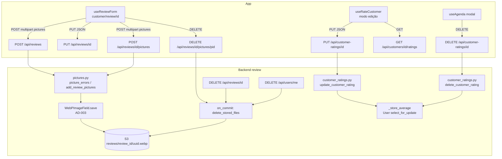

# Editar e excluir avaliações, com várias fotos Design

**Spec**: `.specs/features/review-editing/spec.md`
**Status**: Draft (aguardando aprovação junto com as tasks)

---

## Architecture Overview

As fotos saem de `Review.picture` e vão para uma tabela filha, `ReviewPicture`. Cada linha tem o seu `WebPImageField`, então a conversão, o upload e a URL continuam no ponto único do AD-003.

As escritas de foto passam por um módulo de domínio, `review/pictures.py`, que concentra:
- os limites;
- o upload com limpeza em falha;
- a coleta de nomes para apagar no `on_commit`.

A edição e a exclusão da nota do cabeleireiro ficam em `review/customer_ratings.py`, ao lado de `record_customer_rating`, e reaproveitam o mesmo lock e o mesmo cálculo de média (AD-010).



### Por que tabela e não JSONB

| Critério | `ReviewPicture` | JSONB em `Review` |
| --- | --- | --- |
| AD-003 | Um `WebPImageField` por linha: conversão, upload e `url` prontos. | Conversão, upload e URL à mão, fora do campo. Quebra o AD-003. |
| Adicionar ou remover uma foto | `INSERT` ou `DELETE` de uma linha. | Reescreve o array. Duas edições concorrentes perdem uma escrita sem lock. |
| Integridade | FK com `CASCADE`. | Nenhuma. |
| Leitura | +1 query por listagem (`prefetch_related('pictures')`, índice da FK). | 0 query extra. |
| Limite | `COUNT` com a review travada. | `jsonb_array_length` com a mesma trava. |

A única vantagem do JSONB é economizar uma query que o prefetch já barateia: no máximo 5 linhas por avaliação.

O AD-013, registrado pela feature `hairdresser-gallery` (#118) durante este planejamento, transforma a regra em padrão de projeto: uma coleção de imagens de um dono é sempre uma tabela filha com um `WebPImageField` por linha. `ReviewPicture` segue esse padrão, e o AD-011 só registra o que é próprio das avaliações.

---

## Code Reuse Analysis

### Existing Components to Leverage

| Component | Location | How to Use |
| --------- | -------- | ---------- |
| `WebPImageField` e `InvalidImage` | `backend/hairmatch/images.py:64` | Campo de `ReviewPicture.picture`. `InvalidImage` vira 400 `invalid-image`. |
| `_delete_stored_files` | `backend/users/views.py:255` | Vai para `backend/hairmatch/storage.py` como `delete_stored_files(names)`, para a review e o users usarem a mesma função. Mantém o log com traceback. |
| Padrão do `ProfilePictureView` | `backend/users/views.py:840` | Checar o tamanho antes de abrir a imagem e apagar no `on_commit`. |
| `user_profile_picture_path` | `backend/users/models.py:10` | Padrão de `upload_to` callable. A review usa `instance.review_id`, porque a foto nova ainda não tem `pk` quando o arquivo é salvo. |
| `record_customer_rating` | `backend/review/customer_ratings.py:27` | O cálculo da média sai para `_store_average(user, customer)`, e as funções novas o reaproveitam. |
| `_customer_rating_errors` | `backend/review/views.py:174` | Ganha o parâmetro `require_reservation=True`. O PUT chama com `False`. |
| `problem_response`, `validation_problem`, `body_error`, `json_object` | `backend/hairmatch/problems.py` | Erros RFC 9457 (AD-006). Nenhum slug novo. |
| `authenticated_customer`, `authenticated_hairdresser`, `forbidden` | `backend/users/authentication.py` | Sessão e ownership (AD-004). |
| `make_upload`, `assert_problem`, `activate_account` | `backend/review/tests.py`, `backend/hairmatch/problem_testing.py` | Base dos testes novos. |
| `PickedImage` e o upload com blob no web | `frontend-mobile/services/account.service.ts:21-46` | Mesmo jeito de montar `FormData` para `pictures`. |
| `problemMessage`, `ErrorModal`, `ConfirmationModal`, `StarRating` | `frontend-mobile/utils/api-problem.ts`, `components/` | Erros, confirmações e estrelas nas telas. |
| `getCustomerRatings` | `frontend-mobile/services/customer-rating.service.ts` | A tela de edição do cabeleireiro lê a nota atual. |

### Integration Points

| System | Integration Method |
| ------ | ------------------ |
| Postgres | Migração `review/0005_reviewpicture` (cria a tabela) e, no fim da fase 1, `review/0006_remove_review_picture`. Nenhuma migração de dados. |
| S3 (LocalStack em dev, `InMemoryStorage` nos testes) | Upload pelo `WebPImageField.save`. Remoção por `delete_stored_files` no `on_commit`, ou na hora quando a requisição falha. |
| `reserve` | `ReserveFullInfoSerializer` usa `ReviewLiteSerializer`. As views RT-43, RT-45 e RT-46 ganham `prefetch_related('review__pictures')`. |
| `users` | `_delete_account_rows` lê os nomes de `ReviewPicture` e importa `delete_stored_files` do `hairmatch.storage`. |
| `agenda` | `get_customer_rating` devolve também o `id`. |
| Route Table | RT-90 a RT-93 no spec `api-restful-routes` e em `ROUTE_TABLE`. |

---

## Components

### `delete_stored_files` (movido)

- **Purpose**: Apagar objetos do storage de media, logando cada falha sem interromper as outras.
- **Location**: `backend/hairmatch/storage.py`
- **Interfaces**:
  - `delete_stored_files(names: Iterable[str]) -> None`: chama `default_storage.delete(name)` para cada nome não vazio. Uma exceção vira `logger.exception('Could not delete %s from the media storage', name)` (REV-27).
- **Dependencies**: `default_storage`, `logging`.
- **Reuses**: o corpo de `_delete_stored_files`. `users/views.py` passa a importá-la, e o nome antigo deixa de existir.

### `ReviewPicture` (modelo)

- **Purpose**: Uma foto de uma avaliação.
- **Location**: `backend/review/models.py`
- **Interfaces**:
  - `review_picture_path(instance, filename) -> str`: devolve `f"reviews/{instance.review_id}/{uuid4().hex}{ext}"`, com a extensão do arquivo recebido. O `WebPImageFieldFile.save` troca a extensão por `.webp` (REV-02).
  - `ReviewPicture.review`: `ForeignKey(Review, CASCADE, related_name='pictures')` (REV-33).
  - `ReviewPicture.picture`: `WebPImageField(upload_to=review_picture_path)`.
  - `ReviewPicture.created_at`: `auto_now_add`.
  - `Meta.ordering = ['id']`.
- **Dependencies**: `WebPImageField`.
- **Reuses**: o padrão de `user_profile_picture_path`.

### `review/pictures.py` (domínio das fotos)

- **Purpose**: Os limites e a escrita das fotos, num só lugar para a criação e o RT-90.
- **Location**: `backend/review/pictures.py`
- **Interfaces**:
  - `MAX_REVIEW_PICTURES = 5`, `REVIEW_PICTURE_MAX_SIZE = 5 * 1024 * 1024` e `INVALID_REVIEW_PICTURE_DETAIL = 'The review picture is not a valid image.'`.
  - `picture_errors(files, existing=0, required=False) -> list[dict]`: devolve no máximo um item `body_error('pictures', ...)`, o primeiro que se aplica:
    1. `required` e `files` vazio: "This field is required." (REV-11);
    2. `existing + len(files) > 5`: "A review can have at most 5 pictures." (REV-04 e REV-12);
    3. algum `file.size > REVIEW_PICTURE_MAX_SIZE`: "Each picture must have at most 5 MB." (REV-05 e REV-13).

    Não abre nenhum arquivo.
  - `add_review_pictures(review, files, saved_names: list) -> None`: para cada arquivo, em ordem, `ReviewPicture.objects.create(review=review, picture=file)`, e acrescenta o nome gravado a `saved_names` logo depois de cada `create`. Deixa `InvalidImage` subir.
  - `picture_names(queryset) -> list[str]`: devolve os nomes (`values_list('picture', flat=True)`) não vazios das fotos do queryset.
- **Padrão de limpeza em falha** (REV-06, REV-14 e REV-28), usado pelas duas views que gravam:

  ```python
  saved = []
  try:
      with transaction.atomic():
          ...  # cria a review, ou trava a review existente
          add_review_pictures(review, files, saved)
  except InvalidImage:
      delete_stored_files(saved)
      return problem_response(request, 'invalid-image', INVALID_REVIEW_PICTURE_DETAIL)
  except BaseException:
      delete_stored_files(saved)
      raise
  ```

  A limpeza roda na hora, e não no `on_commit`, porque a transação foi desfeita e o `on_commit` nunca dispararia.
- **Dependencies**: `ReviewPicture`, `body_error`.

### `CreateReview` (RT-23, alterada)

- **Location**: `backend/review/views.py:57`
- **Mudanças**:
  - `files = request.FILES.getlist('pictures')`. O campo `picture` é ignorado (REV-08).
  - Os erros de `picture_errors(files)` entram na mesma lista dos erros de campo, antes do `validation_problem` (REV-07).
  - A criação usa o padrão de limpeza acima. `Review.objects.create(...)` não recebe mais `picture`.
  - A resposta continua 201 `{'message': ...}`.

### `ReviewPictureCollection` (RT-90, nova)

- **Location**: `backend/review/views.py`. Rota `path('reviews/<int:id>/pictures', ..., name='review_pictures')`.
- **Interfaces**: `POST`, multipart.
  1. `authenticated_customer` (REV-19).
  2. `files = request.FILES.getlist('pictures')`. Os erros de `picture_errors(files, required=True)` que não dependem da contagem respondem 400 antes do lookup (REV-11, REV-13).
  3. Padrão de limpeza com:
     - `review = Review.objects.select_for_update().filter(id=id, customer=customer).first()`;
     - `None` responde 404 `not-found` "Review not found." (REV-17);
     - `picture_errors(files, existing=review.pictures.count())` dentro do lock (REV-12, REV-15);
     - `add_review_pictures`.
  4. Responde 201 `{'data': ReviewPictureSerializer(review.pictures.all(), many=True).data}` (REV-10).
- **Dependencies**: `pictures.py`, `ReviewPictureSerializer`.

### `ReviewPictureDetail` (RT-91, nova)

- **Location**: `backend/review/views.py`. Rota `path('reviews/<int:id>/pictures/<int:picture_id>', ..., name='review_picture_detail')`.
- **Interfaces**: `DELETE`.
  1. `authenticated_customer` (REV-19).
  2. Uma review que não existe ou é de outro cliente responde 404 "Review not found." (REV-17).
  3. `ReviewPicture.objects.filter(id=picture_id, review=review).first()`. `None` responde 404 "Picture not found." (REV-18).
  4. Em `transaction.atomic()`: guarda o nome, apaga a linha e registra `on_commit(lambda: delete_stored_files([name]))`.
  5. Responde 204 (REV-16).

### `RemoveReview` (RT-26, alterada)

- **Location**: `backend/review/views.py:150`
- **Mudança**: dentro do `atomic`, `names = picture_names(review.pictures.all())` antes de `review.delete()`, e depois `on_commit(lambda: delete_stored_files(names))` (REV-25, REV-28).

### `_delete_account_rows` (alterada)

- **Location**: `backend/users/views.py:229`
- **Mudança**: `pictures = picture_names(ReviewPicture.objects.filter(Q(review__customer__user=user) | Q(review__hairdresser__user=user)))`, no lugar do `values_list('picture')` de `Review` (REV-26).

### Serializers (alterados)

- **Location**: `backend/review/serializers.py`
- **Interfaces**:
  - `ReviewPictureSerializer`: `fields = ['id', 'url']`, com `url = SerializerMethodField()` que devolve `obj.picture.url` (REV-31).
  - `ReviewSerializer` e `ReviewLiteSerializer` ganham `pictures = ReviewPictureSerializer(many=True, read_only=True)` (REV-30). Continuam com `fields = '__all__'`: quando a coluna `picture` sai, ela some da resposta sem outra mudança.
- **Prefetch** (REV-32):
  - `ListReview`: `.select_related('customer__user').prefetch_related('pictures')`.
  - `ReserveById` (RT-43) e `ListReserve` (RT-45 e RT-46): `.select_related('service__hairdresser__user', 'review').prefetch_related('review__pictures')`. O teste de queries é a prova.

### `customer_ratings.py` (alterado)

- **Location**: `backend/review/customer_ratings.py`
- **Interfaces**:
  - `_store_average(user, customer) -> None`: calcula `Avg('rating')` das notas do cliente e grava `round(avg, 2)` ou `None` em `user.rating` (`update_fields=['rating']`). `record_customer_rating` passa a usá-la.
  - `update_customer_rating(customer_rating, rating, comment) -> CustomerRating`: em `atomic`, trava o `User` do cliente (`select_for_update`), grava `rating` e `comment` (`update_fields`) e chama `_store_average` (REV-40, REV-50).
  - `delete_customer_rating(customer_rating) -> None`: em `atomic`, trava o `User`, apaga a nota e chama `_store_average`. Sem notas, a média vira `None` (REV-49 a REV-51).
- **Mudança no modelo**: o docstring "It is immutable once created" de `CustomerRating` sai.

### `CustomerRatingDetail` (RT-92 e RT-93, nova)

- **Location**: `backend/review/views.py`. Rota `path('customer-ratings/<int:id>', ..., name='customer_rating_detail')`. É uma classe só, com `put` e `delete`, para o `Allow` do 405 sair do DRF (AD-007).
- **Interfaces**:
  - `PUT`:
    1. `authenticated_hairdresser` (REV-48);
    2. `json_object` (REV-44);
    3. `_customer_rating_errors(data, require_reservation=False)` levanta 400 antes do lookup (REV-42, REV-43, REV-45);
    4. `CustomerRating.objects.select_related('customer').filter(id=id).first()`. `None` responde 404 "Rating not found." (REV-46);
    5. `hairdresser_id != hairdresser.id`, inclusive `None`, responde `forbidden` (REV-47);
    6. `comment = (data.get('comment') or '').strip() or None` (REV-41);
    7. `update_customer_rating` e resposta 200 `{'data': CustomerRatingCreatedSerializer(obj).data}` (REV-40).
  - `DELETE`: os mesmos passos 1, 4 e 5, depois `delete_customer_rating` e 204 (REV-49).

### Agenda (alterada)

- **Location**: `backend/agenda/serializers.py:47`
- **Mudança**: `get_customer_rating` devolve `{'id': rating.id, 'rating': rating.rating, 'comment': rating.comment}` (REV-55).

### App: tipos e serviços

- **Location**:
  - `frontend-mobile/models/Review.types.ts` (novo): `ReviewPicture {id, url}`, `Review {id, rating, comment, created_at, customer, hairdresser, pictures}`.
  - `models/Reserve.types.ts`: `review: Review | null`.
  - `services/review.service.ts`:
    - `createReview(data: {rating, comment, hairdresser, reserve, pictures: PickedImage[]})`;
    - `updateReview(id, {rating, comment})`;
    - `addReviewPictures(id, pictures: PickedImage[]): Promise<ReviewPicture[]>`;
    - `deleteReviewPicture(id, pictureId)`.

    Um helper interno `appendPicture(formData, picture)` cuida do blob no web, igual a `account.service.ts`.
  - `models/Agenda.types.ts`: `customer_rating` e `customerRating` ganham `id`.
  - `services/customer-rating.service.ts`: `updateCustomerRating(id, {rating, comment})` e `deleteCustomerRating(id)`.

### App: `useReviewForm` e tela de avaliação

- **Location**: `frontend-mobile/hooks/customerHooks/useReviewForm.ts` e `app/(app)/customer/review/[id].tsx`
- **Estado**:
  - `rating`, `comment`;
  - `existing: ReviewPicture[]`, as fotos ainda mantidas;
  - `removedIds: number[]`;
  - `queued: PickedImage[]`;
  - `isEditing = !!reserve?.review`.

  A carga da reserva preenche o formulário quando há review (REV-61).
- **Interfaces**:
  - `pickPictures()`: `launchImageLibraryAsync({mediaTypes: ['images'], allowsMultipleSelection: true, selectionLimit: remaining, quality: 0.5})`, em que `remaining = 5 − existing.length − queued.length`. Corta em `remaining` e mostra "Você pode enviar até 5 fotos." se cortou (REV-62, REV-63).
  - `removeExisting(id)` e `removeQueued(index)` (REV-65).
  - `submit()`:
    - guarda de duplo toque com `useRef` (REV-69);
    - criar: `createReview` (REV-66);
    - editar: `updateReview`, depois `deleteReviewPicture` para cada `removedIds` e `addReviewPictures(queued)` se houver (REV-67). Cada passo bem-sucedido limpa a parte dele do estado (`removedIds` e `queued`);
    - em erro: `ErrorModal(problemMessage(error, ...))`, recarrega a reserva e refaz `existing` a partir dela, sem tocar em `queued`, `rating` e `comment`. `removedIds` fica só com os ids que ainda existem no servidor, e essas fotos continuam escondidas até o próximo salvar (REV-68).
- **Tela**:
  - título "Avaliar Atendimento" ou "Editar Avaliação" (REV-60, REV-61);
  - grade de miniaturas com "x";
  - botão de adicionar escondido quando `remaining === 0` (REV-64);
  - "Enviando..." no botão.

### App: detalhe da reserva

- **Location**: `frontend-mobile/app/(app)/customer/reserves/[id].tsx` e `hooks/customerHooks/useReserveDetails.ts`
- **Mudanças**:
  - o item "Editar avaliação" do menu ganha `onPress` → `router.push('/customer/review/{reserveId}')` (REV-61);
  - a imagem única vira um `ScrollView horizontal` com `review.pictures`, ou o placeholder atual (REV-70).

### App: agenda e tela do cabeleireiro

- **Location**:
  - `frontend-mobile/hooks/hairdresserHooks/useAgenda.ts`, `app/(app)/hairdresser/agenda/index.tsx`;
  - `hooks/hairdresserHooks/useRateCustomer.ts`, `app/(app)/hairdresser/rate-customer/[reservationId].tsx`.
- **Interfaces**:
  - `useAgenda`:
    - `goToEditRating(event)` empurra `rate-customer/{reservationId}` com `{customerName, customerId, ratingId}` (REV-76);
    - `deleteRating()`: confirmação, `deleteCustomerRating`, fecha o modal e chama de novo o fetch da agenda (REV-80);
    - `ErrorModal` em falha (REV-81).
  - Modal da agenda: com `customerRating`, mostra "Editar avaliação" e "Excluir avaliação" (REV-75).
  - `useRateCustomer`:
    - com `ratingId`, entra em modo edição e busca `getCustomerRatings(customerId)` para achar o item. Se não achar, ou se a busca falhar, mostra "Não foi possível carregar a avaliação." e vai para a agenda ao fechar (REV-77);
    - `submit` chama `updateCustomerRating` em vez de `createCustomerRating` (REV-78).
  - Tela:
    - título "Editar Avaliação";
    - confirmação "Salvar as alterações da avaliação?" na edição e "Você poderá editar ou excluir a avaliação depois." na criação (REV-79).

---

## Data Models

### ReviewPicture

```python
class ReviewPicture(models.Model):
    review = models.ForeignKey(Review, on_delete=models.CASCADE, related_name='pictures')
    picture = WebPImageField(upload_to=review_picture_path)
    created_at = models.DateTimeField(auto_now_add=True)

    class Meta:
        ordering = ['id']
```

**Relationships**:
- `Review 1 — 0..5 ReviewPicture`. O limite é da aplicação, checado com a review travada.
- `Review.picture` é removida na migração 0006.

### Contrato de leitura

```text
review: {
  id, rating, comment, created_at, customer, hairdresser,
  pictures: [{id: 12, url: "http://localhost:4566/hairmatch-media/reviews/7/3f2a...c1.webp"}]
}
POST /api/reviews/{id}/pictures      multipart: pictures=<arquivo> (repetido)
  201 {"data": [{id, url}, ...]}
DELETE /api/reviews/{id}/pictures/{picture_id}
  204
PUT /api/customer-ratings/{id}       JSON: {"rating": 4, "comment": "Pontual"}
  200 {"data": {id, reservation, rating, comment, created_at}}
DELETE /api/customer-ratings/{id}
  204
agenda item: customer_rating: {id, rating, comment} | null
```

---

## Error Handling Strategy

| Error Scenario | Handling | User Impact |
| -------------- | -------- | ----------- |
| Mais de 5 fotos, ou arquivo acima de 5 MB | 400 `validation-error` `#/pictures`, antes de abrir qualquer imagem. | O app mostra "Alguns dados estão inválidos." O seletor já impede o caso comum. |
| Arquivo que não é imagem | `InvalidImage` → 400 `invalid-image`. Os objetos já enviados na requisição são apagados na hora. | "A imagem enviada é inválida. Escolha outra foto." |
| Falha de upload no S3 durante a requisição | A exceção sobe. Os objetos já enviados são apagados, e o handler do AD-006 responde 500 `internal-error`. | Texto genérico. O formulário fica preenchido. |
| Falha ao apagar do S3 depois do commit | `delete_stored_files` loga e segue. | Nenhum. O objeto fica órfão e aparece no log. |
| Review ou foto de outro cliente | 404 `not-found`. | "Não encontramos o que você procurou." |
| Nota de outro cabeleireiro ou de autor apagado | 403 `forbidden`. | "Você não tem permissão para acessar este recurso." |
| Edição do cliente falha no meio | O app recarrega a reserva e mantém o que não foi enviado (REV-68). | O cliente vê o estado real e pode reenviar. |

---

## Risks & Concerns

| Concern | Location (file:line) | Impact | Mitigation |
| ------- | -------------------- | ------ | ---------- |
| O upload acontece durante o `create`, dentro da transação. Um rollback deixaria objetos no bucket. | `backend/hairmatch/images.py:59` | Órfãos no S3 a cada foto inválida. | Padrão de limpeza com `saved_names` e `delete_stored_files` na hora (REV-06, REV-14). |
| Tamanho do corpo: 5 fotos de 5 MB dão cerca de 25 MB numa requisição. Nenhum proxy do repositório limita o corpo, mas o ambiente de deploy pode limitar. | `docker/docker-compose.yml` (sem proxy) | 413 em produção antes do Django. | Picker em `quality: 0.5`. Conferir o limite do proxy de produção antes do deploy (operacional, registrado no Handoff). |
| `__all__` nos serializers de review expõe qualquer coluna nova. | `backend/review/serializers.py:8` | Um campo interno futuro vazaria. | Fora do escopo. A coluna que sai (`picture`) some sozinha e é coberta por REV-30. |
| `ReserveFullInfoSerializer` aninha serviço, cabeleireiro e usuário sem `select_related` nas listagens. | `backend/reserve/views.py:157` | N+1 que piora com as fotos. | `select_related` e `prefetch_related` nas três views, provados pelo teste de queries de REV-32. |
| A remoção da coluna quebra quem ainda lê `Review.picture`: `CreateReview`, `_delete_account_rows` e os testes WEBP-03/12/13 e de exclusão de conta. | `backend/review/views.py:108`, `backend/users/views.py:247`, `backend/review/tests.py:204-254`, `backend/users/tests.py:5646` | Gate vermelho no meio da fase. | Expand/contract: a coluna só sai na T7, depois de todos os usos migrados. Cada teste reescrito é citado no `tasks.md` com o AC que o substitui. |
| O app manda o PUT do cliente com `rating` float. `UpdateReview` aceita float, e a nota do cabeleireiro exige inteiro. | `backend/review/views.py:127` | Nenhum hoje. | O contrato do cliente fica como está (REV-20). |
| A feature `hairdresser-gallery` (#118), planejada em paralelo, também cita `_delete_stored_files` em `users/views.py`, e a T1 renomeia essa função para `hairmatch.storage.delete_stored_files`. | `backend/users/views.py:255` | A feature que entrar depois quebra no import. | Quem executar depois troca a referência para `delete_stored_files`. O Handoff registra isso. |
| Limite cheio: a galeria responde 409 `gallery-full`, e esta feature responde 400 `validation-error` `#/pictures`. | `.specs/features/api-problem-details/spec.md` | Dois jeitos de dizer "limite atingido". | É intencional: aqui uma requisição leva até 5 arquivos, então o excesso é um erro do corpo e aponta para o campo. Na galeria, cada requisição leva uma foto, e o 409 descreve o estado. O app traduz cada slug separadamente. |
| `useReviewForm` limpa o formulário antes do envio e perde tudo num erro. | `frontend-mobile/hooks/customerHooks/useReviewForm.ts:117-121` | O cliente redigita a avaliação. | O hook reescrito só limpa depois do sucesso (REV-68). |

---

## Tech Decisions

| Decision | Choice | Rationale |
| -------- | ------ | --------- |
| Armazenamento das fotos | Tabela `ReviewPicture`. | Ver "Por que tabela e não JSONB". Conforma o AD-013. O AD-011 registra a chave, os limites e a limpeza. |
| Nome do objeto | `reviews/<review_id>/<uuid4 hex>.webp`. | Pedido do usuário mais unicidade sem HEAD de colisão no S3. |
| Rotas de foto | Sub-recurso (RT-90 e RT-91), com o PUT da review em JSON. | AD-007. Não reabre a escrita de chave arbitrária que o commit 527a69a fechou. |
| Limpeza em falha | Na hora (`except` com `saved_names`), e não no `on_commit`. | O `on_commit` não roda quando a transação é desfeita. |
| Média na edição e na exclusão | O mesmo `select_for_update` do `User` e `_store_average`. | Estende o AD-010. Vira o AD-012. |
| Leitura da nota na edição do app | `GET /api/customers/{id}/ratings`, filtrado por `id` no app. | Evita uma rota nova e o comentário na URL. |
| Ordem dos passos da edição do cliente | `PUT` → `DELETE` → `POST`. | Remover antes de adicionar libera o limite de 5 para a troca. |
