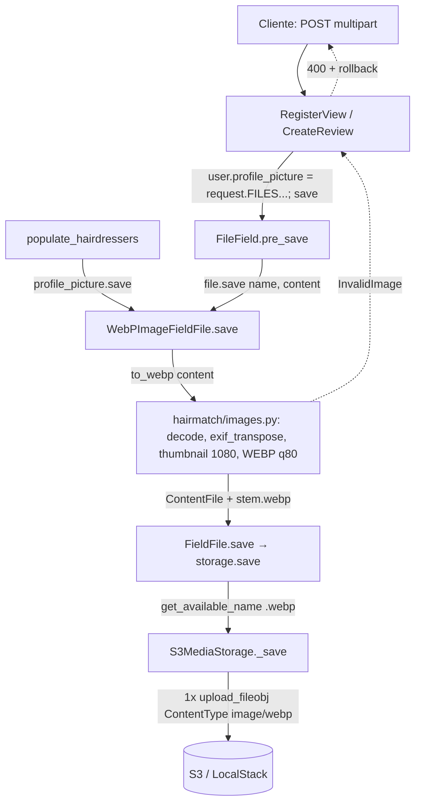

# Conversão de Fotos para WebP Design

**Spec**: `.specs/features/webp-conversion/spec.md`
**Status**: Draft

---

## Architecture Overview

A conversão acontece dentro do `FieldFile` do campo de imagem, em memória, antes do único upload ao S3. As views e o seed continuam atribuindo ou salvando arquivos como hoje. Quem troca o conteúdo e o nome é o campo.



O caminho de restore do seed é o único que chama `default_storage.save` direto, sem passar pelo campo. Por isso ele chama `to_webp` explicitamente quando a chave termina em `.webp` (WEBP-15).

### Abordagens consideradas (dentro do backend)

| Abordagem | Veredito |
| --------- | -------- |
| **`WebPImageFieldFile.save` no campo (escolhida)** | Cobre atribuição + `model.save()` (via `pre_save`) e `field.save()` do seed com um único ponto. Funciona com o `InMemoryStorage` dos testes. O nome `.webp` é decidido antes de `get_available_name`. |
| Converter em `S3MediaStorage._save` | Os testes usam `InMemoryStorage`, então a conversão nunca seria exercitada pela suíte de views. `get_available_name` checaria colisão com o nome original, e não com o `.webp`. Também converteria o restore de chaves `.jpg` antigas (quebra WEBP-16). |
| Converter em cada view | Repete a lógica em três pontos (senha, Google, review) e mais no seed. Um caminho novo que esqueça de chamar a conversão sobe o original. |

A comparação com Lambda e com o fluxo "sobe → baixa → converte → sobe" está no spec. A decisão está registrada como AD-003.

---

## Code Reuse Analysis

### Existing Components to Leverage

| Component | Location | How to Use |
| --------- | -------- | ---------- |
| `S3MediaStorage` | `backend/hairmatch/storage.py:13` | Sem mudança de lógica. Só ganha `mimetypes.add_type('image/webp', '.webp')` para `_save` (l.41) resolver o `ContentType` no Python 3.9 do container. |
| `user_profile_picture_path` | `backend/users/models.py:8` | Mantido como `upload_to`. Recebe o nome `.webp` já trocado. Continua referenciado pela migration `0006`. |
| Pillow | `backend/requirements.txt:7` | Já instalado (10.2.0 no host). As wheels manylinux trazem libwebp. Verificar `features.check('webp')` no container (T1). |
| `STORAGES` com `InMemoryStorage` em teste | `backend/hairmatch/settings.py:150` | Permite testar conteúdo e nome gravados sem mock do S3. |
| `S3MediaStorageTest` | `backend/hairmatch/tests.py:155` | Padrão para testar `ContentType` com `boto3.client` mockado. |
| `PopulateHairdressersCommandTest` | `backend/users/tests.py:2560` | Reaproveitar o setup com diretório temporário e `patch.object(PLACEHOLDERS_DIR)`, trocando `b'fake image'` por JPEGs reais. |
| `transaction.atomic` no cadastro Google | `backend/users/views.py:130` | Mesmo padrão aplicado ao cadastro por senha. |

### Integration Points

| System | Integration Method |
| ------ | ------------------ |
| Modelo `User` | `profile_picture` passa de `models.ImageField` para `WebPImageField`. É uma migration AlterField sem SQL (`users/0007`). |
| Modelo `Review` | `picture` passa para `WebPImageField` (`upload_to='reviews/images/'`). É uma migration AlterField sem SQL (`review/0003`). |
| S3 / LocalStack | Sem mudança: continua sendo um `upload_fileobj` por foto. |
| App mobile | Sem mudança: consome a URL absoluta devolvida pelo serializer. |

---

## Components

### `hairmatch/images.py` (novo)

- **Purpose**: Converter qualquer imagem decodificável pelo Pillow em um WebP estático de no máximo 1080 px, e oferecer o campo de modelo que aplica isso.
- **Location**: `backend/hairmatch/images.py`
- **Interfaces**:
  - `MAX_SIDE = 1080`, `WEBP_QUALITY = 80`
  - `class InvalidImage(ValueError)`: arquivo não decodificável, truncado ou decompression bomb.
  - `webp_name(name: str) -> str`: `'dir/FOTO.JPG'` → `'dir/FOTO.webp'` e `'foto'` → `'foto.webp'`. Só troca a extensão (`os.path.splitext`).
  - `to_webp(content: File) -> ContentFile`: faz `seek(0)` e depois `Image.open`. Em seguida, na ordem:
    1. `draft('RGB', (MAX_SIDE, MAX_SIDE))`, que só tem efeito em JPEG e acelera a decodificação;
    2. `ImageOps.exif_transpose`;
    3. normalização de modo: alfa vira `RGBA` e o resto vira `RGB`;
    4. `thumbnail((MAX_SIDE, MAX_SIDE), Image.LANCZOS)`;
    5. `save(buf, 'WEBP', quality=80, method=4, exif=b"", icc_profile=original.info.get('icc_profile'))`, sem `save_all`. O `exif=b""` explícito é necessário porque o `exif_transpose` deixa o EXIF (inclusive GPS) em `info`, e o comportamento padrão do encoder varia entre versões do Pillow, que não está fixado no `requirements.txt`.
    Levanta `InvalidImage` a partir de `UnidentifiedImageError`, `OSError`, `SyntaxError` e `Image.DecompressionBombError`.
  - `class WebPImageFieldFile(ImageFieldFile)`: `save(name, content, save=True)` chama `super().save(webp_name(name), to_webp(content), save)`.
  - `class WebPImageField(models.ImageField)`: `attr_class = WebPImageFieldFile`.
- **Dependencies**: Pillow e `django.db.models.fields.files`.
- **Reuses**: `ImageField` e `ImageFieldFile` do Django. Não há lógica de storage.

### `hairmatch/image_fixtures.py` (novo, só para testes)

- **Purpose**: Gerar imagens reais em memória para os testes de `hairmatch`, `users` e `review`, sem arquivos binários no repositório.
- **Interfaces**: `make_image_bytes(size=(20, 10), mode='RGB', fmt='JPEG', orientation=None, frames=1) -> bytes` e `make_upload(name='profile.jpg', **kwargs) -> SimpleUploadedFile`.
- **Por que um módulo próprio**: importar um helper de `hairmatch/tests.py` dentro de `users/tests.py` faria o runner do Django rodar as classes de teste importadas duas vezes. O nome não começa com `test`, então o módulo não é coletado como teste.

### `hairmatch/storage.py` (modificado)

- **Purpose**: Garantir `ContentType: image/webp` no upload.
- **Interfaces**: `mimetypes.add_type('image/webp', '.webp')` no nível do módulo. `_save` não muda.

### `users/views.py` (modificado)

- **Cadastro por senha** (`RegisterView`, l.69–96): `User.objects.create`, a atribuição da foto + `user.save()` e `_create_role_profile` passam para dentro de `with transaction.atomic():`. `except InvalidImage` vem antes dos handlers atuais e devolve `JsonResponse({'error': 'Imagem de perfil inválida.'}, status=400)`.
- **Cadastro Google** (`_register_with_google`, l.130–155): `except InvalidImage` entra **antes** de `except ValueError` (l.152), porque `InvalidImage` herda de `ValueError`.

### `review/views.py` (modificado)

- **`CreateReview.post`** (l.68–82): `except InvalidImage` antes de `except Exception`, devolvendo `JsonResponse({'error': 'Imagem inválida.'}, status=400)`. O `transaction.atomic` que já existe desfaz o `Review` e o `reserve.review`.

### `users/management/commands/populate_hairdressers.py` (modificado)

- **Criação** (l.219–221): não muda. `profile_picture.save(profile_pic_name, File(f))` já passa pelo `WebPImageFieldFile` (WEBP-14).
- **`restore_missing_pictures`** (l.25–43): monta `{stem: arquivo}` a partir de `PLACEHOLDERS_DIR` e procura o stem de cada chave. Se a chave termina em `.webp`, grava `default_storage.save(key, to_webp(File(f)))`. Senão, grava os bytes originais, como hoje (WEBP-15, WEBP-16).

---

## Data Models

Nenhuma coluna muda. `profile_picture` e `picture` continuam `varchar(100)` com o path. Muda só a classe Python do campo:

```python
# users/models.py
profile_picture = WebPImageField(upload_to=user_profile_picture_path, null=True, blank=True)

# review/models.py
picture = WebPImageField(upload_to='reviews/images/', blank=True, null=True)
```

**Relationships**: os valores antigos (`.jpg`/`.png`) continuam válidos e são servidos como estão. Converter esses valores está fora do escopo.

---

## Error Handling Strategy

| Error Scenario | Handling | User Impact |
| -------------- | -------- | ----------- |
| Arquivo não é imagem ou está truncado (cadastro por senha) | `InvalidImage` sai do `transaction.atomic` e faz rollback do `User` | 400 `"Imagem de perfil inválida."`. O e-mail continua livre. |
| Mesmo caso no cadastro Google | `InvalidImage` capturado antes de `ValueError`, com rollback do atomic que já existe | 400 `"Imagem de perfil inválida."`, sem cookie `jwt` |
| Mesmo caso na criação de review | `InvalidImage` capturado antes de `Exception`, com rollback | 400 `"Imagem inválida."` |
| Imagem acima de ~179 MP (`DecompressionBombError`) | Convertido em `InvalidImage` | Igual às linhas acima |
| Falha do S3 no upload | Sem mudança (continua caindo no handler atual) | Igual a hoje |

---

## Risks & Concerns

| Concern | Location (file:line) | Impact | Mitigation |
| ------- | -------------------- | ------ | ---------- |
| O cadastro por senha cria o `User` fora de transação e só depois salva a foto | `backend/users/views.py:69-88` | Com a conversão, uma foto inválida deixa um usuário órfão, sem `Customer`/`Hairdresser`, e o e-mail fica bloqueado | Envolver em `transaction.atomic` (WEBP-10). O teste verifica `User.objects.count() == 0`. |
| O handler genérico do cadastro por senha devolve `JsonResponse({'error': err})` com um objeto `Exception` | `backend/users/views.py:95-96` | Qualquer exceção vira um erro de serialização em vez de um 500 legível | Fora do escopo. `InvalidImage` é tratado antes desse handler. Registrar como follow-up. |
| `except ValueError` no cadastro Google captura `InvalidImage` com a mensagem de preferências | `backend/users/views.py:152` | O usuário veria "As preferências enviadas são inválidas." para uma foto ruim | `except InvalidImage` vem antes (WEBP-11). Um teste verifica a mensagem exata. |
| Os testes gravam bytes falsos como imagem | `backend/users/tests.py:217` (`b"file_content"`) e `backend/users/tests.py:2569` (`b'fake image'`) | Esses testes passariam a falhar com `InvalidImage` | Trocar por JPEGs reais gerados com Pillow em memória (helper de teste). Atualizar as asserções para `.webp`. |
| O `mimetypes` do Python 3.9 pode não conhecer `.webp` | `backend/hairmatch/storage.py:41`, `docker/backend/Dockerfile:2` | O upload sai com `application/octet-stream` e o navegador baixa em vez de exibir | `mimetypes.add_type` no módulo. Teste de `ContentType` e verificação no container (T1). |
| Custo de CPU na requisição | `hairmatch/images.py` (novo) | Uma foto de 24 MP sem otimização leva ~1 s para codificar | `draft()` em JPEG e `thumbnail` antes do encode. Medido nos placeholders: o encode de 1080 px é uma fração disso. |
| O objeto S3 fica órfão se `_create_role_profile` falhar depois do upload | `backend/users/views.py:86-93` | O upload não é desfeito pelo rollback do banco | É o comportamento de hoje, e o impacto é pequeno (um objeto de ~50 KB). Fica como follow-up e não bloqueia. |
| `requirements.txt` não fixa a versão do Pillow | `backend/requirements.txt:7` | Uma mudança de versão pode alterar a saída | Os testes verificam propriedades (formato, dimensões, modo, EXIF), não bytes exatos. |

---

## Tech Decisions

| Decision | Choice | Rationale |
| -------- | ------ | --------- |
| Onde converter | `WebPImageFieldFile.save` | Um ponto único para todos os caminhos. Testável com `InMemoryStorage`. Nome correto antes de `get_available_name`. |
| Redimensionar antes de codificar | `thumbnail((1080, 1080))` depois de `exif_transpose` | Decisão do usuário (spec). A rotação vem antes para o limite valer sobre as dimensões exibidas. |
| Acelerar a decodificação de JPEG | `Image.draft('RGB', (1080, 1080))` | Decodifica em escala 1/2, 1/4 ou 1/8, sempre acima do alvo, sem perda visível depois do `thumbnail`. |
| `InvalidImage` herda de `ValueError` | Sim | É semanticamente um valor inválido. O custo é o cuidado com a ordem dos `except` (registrado nos riscos). |
| Migrations | AlterField em `users` e `review` | O autodetector exige isso ao trocar a classe do campo. Não geram SQL. |
| `Preferences.picture` | Não muda | Nunca recebe upload (ver spec). |

> AD-003 registra a decisão de projeto: conversão síncrona no backend, sem Lambda, e o campo como ponto único.
